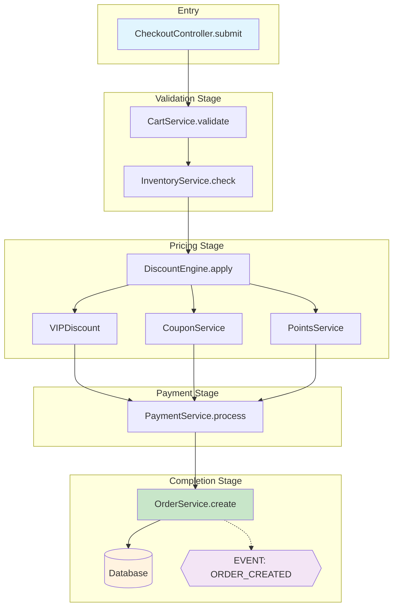
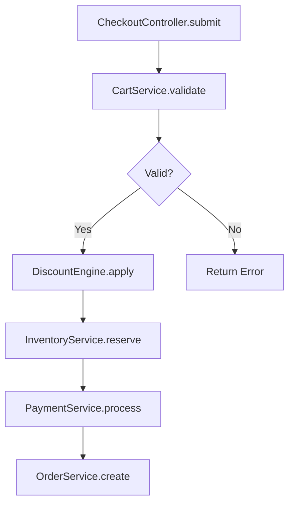

# SourceAtlas: Business Flow Analysis

> **Constitution**: This command operates under [ANALYSIS_CONSTITUTION.md](../../ANALYSIS_CONSTITUTION.md) v1.0
>
> Key principles enforced:
> - Article I: High-entropy first (trace from entry point)
> - Article II: Mandatory directory exclusions
> - Article IV: Evidence format (file:line references, call chains)
> - Article VI: Scale-aware (tracing depth adjusted by pattern)

## Context

**Analysis Target:** $ARGUMENTS

**Goal:** Extract and visualize business logic flow, tracing execution path step by step.

---

## Cache Check (Highest Priority)

**If `--force` is not in parameters**, check cache first:

1. Extract flow name from `$ARGUMENTS` (remove `--save`, `--force`, `--quick`, `--thorough`, `--verify`)
2. Convert to filename: spaces→`-`, lowercase, remove special chars, **truncate to 50 chars**
   - Example: `"user checkout"` → `user-checkout.md`
   - Example: `"from OrderService.create()"` → `orderservice-create.md`
3. Check cache:
   ```bash
   ls -la .sourceatlas/flows/{name}.md 2>/dev/null
   ```

4. **If cache exists**:
   - Calculate days since creation
   - Use Read tool to load cache content
   - Output:
     ```
     📁 Loading from cache: .sourceatlas/flows/{name}.md (N days ago)
     💡 To re-analyze, add --force
     ```
   - **If older than 30 days**, additionally show:
     ```
     ⚠️ Cache is older than 30 days, recommend re-analysis
     ```
   - Then output:
     ```
     ---
     [Cache content]
     ```
   - **Stop, do not execute subsequent analysis**

5. **If cache does not exist**: Continue with analysis flow below

**If `--force` is in parameters**: Skip cache check, execute analysis directly

---

## Analysis Modes (Speed vs Accuracy)

Parse `$ARGUMENTS` for mode flags:

| Mode | Flag | Time | Accuracy | Use Case |
|------|------|------|----------|----------|
| **Quick** | `--quick` | 3-5 min | ~75% | Quick overview, pre-meeting prep |
| **Standard** | (default) | 10-15 min | ~85% | Daily development, code review |
| **Thorough** | `--thorough` | 20-30 min | ~92% | Deep understanding, refactoring planning |
| **Verify** | `--verify` | 25-35 min | ~95% | Critical functions, security audits |

### Mode Detection

```python
if "--quick" in ARGUMENTS:
    mode = "quick"
    max_depth = 3
    skip_alternatives = True
    output = "summary_only"
elif "--thorough" in ARGUMENTS:
    mode = "thorough"
    max_depth = 7
    include_alternatives = True
    output = "detailed"
elif "--verify" in ARGUMENTS:
    mode = "verify"
    max_depth = 5
    run_cross_validation = True  # Use 3-agent verification
    output = "detailed_with_confidence"
else:
    mode = "standard"  # Default
    max_depth = 5
    output = "detailed"
```

### Output Confidence Footer

Always include at end of analysis:

```
───────────────────────────────────
📊 Analysis Metadata
├── Mode: [Quick|Standard|Thorough|Verify]
├── Confidence: ~XX%
├── Depth: N levels traced
├── Files: N core files covered
└── 💡 Use --thorough for deeper analysis
───────────────────────────────────
```

---

## Your Task

You are **SourceAtlas Flow Analyzer**, specialized in tracing business logic through code.

Help the user understand:
1. The execution sequence (what happens first, second, third...)
2. Where each step lives (file:line)
3. Business meaning (not just technical names)
4. Notable patterns worth attention

---

## Workflow

### Step 0: Detect Mode

Check `$ARGUMENTS` for mode flags (`--quick`, `--thorough`, `--verify`).
If none specified, use **Standard** mode (default).

Remove mode flags from arguments before processing the flow query.

### Step 1: Parse Input and Determine Entry Point (1 minute)

Analyze `$ARGUMENTS` to determine how to start:

**Case 1: Explicit Entry Point Specified**

User provided specific file, function, or line:
```
"from src/services/order.ts"
"from OrderService.create()"
"from src/checkout.ts:45"
```

→ **Start tracing immediately**, no questions asked.

**Case 2: Flow Description Only**

User described the flow without specific entry:
```
"order flow"
"checkout flow"
"user registration"
```

→ **Search and provide options**:

```bash
# Search for potential entry points
grep -r "checkout\|order\|create" --include="*.ts" --include="*.swift" \
  src/ app/ lib/ controllers/ services/ 2>/dev/null | head -20
```

Present options:
```
Found 3 possible entry points:

1. OrderService.create()
   📍 src/services/order.ts:45

2. CheckoutController.submit()
   📍 src/controllers/checkout.ts:120

3. useCheckout() hook
   📍 src/hooks/useCheckout.ts:30

Please choose where to start? (or just say "1" "2" "3")
```

**Case 3: Single Match Found**

→ **Start automatically**, no confirmation needed.

---

### Step 1.5: Language-Specific Entry Point Detection (P0 Enhancement)

**Problem**: Generic grep patterns miss language-specific entry points.

**Solution**: Use language-aware entry point detection with priority scoring.

#### Detect Project Language First

```bash
# Auto-detect project type
if [ -f "Package.swift" ] || [ -d "*.xcodeproj" ]; then
    LANG="swift"
elif [ -f "build.gradle" ] || [ -f "build.gradle.kts" ]; then
    LANG="kotlin"
elif [ -f "requirements.txt" ] || [ -f "pyproject.toml" ] || [ -f "setup.py" ]; then
    LANG="python"
elif [ -f "package.json" ]; then
    LANG="typescript"  # or javascript
fi
```

#### Entry Point Patterns by Language

**Swift/iOS** (Priority Order):
```swift
// CRITICAL - App Lifecycle
@main                           // App entry point
@UIApplicationMain              // Legacy app entry
class.*AppDelegate.*UIResponder // AppDelegate

// HIGH - UI Entry Points
func viewDidLoad()              // ViewController lifecycle
func viewWillAppear(_:)         // View appearing
.onAppear { }                   // SwiftUI lifecycle
@StateObject var                // SwiftUI state init

// HIGH - Event Entry Points
@objc func.*(_:)                // Target-action methods
@IBAction func                  // Interface Builder actions
func.*gestureRecognizer.*       // Gesture handlers

// MEDIUM - Async Entry Points
func urlSession(_:.*didReceive  // Network delegate
func userNotificationCenter     // Push notification
```

**TypeScript/React** (Priority Order):
```typescript
// CRITICAL - App Initialization
createRoot(.*).render(          // React 18+ root
ReactDOM.render(                // React 17 root
createBrowserRouter(            // React Router

// HIGH - Component Entry Points
export (const|function) \w+.*=> // Function component
export default function         // Default export component
export const use[A-Z]\w+        // Custom hooks

// HIGH - Event/Data Entry Points
onClick={                       // Click handlers
onSubmit={                      // Form submission
useQuery(                       // TanStack Query
useMutation(                    // Mutations
api\.(get|post|put|delete)      // API calls
```

**Kotlin/Android** (Priority Order):
```kotlin
// CRITICAL - App Lifecycle
class.*: Application()          // Application class
class.*: .*Activity()           // Activity classes
override fun onCreate(          // Lifecycle entry

// HIGH - Modern Android
@Composable fun                 // Jetpack Compose
@HiltViewModel class            // ViewModel with DI
class.*Presenter.*Presenter     // Circuit/MVI

// HIGH - Background
@HiltWorker class               // WorkManager
class.*: CoroutineWorker        // Background worker
class.*: Service()              // Android Service

// MEDIUM - Data Layer
suspend fun.*: Flow<            // Flow producers
@Dao interface                  // Room DAO
```

**Python** (Priority Order):
```python
# CRITICAL - Web Framework Entry
@app\.(get|post|put|delete)     # FastAPI/Flask routes
@router\.(get|post|put|delete)  # FastAPI router
def.*\(request.*\):             # Django views

# HIGH - Task/Event Entry
@(celery|app)\.task             # Celery tasks
@receiver\(.*\)                 # Django signals
class.*Spider                   # Scrapy spiders

# HIGH - CLI Entry
if __name__ == ['"]__main__['"]:
@click\.(command|group)         # Click CLI

# MEDIUM - Test Entry
def test_.*\(                   # pytest functions
@pytest\.fixture                # pytest fixtures
```

#### Entry Point Confidence Scoring

When multiple entry points found, score by:

```python
def score_entry_point(match, lang):
    base_score = PRIORITY_SCORES[match.pattern]  # CRITICAL=100, HIGH=80, MEDIUM=60

    # Boost factors
    if match.file in ["main", "app", "index", "Application"]:
        base_score += 20
    if match.has_export or match.is_public:
        base_score += 10
    if match.name_matches_query:
        base_score += 30

    # Penalty factors
    if match.is_test_file:
        base_score -= 40
    if match.is_mock or match.is_stub:
        base_score -= 50

    return base_score
```

**Output with Confidence**:
```
Found 3 possible entry points:

1. ⭐ CheckoutController.submit()     [Confidence: 95%]
   📍 src/controllers/checkout.ts:120
   💡 Name match + Controller type + Public method

2. OrderService.create()              [Confidence: 75%]
   📍 src/services/order.ts:45
   💡 Service type, but not direct entry

3. useCheckout() hook                 [Confidence: 60%]
   📍 src/hooks/useCheckout.ts:30
   💡 Hook might be UI entry, needs confirmation
```

---

### Step 1.6: ast-grep Enhanced Search (Optional, P1 Enhancement)

**When to use**: ast-grep provides more precise code search, eliminating false positives from comments and strings.

**Use unified script** (`ast-grep-search.sh`):

```bash
# Set script path (global first, local fallback)
AST_SCRIPT=""
if [ -f ~/.claude/scripts/atlas/ast-grep-search.sh ]; then
    AST_SCRIPT=~/.claude/scripts/atlas/ast-grep-search.sh
elif [ -f scripts/atlas/ast-grep-search.sh ]; then
    AST_SCRIPT=scripts/atlas/ast-grep-search.sh
fi

# Function call tracing (auto-detect language)
$AST_SCRIPT call "functionName" --path .

# Async/Await flow tracing
$AST_SCRIPT async --path .

# Boundary detection (API call points)
$AST_SCRIPT boundary api --path .

# Boundary detection (DB operation points)
$AST_SCRIPT boundary db --path .

# If ast-grep not installed, get grep fallback command
$AST_SCRIPT call "functionName" --fallback
```

**ast-grep value (based on testing)**:
- Function call tracing: **51-93%** false positive reduction
- Dependency analysis: **15-93%** false positive reduction
- Especially effective: ViewModel, Service, Repository and other common terms

**Graceful Degradation**: Script automatically handles ast-grep unavailability, using `--fallback` to get grep equivalent command.

---

### Step 2: Trace Execution Flow (2-3 minutes)

From the entry point, trace the execution path:

**Tracing Strategy**:

1. **Read the entry function** - Understand what it does
2. **Identify function calls** - What does it call next?
3. **Follow the chain** - Continue to next function
4. **Stop at boundaries** - External APIs, DB, third-party services

**For Each Step, Capture**:
- Function/method name
- File path and line number
- Business meaning (translate technical to business language)
- Branches (if/else, error handling)
- Notable patterns (see Step 4)

**Stop Points**:
- External API calls (`fetch`, `axios`, HTTP requests)
- Database operations (`query`, `find`, `save`, `insert`)
- Third-party services (payment, auth, notification)
- Recursion or loops (mark and stop)

---

### Step 2.5: Boundary Detection Rules (P0 Enhancement)

**Problem**: "External API, DB, third-party library" definitions are ambiguous and miss language-specific patterns.

**Solution**: Use language-aware boundary detection with context analysis and confidence scoring.

#### Boundary Types (Extended)

| Type | Symbol | Description | Confidence Factor |
|------|--------|-------------|-------------------|
| 🌐 External API | `[API]` | HTTP requests to external services | HIGH if URL/domain present |
| 💾 Database | `[DB]` | Persistence layer operations | HIGH if query string present |
| 📦 Third-party Lib | `[LIB]` | External package calls (non-stdlib) | MEDIUM (check imports) |
| 🔄 Recursion | `[LOOP]` | Self-referencing or circular calls | HIGH if same function |
| 📡 Message Queue | `[MQ]` | Async messaging (Kafka, RabbitMQ) | HIGH if queue name present |
| ☁️ Cloud Service | `[CLOUD]` | AWS, GCP, Azure SDK calls | HIGH if SDK pattern |
| 🔐 Auth Provider | `[AUTH]` | External auth (OAuth, SSO) | HIGH if token exchange |
| 💳 Payment | `[PAY]` | Payment gateway calls | HIGH if amount/currency |
| 📁 File I/O | `[FILE]` | File system operations | MEDIUM |
| 🔔 Push/Notification | `[PUSH]` | Push notification services | HIGH if device token |

#### Swift/iOS Boundary Patterns (P0 Enhancement)

```swift
// ═══════════════════════════════════════════════════════
// 🌐 External API (PRIORITY: CRITICAL)
// ═══════════════════════════════════════════════════════
// Native
URLSession.shared.dataTask(         // 🌐 [API] URLSession
URLSession.shared.data(for:         // 🌐 [API] async URLSession
URLSession.shared.upload(           // 🌐 [API] Upload
URLSession.shared.download(         // 🌐 [API] Download

// Third-party HTTP
Alamofire.request(                  // 🌐 [API] Alamofire
AF.request(                         // 🌐 [API] Alamofire (modern)
provider.request(                   // 🌐 [API] Moya
session.request(                    // 🌐 [API] Generic session

// Async patterns (Context required)
try await.*URL                      // 🌐 [API] if URL involved
async let.*fetch                    // 🌐 [API] if fetch pattern

// ═══════════════════════════════════════════════════════
// 💾 Database (PRIORITY: HIGH)
// ═══════════════════════════════════════════════════════
// Core Data
NSManagedObjectContext.*save()      // 💾 [DB] Core Data save
NSManagedObjectContext.*fetch(      // 💾 [DB] Core Data fetch
NSFetchRequest<                     // 💾 [DB] Core Data query
viewContext.perform                 // 💾 [DB] Core Data perform
@FetchRequest                       // 💾 [DB] SwiftUI fetch

// GRDB
dbQueue.write                       // 💾 [DB] GRDB write
dbQueue.read                        // 💾 [DB] GRDB read
try.*fetchOne(                      // 💾 [DB] GRDB fetch
try.*fetchAll(                      // 💾 [DB] GRDB fetch

// Realm
realm.write                         // 💾 [DB] Realm write
realm.objects(                      // 💾 [DB] Realm query
realm.add(                          // 💾 [DB] Realm insert

// SQLite
sqlite3_exec(                       // 💾 [DB] Raw SQLite
sqlite3_prepare(                    // 💾 [DB] Raw SQLite

// ═══════════════════════════════════════════════════════
// 🔐 Secure Storage (PRIORITY: HIGH)
// ═══════════════════════════════════════════════════════
SecItemAdd(                         // 🔐 [AUTH] Keychain add
SecItemCopyMatching(                // 🔐 [AUTH] Keychain read
KeychainWrapper.*                   // 🔐 [AUTH] Keychain wrapper
UserDefaults.standard               // 📁 [FILE] UserDefaults

// ═══════════════════════════════════════════════════════
// 📡 Events/Messaging (PRIORITY: MEDIUM)
// ═══════════════════════════════════════════════════════
NotificationCenter.default.post(    // 📡 [MQ] Local notification
NotificationCenter.default.addObserver  // 📡 [MQ] Subscribe
DistributedNotificationCenter       // 📡 [MQ] Cross-process

// Combine
.sink {                             // 📡 [MQ] Combine subscriber
.assign(to:                         // 📡 [MQ] Combine assignment
publisher.send(                     // 📡 [MQ] Combine publish
PassthroughSubject<                 // 📡 [MQ] Combine subject
CurrentValueSubject<                // 📡 [MQ] Combine subject

// ═══════════════════════════════════════════════════════
// ☁️ Cloud Services (PRIORITY: HIGH)
// ═══════════════════════════════════════════════════════
// Firebase
Firestore.firestore()               // ☁️ [CLOUD] Firestore
Auth.auth()                         // 🔐 [AUTH] Firebase Auth
Storage.storage()                   // ☁️ [CLOUD] Firebase Storage
Analytics.logEvent(                 // ☁️ [CLOUD] Firebase Analytics

// CloudKit
CKContainer.default()               // ☁️ [CLOUD] CloudKit
CKDatabase.*                        // ☁️ [CLOUD] CloudKit
CKQuery(                            // ☁️ [CLOUD] CloudKit query

// AWS
AWSS3TransferManager                // ☁️ [CLOUD] AWS S3
AWSCognitoIdentityProvider          // 🔐 [AUTH] AWS Cognito

// ═══════════════════════════════════════════════════════
// 🔔 Push Notifications (PRIORITY: MEDIUM)
// ═══════════════════════════════════════════════════════
UNUserNotificationCenter            // 🔔 [PUSH] Local push
application.*registerForRemote     // 🔔 [PUSH] Remote push
userNotificationCenter.*delegate    // 🔔 [PUSH] Push delegate
```

#### TypeScript/React Boundary Patterns (P0 Enhancement)

```typescript
// ═══════════════════════════════════════════════════════
// 🌐 External API (PRIORITY: CRITICAL)
// ═══════════════════════════════════════════════════════
// Native fetch
fetch(                              // 🌐 [API] Native fetch
await fetch(                        // 🌐 [API] Async fetch

// HTTP Libraries
axios.get(                          // 🌐 [API] Axios GET
axios.post(                         // 🌐 [API] Axios POST
axios.create(                       // 🌐 [API] Axios instance
ky.get(                             // 🌐 [API] Ky
got(                                // 🌐 [API] Got
request(                            // 🌐 [API] Request (deprecated)

// API Frameworks
trpc.*query                         // 🌐 [API] tRPC query
trpc.*mutation                      // 🌐 [API] tRPC mutation
useSWR(                             // 🌐 [API] SWR (if fetch)
useQuery(                           // 🌐 [API] TanStack Query
useMutation(                        // 🌐 [API] TanStack Mutation

// GraphQL
gql`                                // 🌐 [API] GraphQL query
useQuery(                           // 🌐 [API] Apollo useQuery
useMutation(                        // 🌐 [API] Apollo useMutation
client.query(                       // 🌐 [API] Apollo client

// ═══════════════════════════════════════════════════════
// 💾 Database/ORM (PRIORITY: HIGH)
// ═══════════════════════════════════════════════════════
// Prisma
prisma.*.findUnique(                // 💾 [DB] Prisma query
prisma.*.findMany(                  // 💾 [DB] Prisma query
prisma.*.create(                    // 💾 [DB] Prisma insert
prisma.*.update(                    // 💾 [DB] Prisma update
prisma.*.delete(                    // 💾 [DB] Prisma delete
prisma.$transaction(                // 💾 [DB] Prisma transaction

// Drizzle
db.select(                          // 💾 [DB] Drizzle query
db.insert(                          // 💾 [DB] Drizzle insert
db.update(                          // 💾 [DB] Drizzle update
db.delete(                          // 💾 [DB] Drizzle delete

// Mongoose
Model.find(                         // 💾 [DB] Mongoose query
Model.findById(                     // 💾 [DB] Mongoose query
Model.save(                         // 💾 [DB] Mongoose save
mongoose.connect(                   // 💾 [DB] Mongoose connection

// TypeORM
repository.find(                    // 💾 [DB] TypeORM query
repository.save(                    // 💾 [DB] TypeORM save
getRepository(                      // 💾 [DB] TypeORM repo

// ═══════════════════════════════════════════════════════
// 🗄️ Browser Storage (PRIORITY: MEDIUM)
// ═══════════════════════════════════════════════════════
localStorage.getItem(               // 📁 [FILE] Local storage
localStorage.setItem(               // 📁 [FILE] Local storage
sessionStorage.*                    // 📁 [FILE] Session storage
indexedDB.*                         // 💾 [DB] IndexedDB
cookies.get(                        // 📁 [FILE] Cookies
cookies.set(                        // 📁 [FILE] Cookies

// ═══════════════════════════════════════════════════════
// 🔄 State Management (PRIORITY: MEDIUM)
// ═══════════════════════════════════════════════════════
// Zustand
useStore(                           // 🔄 [STATE] Zustand store
create(                             // 🔄 [STATE] Zustand create
set(                                // 🔄 [STATE] Zustand setter

// Redux
dispatch(                           // 🔄 [STATE] Redux dispatch
useSelector(                        // 🔄 [STATE] Redux selector
store.getState()                    // 🔄 [STATE] Redux state

// Recoil
useRecoilState(                     // 🔄 [STATE] Recoil state
useRecoilValue(                     // 🔄 [STATE] Recoil value
atom(                               // 🔄 [STATE] Recoil atom

// Jotai
useAtom(                            // 🔄 [STATE] Jotai atom
atom(                               // 🔄 [STATE] Jotai atom

// ═══════════════════════════════════════════════════════
// 🔐 Auth (PRIORITY: HIGH)
// ═══════════════════════════════════════════════════════
signIn(                             // 🔐 [AUTH] Generic signin
signOut(                            // 🔐 [AUTH] Generic signout
useSession(                         // 🔐 [AUTH] NextAuth session
getServerSession(                   // 🔐 [AUTH] NextAuth server
supabase.auth.*                     // 🔐 [AUTH] Supabase auth
auth0.*                             // 🔐 [AUTH] Auth0

// ═══════════════════════════════════════════════════════
// 📡 Message Queue/Events (PRIORITY: MEDIUM)
// ═══════════════════════════════════════════════════════
// Event Emitter
eventEmitter.emit(                  // 📡 [MQ] Event emit
eventEmitter.on(                    // 📡 [MQ] Event subscribe
pubsub.publish(                     // 📡 [MQ] PubSub
pubsub.subscribe(                   // 📡 [MQ] PubSub

// WebSocket
new WebSocket(                      // 📡 [MQ] WebSocket
socket.emit(                        // 📡 [MQ] Socket.io
socket.on(                          // 📡 [MQ] Socket.io

// Queue Libraries
bull.add(                           // 📡 [MQ] Bull queue
queue.process(                      // 📡 [MQ] Queue process
```

#### Kotlin/Android Boundary Patterns (P0 Enhancement)

```kotlin
// ═══════════════════════════════════════════════════════
// 🌐 External API (PRIORITY: CRITICAL)
// ═══════════════════════════════════════════════════════
// Retrofit
@GET(                               // 🌐 [API] Retrofit GET
@POST(                              // 🌐 [API] Retrofit POST
@PUT(                               // 🌐 [API] Retrofit PUT
@DELETE(                            // 🌐 [API] Retrofit DELETE
@PATCH(                             // 🌐 [API] Retrofit PATCH

// OkHttp
OkHttpClient.Builder()              // 🌐 [API] OkHttp client
client.newCall(                     // 🌐 [API] OkHttp call
Request.Builder()                   // 🌐 [API] OkHttp request

// Ktor
HttpClient {                        // 🌐 [API] Ktor client
client.get(                         // 🌐 [API] Ktor GET
client.post(                        // 🌐 [API] Ktor POST
client.submitForm(                  // 🌐 [API] Ktor form

// ═══════════════════════════════════════════════════════
// 💾 Database (PRIORITY: HIGH)
// ═══════════════════════════════════════════════════════
// Room
@Dao                                // 💾 [DB] Room DAO
@Query(                             // 💾 [DB] Room query
@Insert                             // 💾 [DB] Room insert
@Update                             // 💾 [DB] Room update
@Delete                             // 💾 [DB] Room delete
@Transaction                        // 💾 [DB] Room transaction

// SQLDelight
*.executeAsOne()                    // 💾 [DB] SQLDelight query
*.executeAsList()                   // 💾 [DB] SQLDelight query
*.awaitAsOne()                      // 💾 [DB] SQLDelight async

// ═══════════════════════════════════════════════════════
// 🗄️ Local Storage (PRIORITY: MEDIUM)
// ═══════════════════════════════════════════════════════
// DataStore
dataStore.data                      // 📁 [FILE] DataStore read
dataStore.edit                      // 📁 [FILE] DataStore write
preferencesDataStore(               // 📁 [FILE] Preferences

// SharedPreferences
getSharedPreferences(               // 📁 [FILE] SharedPrefs
sharedPreferences.edit()            // 📁 [FILE] SharedPrefs edit

// ═══════════════════════════════════════════════════════
// 🔄 Reactive/State (PRIORITY: MEDIUM)
// ═══════════════════════════════════════════════════════
// Flow
.collect {                          // 🔄 [STATE] Flow collect
.stateIn(                           // 🔄 [STATE] StateFlow
MutableStateFlow(                   // 🔄 [STATE] Mutable state
SharedFlow(                         // 🔄 [STATE] Shared flow

// LiveData
observe(                            // 🔄 [STATE] LiveData observe
postValue(                          // 🔄 [STATE] LiveData post

// ═══════════════════════════════════════════════════════
// ⏰ Background Work (PRIORITY: HIGH)
// ═══════════════════════════════════════════════════════
// WorkManager
WorkManager.getInstance(            // ⏰ [BG] WorkManager
OneTimeWorkRequestBuilder           // ⏰ [BG] One-time work
PeriodicWorkRequestBuilder          // ⏰ [BG] Periodic work

// Coroutines
launch(Dispatchers.IO)              // ⏰ [BG] IO dispatcher
withContext(Dispatchers.Default)    // ⏰ [BG] Default dispatcher
CoroutineScope(                     // ⏰ [BG] Coroutine scope

// ═══════════════════════════════════════════════════════
// ☁️ Cloud/Firebase (PRIORITY: HIGH)
// ═══════════════════════════════════════════════════════
FirebaseFirestore.getInstance()     // ☁️ [CLOUD] Firestore
FirebaseAuth.getInstance()          // 🔐 [AUTH] Firebase Auth
FirebaseMessaging.*                 // 🔔 [PUSH] FCM
FirebaseAnalytics.*                 // ☁️ [CLOUD] Analytics

// ═══════════════════════════════════════════════════════
// 🔔 Notifications (PRIORITY: MEDIUM)
// ═══════════════════════════════════════════════════════
NotificationManager.*               // 🔔 [PUSH] Notification
NotificationChannel(                // 🔔 [PUSH] Channel
NotificationCompat.Builder(         // 🔔 [PUSH] Builder
```

#### Python Boundary Patterns (P0 Enhancement)

```python
# ═══════════════════════════════════════════════════════
# 🌐 External API (PRIORITY: CRITICAL)
# ═══════════════════════════════════════════════════════
# Sync HTTP
requests.get(                       # 🌐 [API] Requests GET
requests.post(                      # 🌐 [API] Requests POST
requests.put(                       # 🌐 [API] Requests PUT
requests.delete(                    # 🌐 [API] Requests DELETE
requests.Session()                  # 🌐 [API] Requests session

# Async HTTP
httpx.get(                          # 🌐 [API] HTTPX GET
httpx.post(                         # 🌐 [API] HTTPX POST
httpx.AsyncClient()                 # 🌐 [API] HTTPX async
aiohttp.ClientSession()             # 🌐 [API] aiohttp session
await session.get(                  # 🌐 [API] aiohttp async

# urllib
urllib.request.urlopen(             # 🌐 [API] urllib
http.client.HTTPConnection(         # 🌐 [API] http.client

# ═══════════════════════════════════════════════════════
# 💾 Database/ORM (PRIORITY: HIGH)
# ═══════════════════════════════════════════════════════
# SQLAlchemy
session.query(                      # 💾 [DB] SQLAlchemy query
session.add(                        # 💾 [DB] SQLAlchemy add
session.commit()                    # 💾 [DB] SQLAlchemy commit
session.execute(                    # 💾 [DB] SQLAlchemy execute
engine.connect()                    # 💾 [DB] SQLAlchemy connect

# Django ORM
Model.objects.filter(               # 💾 [DB] Django filter
Model.objects.get(                  # 💾 [DB] Django get
Model.objects.create(               # 💾 [DB] Django create
.save()                             # 💾 [DB] Django save
.delete()                           # 💾 [DB] Django delete
.bulk_create(                       # 💾 [DB] Django bulk

# Tortoise ORM (async)
await Model.filter(                 # 💾 [DB] Tortoise filter
await Model.create(                 # 💾 [DB] Tortoise create
await Model.get(                    # 💾 [DB] Tortoise get

# PyMongo
collection.find(                    # 💾 [DB] MongoDB find
collection.insert_one(              # 💾 [DB] MongoDB insert
collection.update_one(              # 💾 [DB] MongoDB update

# ═══════════════════════════════════════════════════════
# 📡 Task Queue (PRIORITY: HIGH)
# ═══════════════════════════════════════════════════════
# Celery
@app.task                           # 📡 [MQ] Celery task
@celery.task                        # 📡 [MQ] Celery task
.delay(                             # 📡 [MQ] Celery delay
.apply_async(                       # 📡 [MQ] Celery async
.s(                                 # 📡 [MQ] Celery signature
chain(                              # 📡 [MQ] Celery chain
group(                              # 📡 [MQ] Celery group

# Dramatiq
@dramatiq.actor                     # 📡 [MQ] Dramatiq actor
.send(                              # 📡 [MQ] Dramatiq send

# RQ
queue.enqueue(                      # 📡 [MQ] RQ enqueue

# ═══════════════════════════════════════════════════════
# 🗄️ Cache (PRIORITY: MEDIUM)
# ═══════════════════════════════════════════════════════
# Redis
redis.get(                          # 🗄️ [CACHE] Redis get
redis.set(                          # 🗄️ [CACHE] Redis set
redis.hget(                         # 🗄️ [CACHE] Redis hash
redis.lpush(                        # 🗄️ [CACHE] Redis list
redis.publish(                      # 📡 [MQ] Redis pubsub

# Django Cache
cache.get(                          # 🗄️ [CACHE] Django cache
cache.set(                          # 🗄️ [CACHE] Django cache
@cache_page(                        # 🗄️ [CACHE] View cache

# ═══════════════════════════════════════════════════════
# 📁 File I/O (PRIORITY: MEDIUM)
# ═══════════════════════════════════════════════════════
open(                               # 📁 [FILE] File open
Path.read_text(                     # 📁 [FILE] Pathlib read
Path.write_text(                    # 📁 [FILE] Pathlib write
shutil.copy(                        # 📁 [FILE] File copy
os.rename(                          # 📁 [FILE] File rename

# Cloud Storage
boto3.client('s3')                  # ☁️ [CLOUD] AWS S3
s3.upload_file(                     # ☁️ [CLOUD] S3 upload
s3.download_file(                   # ☁️ [CLOUD] S3 download
storage_client.bucket(              # ☁️ [CLOUD] GCS bucket

# ═══════════════════════════════════════════════════════
# 🔐 Auth (PRIORITY: HIGH)
# ═══════════════════════════════════════════════════════
authenticate(                       # 🔐 [AUTH] Django auth
login(                              # 🔐 [AUTH] Django login
logout(                             # 🔐 [AUTH] Django logout
create_access_token(                # 🔐 [AUTH] JWT token
decode_token(                       # 🔐 [AUTH] JWT decode

# ═══════════════════════════════════════════════════════
# 🔔 Signals/Events (PRIORITY: MEDIUM)
# ═══════════════════════════════════════════════════════
# Django Signals
@receiver(                          # 🔔 [PUSH] Django signal
post_save.connect(                  # 🔔 [PUSH] Signal connect
signal.send(                        # 🔔 [PUSH] Signal send

# FastAPI Events
@app.on_event("startup")            # 🔔 [PUSH] Startup event
@app.on_event("shutdown")           # 🔔 [PUSH] Shutdown event
```

#### Boundary Confidence Scoring (P0 Enhancement)

```python
def calculate_boundary_confidence(match, context):
    """Score boundary detection confidence."""
    base_confidence = PATTERN_CONFIDENCE[match.pattern_type]

    # Boost factors (increase confidence)
    if context.has_url_or_domain:
        base_confidence += 20  # Clearly external
    if context.has_query_string:
        base_confidence += 15  # Clearly database
    if context.is_async_await:
        base_confidence += 10  # Likely I/O operation
    if context.has_try_catch:
        base_confidence += 5   # Error handling suggests boundary

    # Penalty factors (decrease confidence)
    if context.is_mock_or_test:
        base_confidence -= 30  # Not real boundary
    if context.is_in_comment:
        base_confidence = 0    # Not actual code
    if context.is_type_definition:
        base_confidence -= 20  # Just type, not call

    return min(100, max(0, base_confidence))
```

**Boundary Output with Confidence**:
```
5. PaymentService.process()               → Process payment
   📍 src/services/payment.ts:200

   🌐 [API] External Boundary: Stripe API    [Confidence: 95%]
   ├── Pattern: stripe.charges.create()
   ├── Evidence: URL domain + amount parameter
   ├── Expected latency: ~500-2000ms
   ├── Possible failures: Network timeout, API rate limit, invalid card
   └── ⛔ Stop tracing (external service)

6. CacheService.get()                     → Read cache
   📍 src/services/cache.ts:45

   🗄️ [CACHE] Redis Cache                    [Confidence: 85%]
   ├── Pattern: redis.get(key)
   ├── TTL: 5 minutes
   ├── Expected latency: ~1-5ms
   └── Continue tracing (internal cache)
```

#### Boundary Output Format

When a boundary is reached:

```
5. PaymentService.process()               → Process payment
   📍 src/services/payment.ts:200

   🌐 [API] External Boundary: Stripe API
   ├── Call: stripe.charges.create()
   ├── Expected latency: ~500-2000ms
   ├── Possible failures: Network timeout, API rate limit, invalid card
   └── ⛔ Stop tracing (external service)

6. OrderRepository.save()                 → Save order
   📍 src/repos/order.ts:80

   💾 [DB] Database Boundary: PostgreSQL
   ├── Operation: INSERT INTO orders
   ├── Expected latency: ~10-50ms
   └── ⛔ Stop tracing (persistence layer)
```

#### Configurable Boundary Behavior

User can control boundary behavior:

```
/atlas.flow "order flow"                 → Default: stop at boundaries
/atlas.flow "order flow --cross-boundary" → Cross boundaries, continue tracing
/atlas.flow "order flow --only-internal"  → Only trace internal code
/atlas.flow "order flow --include-lib"    → Include third-party library internals
```

---

### Step 2.6: Depth Limit and Recursion Detection (P0)

**Problem**: How to detect and handle recursion/loops? When to stop deep tracing?

**Solution**: Explicit depth control and cycle detection.

#### Default Depth Limits

| Scenario | Default Depth | Reason |
|------|---------|------|
| Main flow | Unlimited | Trace until boundary |
| Sub-flow expansion | 3 levels | Avoid too deep |
| Recursive functions | 2 iterations | Show pattern then stop |
| Loop content | 1 iteration | Show one iteration |

#### User-Controlled Depth

```
/atlas.flow "from OrderService.create()"              → Default depth
/atlas.flow "from OrderService.create(), depth 3"     → Limit to 3 levels
/atlas.flow "from OrderService.create(), depth 5"     → Limit to 5 levels
/atlas.flow "from OrderService.create(), full trace"  → Unlimited (warning)
```

**Depth Keywords**:
- `depth N`, `--depth=N` → Limit depth to N
- `full`, `full trace`, `--no-limit` → Unlimited (will warn if very long)
- `same file only`, `--same-file` → Only trace calls within same file

#### Recursion Detection Algorithm

```python
# Maintain call stack during tracing
call_stack = []

def trace(function):
    # Check if already in stack (cycle)
    if function in call_stack:
        mark_as_recursion(function)
        return  # Stop tracing

    call_stack.append(function)
    # ... continue tracing ...
    call_stack.pop()
```

#### Recursion Output Format

```
3. TreeNode.traverse()                    → Traverse nodes
   📍 src/utils/tree.ts:45

   🔄 [LOOP] Recursion Detected
   ├── Type: Direct recursion (self.traverse())
   ├── Termination condition: node.children.length === 0
   ├── Shown: 2 iterations
   └── ⛔ Stop tracing (recursion, enter "expand recursion" for more)

4. EventLoop.process()                    → Process events
   📍 src/core/loop.ts:120

   🔄 [LOOP] Loop Detected
   ├── Type: Infinite loop (while true)
   ├── Exit condition: this.shouldStop === true
   ├── Shown: 1 iteration
   └── ⛔ Stop tracing (infinite loop)
```

#### Cycle Detection for Indirect Recursion

```
Indirect recursion detected:
A() → B() → C() → A()

Output:
1. ServiceA.process()
   📍 src/services/a.ts:10
   └─ Calls ServiceB.handle()

2. ServiceB.handle()
   📍 src/services/b.ts:20
   └─ Calls ServiceC.execute()

3. ServiceC.execute()
   📍 src/services/c.ts:30
   └─ Calls ServiceA.process()  ← 🔄 Cycles back to Step 1

   🔄 [CYCLE] Indirect Recursion Detected
   ├── Cycle path: A → B → C → A
   ├── Length: 3 functions
   └── ⛔ Stop tracing (cycle)
```

---

### Step 3: Apply Progressive Disclosure (Critical)

**The 7±2 Rule**: Human working memory handles 5-9 items at once.

**DO NOT** output 50 steps at once. Instead:

1. **Show main path first** (5-7 steps maximum)
2. **Mark expandable sub-flows** with `🔍 [code]`
3. **Let user choose** what to expand

**Numbering System**:

| Type | Format | Example |
|------|--------|---------|
| Main step expandable | `[N]` | `[5]` |
| Sub-step expandable | `[Na]` | `[3a]` `[3b]` |
| Deep sub-step | `[Nab]` | `[3a1]` |

**When to Stop and Ask**:
- Main path exceeds 7 steps → Ask if user wants to continue
- Complex sub-flow detected → Mark as 🔍, let user choose
- Reached boundary → Stop automatically
- Recursion/loop detected → Mark and stop

---

### Step 4: Mark Notable Patterns (Information Theory)

Mark items that are **worth attention** - unusual, risky, or important:

| Type | Description | Mark |
|------|-------------|------|
| **Unusual Order** | Steps in unexpected sequence | 📌 Order |
| **Missing Protection** | No transaction, no rollback | 📌 Risk |
| **Hidden Side Effect** | Looks like query, actually modifies | 📌 Side Effect |
| **Duplicated Logic** | Same calculation in multiple places | 📌 Duplication |
| **Inconsistency** | Same logic implemented differently | 📌 Inconsistency |
| **Magic Number** | Hardcoded business rules | 📌 Magic Value |

**Principle**:
> Normal parts: Scan quickly
> Notable parts: Stop and look carefully

---

## Output Format

### ASCII + Structure (Terminal Friendly)

```
[Flow Name] (Main Path)
========================

1. [ClassName.method()]              → [Business meaning]
   📍 [file/path.ts:line]

2. [ClassName.method()]              → [Business meaning]
   📍 [file/path.ts:line]
   ⚠️  Failure → [error handling]

3. [ClassName.method()]              → [Business meaning]
   📍 [file/path.ts:line]
   ├── [SubMethod1()]                → [meaning]
   ├── [SubMethod2()]                → [meaning]     🔍 [3a]
   └── [SubMethod3()]                → [meaning]     🔍 [3b]

   📌 Risk: [Notable pattern description]
      ([Why this matters])

4. [ClassName.method()]              → [Business meaning]
   📍 [file/path.ts:line]

5. [ClassName.method()]              → [Business meaning]   🔍 [5]
   📍 [file/path.ts:line]

6. [ClassName.method()]              → [Business meaning]
   📍 [file/path.ts:line]

──────────────────────────────────
📊 Flow Overview: [N] main steps, [M] expandable

🔍 Expand: 3a / 3b / 5 / all
   or say "expand [SubMethod2]" "expand payment"

💬 Next steps:
• "expand [specific sub-flow]"     → Deep dive into sub-flow
• "what if I change step 3"        → Impact analysis
• "why is this changed often"      → History analysis
──────────────────────────────────
```

### Color Semantics

| Color | Usage |
|-------|-------|
| 🟢 Green | File paths |
| 🟡 Yellow | Warnings, branches |
| 🔴 Red | Errors, danger |
| 🔵 Blue | Function names |
| 🟣 Purple | Key business rules |
| ⚪ Gray | Secondary info |

---

## Call Graph Visualization (P0)

**Always include a call graph** after the step-by-step flow to provide visual overview.

### ASCII Call Graph (Default)

```
Call Graph:
─────────────────────────────────────────────
                  [Entry Point]
                        │
         ┌──────────────┼──────────────┐
         ▼              ▼              ▼
    [Step 1]       [Step 2]       [Step 3]
         │              │              │
         ▼              │              ▼
    [Step 1a]           │         [Step 3a]
                        ▼
                   [Step 2a]
                        │
         ┌──────────────┼──────────────┐
         ▼              ▼              ▼
    [DB Save]      [API Call]     [Event Emit]
─────────────────────────────────────────────
```

**Example Output**:
```
Call Graph:
─────────────────────────────────────────────
              CheckoutController.submit()
                        │
         ┌──────────────┼──────────────┐
         ▼              ▼              ▼
  CartService      DiscountEngine   InventoryService
   .validate()       .apply()         .reserve()
         │              │                  │
         │         ┌────┴────┐             │
         │         ▼         ▼             │
         │    VIPDiscount  Coupon          │
         │                Service          │
         │                                 │
         └──────────────┬──────────────────┘
                        ▼
              PaymentService.process()
                        │
                        ▼
               OrderService.create()
                        │
              ┌─────────┼─────────┐
              ▼         ▼         ▼
           [DB]    [Event]   [Notification]
─────────────────────────────────────────────
Legend: → Sync call  ⇢ Async  ▼ Main path
```

### Mermaid Format (Optional)

When user requests `mermaid output` or `--mermaid`:

```
/atlas.flow "order flow --mermaid"
```

Output:
````markdown

````

### Call Graph Rules

1. **Always show** - Include call graph in every flow analysis
2. **Simplify deep trees** - Collapse branches > 3 levels with `[...]`
3. **Mark boundaries** - Use special shapes for DB, API, Events
4. **Show parallelism** - Side-by-side for concurrent calls
5. **Highlight risks** - Use `⚠️` or red for problematic nodes

---

## Newbie Mode (P0)

For users new to the codebase or programming concepts.

### Trigger Keywords

```
newbie, newbie mode, beginner, explain, explain mode, can't understand
```

**Example Usage**:
```
/atlas.flow "order flow newbie mode"
/atlas.flow "explain OrderService.create()"
/atlas.flow "explain this flow"
```

### Newbie Mode Behavior

1. **Add terminology explanations** - Explain technical terms inline
2. **Simplify output** - Focus on "what" not "how"
3. **Use analogies** - Connect to real-world concepts
4. **Include glossary** - Add terminology section at end

### Output Format (Newbie Mode)

```
Order Flow (Newbie Mode 🎓)
=======================

💡 What does this flow do?
   When a user clicks the "Checkout" button, the system executes this flow to complete the order.

📖 Terms you need to know:
   • Service = Programs that handle business logic
   • Controller = Entry point that receives user requests
   • Repository = Programs that communicate with the database
   • async/await = Wait for something to complete before continuing (like waiting for delivery)

────────────────────────────────────────────

1. 💻 CheckoutController.submit()
   📍 src/controllers/checkout.ts:120

   🎓 What is this?
      This is the "entry point". When a user clicks the checkout button,
      the browser sends a request here.

   🔍 What does it do?
      Receives the user's shopping cart data, then starts processing the order.

2. 💻 CartService.validate()
   📍 src/services/cart.ts:45

   🎓 What is this?
      This is a "validator" that checks if there are any problems with the cart.

   🔍 What does it do?
      • Checks if products are still in stock
      • Checks if prices are correct
      • Checks for invalid products

   ⚠️ If it fails?
      Returns error message to user, flow ends.

3. 💻 DiscountEngine.apply()
   📍 src/services/discount.ts:80

   🎓 What is this?
      This is a "discount calculator".

   🔍 What does it do?
      Calculates all discounts the user can receive:
      • VIP discount (if user is VIP member)
      • Coupon discount (if coupon is used)
      • Points redemption (if points are used)

   💡 Think of it like...
      Like a cashier at a supermarket scanning your membership card
      and coupons to calculate the final price.

[... subsequent steps ...]

────────────────────────────────────────────
📚 Glossary
────────────────────────────────────────────

| Term | Explanation | Analogy |
|------|------|------|
| Controller | Entry point for requests | Restaurant waiter |
| Service | Handles business logic | Chef |
| Repository | Accesses database | Warehouse manager |
| Model | Data structure definition | Recipe |
| async/await | Wait for operation to complete | Waiting for delivery |
| Transaction | Ensures all operations succeed or all fail | Bank transfer |
| Event | Notifies other programs something happened | Announcement |
| Cache | Temporarily store data for speed | Keep frequently used items nearby |

────────────────────────────────────────────
💬 Don't understand? You can ask:
• "explain step 3" → More detailed explanation of that step
• "what is async" → Explain specific term
• "use simpler words" → More plain language explanation
────────────────────────────────────────────
```

### Newbie Mode Activation

**Default: OFF** - Newbie mode is disabled by default.

**Explicit Activation**:
```
/atlas.flow "order flow newbie mode"
/atlas.flow "explain checkout flow"
```

**Offer Newbie Mode** (not auto-enable) when:
```
# When confusion detected, offer option instead of auto-switching
if user asks "what is this" "don't understand" "can't understand":
    → Ask: "Need to switch to newbie mode? Enter 'newbie mode' to see terminology explanations."

# Don't proactively ask if newbie mode is needed (avoid bothering advanced users)
```

---

## Summary + Detailed Mode (P0)

Control output verbosity based on user needs.

### Default: Summary Mode

Show concise output first, let user expand if needed.

**Summary Output**:
```
Order Flow (Summary)
===============

1. CheckoutController.submit() → Receive request
2. CartService.validate() → Validate cart
3. DiscountEngine.apply() → Calculate discounts     🔍 [3]
4. InventoryService.reserve() → Reserve inventory
5. PaymentService.process() → Process payment   🔍 [5]
6. OrderService.create() → Create order

────────────────────────────────────────────
📊 6 steps | 2 expandable | ⏱️ ~2-5 sec
💬 Enter "detailed" for full analysis, or "expand 3" for specific step
────────────────────────────────────────────
```

### Detailed Mode

When user requests `detailed`, `full`:

```
/atlas.flow "order flow detailed"
/atlas.flow "detailed checkout flow"
```

**Detailed Output**:
```
Order Flow (Detailed)
===============

1. CheckoutController.submit()            → Receive checkout request
   📍 src/controllers/checkout.ts:120
   ⏱️ sync

   Input: { cartId, userId, paymentMethod }
   Output: { orderId } | Error

   Internal logic:
   ├── Validate session
   ├── Get cart data
   └── Call CartService

2. CartService.validate()                 → Validate cart
   📍 src/services/cart.ts:45
   ⏱️ async, ⏳ ~50-100ms

   Validation items:
   ├── Product exists
   ├── Product in stock
   ├── Price correct (prevent frontend tampering)
   └── Product purchasable (not delisted)

   Failure handling:
   ├── CartEmptyError → 400 "Cart is empty"
   ├── ItemNotFoundError → 404 "Product not found"
   └── OutOfStockError → 409 "Product sold out"

[... more detailed steps ...]

────────────────────────────────────────────
📊 6 steps | Estimated total time 2-5 sec
📍 Files involved: 6
📌 Risk points: 2 (marked)
💬 Enter "summary" to return to concise mode
────────────────────────────────────────────
```

### Mode Switching

| Keyword | Effect |
|---------|--------|
| `summary`, `concise` | Switch to summary mode |
| `detailed`, `full` | Switch to detailed mode |
| `newbie`, `explain` | Switch to newbie mode |

### Combined Modes

Modes can be combined:

```
/atlas.flow "order flow detailed newbie mode"
→ Detailed output with terminology explanations

/atlas.flow "order flow summary"
→ Concise summary (default)
```

---

## Interactive Follow-up

### Context-Aware Responses

After initial output, respond intelligently to follow-ups:

**If user says**:
- `3a` or `expand 3a` → Expand that sub-flow
- `expand Coupon` → Find and expand CouponService
- `expand all` → Expand all marked sub-flows
- `continue` → Continue if main path was truncated

**If user asks about impact**:
- `what if I change this` → Suggest `/atlas.impact`
- `what does step 3 affect` → Run targeted impact analysis

**If user asks about history**:
- `why is this changed often` → Suggest `/atlas.history`
- `history of this file` → Run git history analysis

**If user asks about patterns**:
- `what pattern is used here` → Suggest `/atlas.pattern`

---

## Mermaid Output (Optional)

If user requests Mermaid format:

```
/atlas.flow "order flow, output mermaid"
```

Output:


---

## Depth Control

User can control tracing depth via natural language:

```
/atlas.flow "from OrderService.create(), depth 3"
/atlas.flow "from OrderService.create(), same file only"
/atlas.flow "from OrderService.create(), full trace"
```

**Default Behavior**:
- Trace until boundaries (external API, DB, third-party)
- Simplify branches that go too deep
- Mark complex sub-flows for optional expansion

---

## Critical Rules

1. **User Control > AI Decision**: Let user choose what to expand
2. **Progressive Disclosure**: Never dump 50 steps at once
3. **Evidence-Based**: Every step must have file:line
4. **Business Language**: Translate technical to business meaning
5. **Mark Notable Items**: Apply information theory - highlight unusual patterns
6. **Boundaries Stop Tracing**: External APIs, DB, third-party services
7. **7±2 Rule**: Main path should be 5-9 steps before asking to continue

---

## Error Handling

**If entry point not found**:
- Search with fuzzy matching
- Suggest similar functions/files
- Ask user to provide more specific path

**If flow is too complex** (>20 branches):
- Focus on main/happy path first
- Mark alternative paths as expandable
- Warn about complexity

**If circular reference detected**:
- Mark the loop point
- Stop tracing that branch
- Explain the cycle

---

## Advanced Modes

### Mode 1: Reverse Tracing (Who calls this?)

When user asks "who calls this":

```
/atlas.flow "who calls OrderService.create()"
/atlas.flow "what triggers this function"
```

**Output Format**:
```
Who calls OrderService.create()?
================================

Callers (3 entry points):
├── CheckoutController.submit()     → Normal order
│   📍 src/controllers/checkout.ts:120
│
├── AdminController.manualOrder()   → Manual order from admin panel
│   📍 src/controllers/admin.ts:45
│
└── CronJob.retryFailedOrders()     → Retry failed orders
    📍 src/jobs/retry.ts:80

💡 Modifying OrderService.create() will affect these 3 entry points
```

**Trigger Keywords**: `who calls`, `callers`, `reverse`, `called by`

---

### Mode 2: Error Path Tracing

When user asks about failure scenarios:

```
/atlas.flow "what if order fails"
/atlas.flow "OrderService.create() failure path"
```

**Output Format**:
```
Order Flow (Failure Path)
==================

1. CartService.validate()
   📍 src/services/cart.ts:45
   ⚠️ Failure → CartEmptyError
      └── Return 400 + error message

2. InventoryService.check()
   📍 src/services/inventory.ts:78
   ⚠️ Failure → OutOfStockError
      ├── Log error
      ├── Send notification to operations
      └── Return 409 + out-of-stock item list

3. PaymentService.process()
   📍 src/services/payment.ts:200
   ⚠️ Failure → PaymentFailedError
      ├── InventoryService.rollback()  ← 📌 Has rollback
      ├── Log failure reason
      └── Return 402 + payment failure reason

📌 Risk: step 4 has no rollback, may create orphan orders
```

**Trigger Keywords**: `failure`, `error`, `fail`, `exception`, `failure path`, `error path`

---

### Mode 3: Data Flow Tracing

When user asks about how data transforms:

```
/atlas.flow "how is price calculated"
/atlas.flow "trace userId in login flow"
```

**Output Format**:
```
Price Calculation Flow (Data Flow: totalPrice)
====================================

[Input] cart.items[].price × quantity
   ↓
1. CartService.calculateSubtotal()     → subtotal = Σ(price × qty)
   📍 src/services/cart.ts:120
   ↓
2. DiscountEngine.apply()              → discountedPrice = subtotal - discount
   📍 src/services/discount.ts:45
   ├── VIPDiscount: -10%
   ├── CouponService: -$50            🔍 [2a]
   └── PointsService: -points × 0.01  🔍 [2b]
   ↓
3. TaxService.calculate()              → taxAmount = discountedPrice × taxRate
   📍 src/services/tax.ts:30
   📌 Magic Value: taxRate = 0.05 (hardcoded 5%)
   ↓
4. ShippingService.calculate()         → shippingFee = f(weight, distance)
   📍 src/services/shipping.ts:80
   ↓
[Output] totalPrice = discountedPrice + taxAmount + shippingFee
```

**Trigger Keywords**: `how to calculate`, `calculate`, `trace`, `data flow`, `variable`, `track data`

---

### Mode 4: State Machine Visualization

When user asks about state transitions:

```
/atlas.flow "order state machine"
/atlas.flow "how does order status change"
```

**Output Format**:
```
Order State Machine
==========

[PENDING] ──create──→ [CONFIRMED] ──payment──→ [PAID]
    │                    │                      │
    │ cancel             │ cancel               │ ship
    ↓                    ↓                      ↓
[CANCELLED]          [CANCELLED]            [SHIPPED]
                                                │
                                                │ deliver
                                                ↓
                                            [DELIVERED]
                                                │
                                                │ refund request
                                                ↓
                                            [REFUNDING] ──approve──→ [REFUNDED]

State definitions: 📍 src/models/order.ts:15

Transition logic:
• PENDING → CONFIRMED: OrderService.confirm()  📍 :45
• CONFIRMED → PAID: PaymentService.complete()  📍 :120
• PAID → SHIPPED: ShippingService.ship()       📍 :80
```

**Trigger Keywords**: `state machine`, `state`, `status`, `status change`, `lifecycle`, `transitions`

---

### Mode 5: Flow Comparison (Diff)

When user asks to compare flows:

```
/atlas.flow "compare VIP order vs regular order"
/atlas.flow "compare old vs new login flow"
```

**Output Format**:
```
VIP Order vs Regular Order (Differences)
===========================

Same steps:
1. CartService.validate()
2. InventoryService.check()
6. OrderService.create()

Differences:
┌─────────────────────────────────────────────────┐
│ Step 3: Discount Calculation                    │
├────────────────────┬────────────────────────────┤
│ Regular Member     │ VIP Member                 │
├────────────────────┼────────────────────────────┤
│ CouponService only │ CouponService prioritized  │
│ PointsService next │ VIPDiscount.calculate()    │
│                    │ PointsService (double)     │
└────────────────────┴────────────────────────────┘

📌 Note: VIP logic scattered across 3 different Services
```

**Trigger Keywords**: `compare`, `diff`, `vs`, `difference`, `different`, `contrast`

---

### Mode 6: Log-Based Flow Discovery

When user wants to trace flow through log statements:

```
/atlas.flow "find order flow from logs"
/atlas.flow "where are the logs"
```

**Strategy**:
1. Search for logging patterns in the codebase
2. Extract log messages and their locations
3. Reconstruct execution flow from log sequence

**Search Patterns**:
```bash
# Common logging patterns
grep -rn "console\.log\|console\.info\|console\.error" src/
grep -rn "logger\.\|log\.\|logging\." src/
grep -rn "print\|NSLog\|os_log" Sources/  # iOS/Swift
grep -rn "Log\.\|Timber\.\|println" src/  # Android/Kotlin
```

**Output Format**:
```
Order Flow (Reconstructed from Logs)
======================

Found 8 log points, reconstructed flow:

1. [INFO] "Starting checkout process"
   📍 src/controllers/checkout.ts:125
   → CheckoutController.submit()

2. [DEBUG] "Validating cart items: ${count}"
   📍 src/services/cart.ts:48
   → CartService.validate()

3. [INFO] "Applying discounts for user: ${userId}"
   📍 src/services/discount.ts:122
   → DiscountEngine.apply()
   📌 Note: logged userId (PII risk)

4. [DEBUG] "Reserving inventory: ${items}"
   📍 src/services/inventory.ts:160
   → InventoryService.reserve()

5. [INFO] "Processing payment: ${amount}"
   📍 src/services/payment.ts:205
   → PaymentService.process()
   📌 Risk: logged amount (may violate PCI-DSS)

6. [INFO] "Order created: ${orderId}"
   📍 src/services/order.ts:210
   → OrderService.create()

──────────────────────────────────
📊 Log coverage: 6/8 steps have logs
⚠️ Missing logs in steps:
   • TaxService.calculate() - No log
   • ShippingService.calculate() - No log

💡 Recommendations:
• Add logs for critical steps
• Check PII/sensitive data logging risks
──────────────────────────────────
```

**Value**:
1. **Verify tracing correctness** - Log order = actual execution order
2. **Find places missing logs** - Debug difficulty points
3. **Identify sensitive data leaks** - PII/PCI-DSS risks
4. **Production debug preparation** - Know what info can be obtained from logs

**Trigger Keywords**: `log`, `logging`, `from logs`, `debug`, `trace logs`

---

### Mode 7: Feature Toggle Analysis

When user wants to understand flow variations based on feature flags:

```
/atlas.flow "what feature toggles affect checkout flow"
/atlas.flow "what happens if new payment is enabled"
/atlas.flow "compare feature toggle on/off differences"
```

**Strategy**:
1. Search for feature flag patterns in the codebase
2. Identify which toggles affect the traced flow
3. Show flow variations for different toggle states

**Search Patterns**:
```bash
# Common feature flag patterns
grep -rn "featureFlag\|feature_flag\|isEnabled\|isFeatureEnabled" src/
grep -rn "LaunchDarkly\|Unleash\|Split\|ConfigCat" src/
grep -rn "process\.env\.\|getConfig\|remoteConfig" src/
grep -rn "@available\|#available\|canImport" Sources/  # iOS
grep -rn "BuildConfig\.\|isDebug\|isBeta" src/  # Android
```

**Output Format - Toggle Discovery**:
```
Checkout Flow Feature Toggles
==============================

Found 4 feature toggles affecting this flow:

┌─────────────────────────────────────────────────────────────┐
│ Toggle                    │ Affected Step   │ Current State │
├───────────────────────────┼─────────────────┼───────────────┤
│ NEW_PAYMENT_FLOW          │ Step 5 Payment  │ 🟡 50% rollout│
│ ENABLE_POINTS_REDEMPTION  │ Step 3 Discount │ 🟢 ON         │
│ USE_NEW_INVENTORY_API     │ Step 4 Inventory│ 🔴 OFF        │
│ BETA_CHECKOUT_UI          │ Step 1 Frontend │ 🟡 Beta users │
└─────────────────────────────────────────────────────────────┘

📍 Toggle Definitions:
• src/config/featureFlags.ts:15
• src/services/launchDarkly.ts:30

💬 Want to see specific scenarios?
• "flow with NEW_PAYMENT_FLOW = ON"
• "compare old vs new payment flow"
• "flow with all toggles enabled"
```

**Output Format - Toggle Impact**:
```
/atlas.flow "flow with NEW_PAYMENT_FLOW = ON"

Checkout Flow (NEW_PAYMENT_FLOW = ON)
======================================

1-4. [Same steps omitted...]

5. PaymentService.process()            → Process payment
   📍 src/services/payment.ts:200

   🚩 NEW_PAYMENT_FLOW = ON:
   ┌─────────────────────────────────────────────┐
   │ New Flow (currently 50% of users)           │
   ├─────────────────────────────────────────────┤
   │ 5a. PaymentGatewayV2.init()                 │
   │     📍 src/services/payment-v2.ts:45        │
   │                                             │
   │ 5b. PaymentGatewayV2.process()              │
   │     📍 src/services/payment-v2.ts:80        │
   │     ⏱️ async, ⏳ ~300-800ms (faster)         │
   │                                             │
   │ 5c. PaymentGatewayV2.confirm()              │
   │     📍 src/services/payment-v2.ts:120       │
   │     📌 New: supports 3D Secure              │
   └─────────────────────────────────────────────┘

   🚩 NEW_PAYMENT_FLOW = OFF:
   ┌─────────────────────────────────────────────┐
   │ Legacy Flow (currently 50% of users)        │
   ├─────────────────────────────────────────────┤
   │ 5a. PaymentGateway.charge()                 │
   │     📍 src/services/payment-legacy.ts:200   │
   │     ⏱️ async, ⏳ ~500-2000ms                 │
   └─────────────────────────────────────────────┘

6. [Subsequent steps...]

──────────────────────────────────────────────────
📊 Toggle Impact Analysis:
• Change Scope: 1 step (Step 5)
• New Files: payment-v2.ts (320 lines)
• Performance: -40% average latency
• Risk: 3D Secure is new, needs additional testing

💬 Next Steps:
• "compare error handling between old/new payment"
• "history of this toggle"
• "complete flow with all toggles on"
──────────────────────────────────────────────────
```

**Output Format - All Toggles Comparison**:
```
/atlas.flow "compare all toggle combinations"

Checkout Flow Toggle Combination Matrix
========================================

┌──────────────────────┬─────────────┬─────────────┬─────────────┐
│ Toggle Combination   │ Payment Step│ Inventory   │ Performance │
├──────────────────────┼─────────────┼─────────────┼─────────────┤
│ All OFF (conservative)│ Legacy     │ Legacy      │ ~3s         │
│ All ON (aggressive)  │ V2 + 3DS    │ New API     │ ~1.2s       │
│ Current Production   │ 50/50       │ Legacy      │ ~2.1s avg   │
│ Recommended Staging  │ V2 + 3DS    │ Legacy      │ ~1.8s       │
└──────────────────────┴─────────────┴─────────────┴─────────────┘

📌 Risk Warnings:
• NEW_PAYMENT + NEW_INVENTORY together is untested
• BETA_CHECKOUT_UI only tested on iOS, Android unknown

💡 Recommended Test Scenarios (priority order):
1. Current Production combo (most users)
2. All ON (future target)
3. NEW_PAYMENT=ON + others OFF (gradual rollout)
```

**Value**:
1. **Understand Flow Variations** - Same API, different users may take different paths
2. **Debug Difficult Cases** - "Why does it work in my env but not production?"
3. **Plan Rollout** - Know which toggles affect which steps
4. **Risk Assessment** - Identify untested toggle combinations
5. **Clean Tech Debt** - Find toggles that are permanently OFF or 100% ON (can be removed)

**Trigger Keywords**: `feature toggle`, `feature flag`, `switch`, `toggle`, `flag`, `rollout`, `A/B`

---

### Mode 8: Event/Message Tracing

When user wants to trace event-driven or message queue flows:

```
/atlas.flow "what does ORDER_CREATED event trigger"
/atlas.flow "what events are emitted after order placement"
/atlas.flow "who is listening to this event"
```

**Strategy**:
1. Search for event emission patterns
2. Find all listeners/subscribers
3. Trace the async flow

**Search Patterns**:
```bash
# Event patterns
grep -rn "emit\|dispatch\|publish\|trigger" src/
grep -rn "@EventListener\|@Subscribe\|@On" src/
grep -rn "addEventListener\|on\(" src/

# Message Queue patterns
grep -rn "sendMessage\|publishMessage\|enqueue" src/
grep -rn "@MessageListener\|@RabbitListener\|@SqsListener" src/
grep -rn "@KafkaListener\|consume\|subscribe" src/
```

**Output Format**:
```
ORDER_CREATED Event Tracing
===========================

📤 Event Emission:
OrderService.create()
   📍 src/services/order.ts:210
   → emit("ORDER_CREATED", { orderId, userId, items })

📥 Event Listeners (4 found):

1. InventoryListener.onOrderCreated()
   📍 src/listeners/inventory.ts:30
   → Deduct actual inventory
   ⏱️ async, Priority: HIGH

2. NotificationListener.onOrderCreated()
   📍 src/listeners/notification.ts:45
   → Send confirmation email to user
   ⏱️ async, Priority: MEDIUM

3. AnalyticsListener.onOrderCreated()
   📍 src/listeners/analytics.ts:20
   → Record order statistics
   ⏱️ async, Priority: LOW

4. LoyaltyListener.onOrderCreated()
   📍 src/listeners/loyalty.ts:35
   → Calculate loyalty points
   ⏱️ async, Priority: MEDIUM

──────────────────────────────────
📌 Important Notes:
• Listener execution order is not guaranteed
• InventoryListener failure will NOT rollback order
• Missing dead letter queue handling

💬 Next Steps:
• "expand InventoryListener" → Trace listener internals
• "what if listener fails" → Error handling analysis
──────────────────────────────────
```

**Trigger Keywords**: `event`, `message`, `queue`, `listener`, `subscriber`, `publish`, `emit`

---

### Mode 9: Transaction Boundary Analysis

When user wants to understand transaction scopes:

```
/atlas.flow "transactions in checkout flow"
/atlas.flow "which transaction is this operation in"
```

**Search Patterns**:
```bash
# Transaction patterns
grep -rn "@Transactional\|BEGIN\|COMMIT\|ROLLBACK" src/
grep -rn "transaction\|withTransaction\|startTransaction" src/
grep -rn "prisma\.\$transaction\|sequelize\.transaction" src/
grep -rn "NSManagedObjectContext\|performAndWait" Sources/  # iOS Core Data
```

**Output Format**:
```
Checkout Flow Transaction Analysis
===================================

┌─ Transaction 1 (@Transactional) ────────────┐
│                                              │
│ 1. CartService.validate()                    │
│    📍 src/services/cart.ts:45                │
│                                              │
│ 2. InventoryService.reserve()                │
│    📍 src/services/inventory.ts:156          │
│    💾 UPDATE inventory SET reserved = ...    │
│                                              │
│ 3. OrderService.create()                     │
│    📍 src/services/order.ts:200              │
│    💾 INSERT INTO orders ...                 │
│                                              │
└──────────────────────────────────────────────┘
   📍 Transaction Start: checkout.ts:120
   📍 Transaction End: checkout.ts:180
   🔒 Isolation: READ_COMMITTED

[No Transaction - External Call]
4. PaymentService.process()
   📍 src/services/payment.ts:200
   🌐 External API call
   ⚠️ Cannot rollback

┌─ Transaction 2 ─────────────────────────────┐
│                                              │
│ 5. OrderService.confirm()                    │
│    📍 src/services/order.ts:250              │
│    💾 UPDATE orders SET status = 'PAID'      │
│                                              │
│ 6. InventoryService.deduct()                 │
│    📍 src/services/inventory.ts:200          │
│    💾 UPDATE inventory SET quantity = ...    │
│                                              │
└──────────────────────────────────────────────┘

──────────────────────────────────
⚠️ Risk Analysis:

📌 Gap Risk: Between Transaction 1 and 2
   • If Step 4 (payment) fails, Transaction 1 has already committed
   • Inventory reserved but order incomplete → needs compensation

📌 Recommendations:
   • Implement Saga pattern for cross-transaction consistency
   • Add compensation logic
──────────────────────────────────
```

**Trigger Keywords**: `transaction`, `rollback`, `commit`, `atomicity`, `consistency`

---

### Mode 10: Permission/Role Flow Analysis

When user wants to understand flow variations by role:

```
/atlas.flow "delete order flow by role"
/atlas.flow "operation differences by permission"
```

**Search Patterns**:
```bash
# Permission patterns
grep -rn "@Authorize\|@RequireRole\|@HasPermission" src/
grep -rn "checkPermission\|hasRole\|canAccess" src/
grep -rn "@PreAuthorize\|@Secured\|@RolesAllowed" src/
grep -rn "guard\|middleware.*auth\|policy" src/
```

**Output Format**:
```
Delete Order Flow (by Role)
============================

[ADMIN] ───────────────────────────────────────
1. OrderController.delete()
   📍 src/controllers/order.ts:150
   🔐 @RequireRole("ADMIN")

2. OrderService.hardDelete()
   📍 src/services/order.ts:300
   → Direct deletion, not recoverable
   → Auto refund processing
   → Send notification to user

[SELLER] ──────────────────────────────────────
1. OrderController.cancel()
   📍 src/controllers/order.ts:180
   🔐 @RequireRole("SELLER")
   🔐 @CheckOwnership("order.sellerId")

2. Check order status
   ⚠️ Can only cancel PENDING, CONFIRMED status

3. OrderService.sellerCancel()
   📍 src/services/order.ts:350
   → Requires cancellation reason
   → Soft delete (recoverable)

[BUYER] ───────────────────────────────────────
1. OrderController.requestCancel()
   📍 src/controllers/order.ts:200
   🔐 @RequireRole("BUYER")
   🔐 @CheckOwnership("order.buyerId")

2. Check order status
   ⚠️ Can only request cancellation for PENDING status
   ⚠️ Cannot cancel if already shipped

3. CancelRequestService.create()
   📍 src/services/cancel-request.ts:45
   → Create cancellation request
   → Wait for seller approval

──────────────────────────────────
📊 Permission Matrix:

| Operation | ADMIN | SELLER | BUYER |
|-----------|-------|--------|-------|
| Hard Delete | ✅ | ❌ | ❌ |
| Direct Cancel | ✅ | ✅ | ❌ |
| Request Cancel | ✅ | ✅ | ✅ |
| View History | ✅ | ✅ | ✅ |

📌 Permission Check Points:
• src/guards/role.guard.ts:20
• src/guards/ownership.guard.ts:35
──────────────────────────────────
```

**Trigger Keywords**: `role`, `permission`, `RBAC`, `authorization`, `access control`

---

### Mode 11: Cache Flow Analysis

When user wants to understand caching impact:

```
/atlas.flow "get product price with cache"
/atlas.flow "does this flow use cache"
```

**Search Patterns**:
```bash
# Cache patterns
grep -rn "@Cacheable\|@CacheEvict\|@CachePut" src/
grep -rn "cache\.get\|cache\.set\|redis\." src/
grep -rn "memoize\|useMemo\|useCallback" src/
grep -rn "NSCache\|URLCache" Sources/  # iOS
```

**Output Format**:
```
Get Product Price (Cache Analysis)
==================================

1. ProductController.getPrice()
   📍 src/controllers/product.ts:45

2. Check Cache
   📍 src/services/cache.ts:30
   💾 Key: "product:${id}:price"
   💾 Store: Redis
   💾 TTL: 5 minutes

   ┌─ [CACHE HIT] ────────────────┐
   │ → Return cached price        │
   │ ⏱️ ~5ms                      │
   └──────────────────────────────┘

   ┌─ [CACHE MISS] ───────────────┐
   │                              │
   │ 3. ProductRepository.find()  │
   │    📍 src/repos/product.ts:80│
   │    💾 SELECT * FROM products │
   │    ⏱️ ~50-100ms              │
   │                              │
   │ 4. CacheService.set()        │
   │    📍 src/services/cache.ts:45│
   │                              │
   └──────────────────────────────┘

──────────────────────────────────
⚠️ Cache Consistency Analysis:

📌 Invalidation Check:
   ✅ ProductService.updatePrice()
      → Has @CacheEvict("product:${id}:price")

   ❌ ProductService.bulkUpdate()
      → No cache invalidation!
      📍 src/services/product.ts:180

   ❌ Direct SQL UPDATE
      → Bypasses ORM, cache not updated

📌 Recommendations:
   • Add cache invalidation to bulkUpdate()
   • Consider cache-aside pattern
   • Lower TTL or use write-through
──────────────────────────────────
```

**Trigger Keywords**: `cache`, `redis`, `memoize`, `TTL`, `invalidate`

---

## Timing Annotations

For each step, optionally include timing information:

```
2. InventoryService.reserve()          → Reserve inventory
   📍 src/services/inventory.ts:156
   ⏱️ async (await)
   ⏳ ~50-200ms (DB operation)

3. PaymentService.process()            → Process payment
   📍 src/services/payment.ts:200
   ⏱️ async (await)
   ⏳ ~500-3000ms (3rd-party API)
   📌 Risk: No timeout configured

4. NotificationService.send()          → Send notification
   📍 src/services/notification.ts:80
   ⏱️ async (fire-and-forget)
   📌 Note: Non-blocking, failure doesn't affect flow
```

**Timing Markers**:
| Marker | Meaning |
|--------|---------|
| ⏱️ sync | Synchronous execution |
| ⏱️ async (await) | Awaited async call |
| ⏱️ async (fire-and-forget) | Non-blocking async |
| ⏳ ~Xms | Estimated duration |

---

## Mode Detection Rules

Automatically detect mode from user input:

```
# ═══════════════════════════════════════════════════════
# Speed/Accuracy Mode (Highest Priority)
# ═══════════════════════════════════════════════════════

if user says "--quick" "quick" "fast":
    → Quick Mode: 3-5 min, ~75% accuracy, summary only, depth 3

if user says "--thorough" "thorough" "complete" "full analysis":
    → Thorough Mode: 20-30 min, ~92% accuracy, include alternatives, depth 7

if user says "--verify" "verify" "audit":
    → Verify Mode: 25-35 min, ~95% accuracy, cross-validation with 3 agents

# (Default: Standard Mode: 10-15 min, ~85% accuracy, depth 5)

# ═══════════════════════════════════════════════════════
# Output Control (P0 - Priority Detection)
# ═══════════════════════════════════════════════════════

if user says "newbie" "beginner" "explain" "I don't understand":
    → Enable Newbie Mode (add terminology explanations + glossary)

if user says "detailed" "full" "complete":
    → Enable Detailed Mode (show all details)

if user says "summary" "concise":
    → Enable Summary Mode (concise output, default)

if user says "mermaid" "--mermaid":
    → Include Mermaid diagram in output

# ═══════════════════════════════════════════════════════
# Depth and Boundary Control (P0)
# ═══════════════════════════════════════════════════════

if user says "trace N levels" "depth N" "--depth=N":
    → Set max depth to N levels

if user says "full trace" "--no-limit":
    → No depth limit (warn: may be long)

if user says "same file only" "--same-file":
    → Only trace within same file

if user says "--cross-boundary" "cross boundary":
    → Continue tracing across external boundaries

if user says "--only-internal" "internal only":
    → Only trace internal code (skip all boundaries)

if user says "--include-lib" "include third-party":
    → Include third-party library internals

# ═══════════════════════════════════════════════════════
# Core Tracing Modes
# ═══════════════════════════════════════════════════════

if user asks "who calls" "reverse" "callers":
    → Reverse Tracing Mode

if user asks "failure" "error" "fail" "exception" "error path":
    → Error Path Mode

if user asks "how is it calculated" "data flow" "trace variable" "calculation":
    → Data Flow Mode

# ═══════════════════════════════════════════════════════
# Flow Variation Modes
# ═══════════════════════════════════════════════════════

if user asks "state machine" "state change" "lifecycle" "status":
    → State Machine Mode

if user asks "compare" "vs" "difference" "diff":
    → Comparison Mode

if user asks "feature toggle" "feature flag" "toggle" "flag" "rollout" "A/B":
    → Feature Toggle Analysis Mode

if user asks "role" "permission" "RBAC" "authorization" "access control":
    → Permission/Role Flow Mode

# ═══════════════════════════════════════════════════════
# System-Level Modes
# ═══════════════════════════════════════════════════════

if user asks "log" "logging" "from logs" "debug" "trace logs":
    → Log Analysis Mode

if user asks "event" "message" "queue" "listener" "subscriber" "publish" "emit":
    → Event/Message Tracing Mode

if user asks "transaction" "rollback" "commit" "atomicity" "consistency":
    → Transaction Boundary Mode

if user asks "cache" "redis" "memoize" "TTL" "invalidate":
    → Cache Flow Analysis Mode

# ═══════════════════════════════════════════════════════
# Default Mode
# ═══════════════════════════════════════════════════════

else:
    → Default Forward Tracing Mode + Summary Output + Call Graph
```

### Mode Combination Examples

```
/atlas.flow "checkout flow"
→ Forward Tracing + Summary + Call Graph (default)

/atlas.flow "checkout flow detailed"
→ Forward Tracing + Detailed + Call Graph

/atlas.flow "checkout flow newbie mode"
→ Forward Tracing + Newbie Mode + Call Graph + Glossary

/atlas.flow "checkout flow detailed newbie mode"
→ Forward Tracing + Detailed + Newbie Mode + Call Graph + Glossary

/atlas.flow "what happens when checkout fails newbie mode"
→ Error Path + Newbie Mode + Call Graph + Glossary

/atlas.flow "order state machine --mermaid"
→ State Machine + Mermaid Diagram
```

---

## Recommended Next (Handoffs)

> Follows **Constitution Article VII: Handoffs Principle**

**Output Format** (append to analysis results):

```markdown
## Recommended Next

| # | Command | Purpose |
|---|---------|---------|
| 1 | `/atlas.impact "[key node]"` | Found this node called in N places, higher change risk |
| 2 | `/atlas.pattern "[pattern]"` | Flow uses this pattern, need to understand implementation conventions |

💡 Enter number (e.g., `1`) or copy command to execute
```

### Termination vs Recommendations (mutually exclusive)

**⚠️ Important: These two outputs are mutually exclusive, choose only one**

**Case A - Termination (omit Recommended Next)**:
When any of these conditions are met, **only output termination message, no table**:
- Simple flow: No complex branches or dependencies
- Findings too vague: Cannot provide high-confidence (>0.7) specific parameters
- Sufficient depth: Already executed 4+ commands

Output:
```markdown
✅ **Flow analysis complete** - Ready to implement or modify
```

**Case B - Recommendations (output Recommended Next table)**:
When flow is complex or has clear follow-up analysis needs, **only output table, no termination message**.

### Recommendation Selection (Case B applies)

| Finding | Suggested Command | Parameter Source |
|---------|------------------|------------------|
| High coupling node | `/atlas.impact` | Node filename |
| Complex pattern involved | `/atlas.pattern` | Pattern name |
| Frequent flow changes | `/atlas.history` | Relevant directory |
| Related flow discovered | `/atlas.flow` | Flow entry point |

### Output Format (Section 7.3)

Use numbered table for quick selection.

### Quality Requirements (Section 7.4-7.5)

- **Specific Parameters**: Use actual filenames or node names
- **Quantity Limit**: 1-2 recommendations, don't force-fill
- **Purpose Field**: Reference specific findings (call count, dependency count, issues)

---

## Output Modes Reference

After `/atlas.flow`, users can:
- Expand specific sub-flows by typing the code (e.g., `3a`)
- Use `/atlas.impact` to understand change impact
- Use `/atlas.history` to see why certain parts change often
- Use `/atlas.pattern` to learn implementation patterns
- Switch output modes or analysis modes:

### Output Control (P0)

| Command | Effect |
|---------|--------|
| `detailed` | Show full details |
| `summary` | Show concise summary (default) |
| `newbie` | Add terminology explanations and analogies |
| `--mermaid` | Output Mermaid diagram |

**Combination Usage**:
```
"checkout flow detailed newbie mode"  → Detailed + terminology explanations
"checkout flow --mermaid"             → Summary + Mermaid diagram
```

### Analysis Modes

**Core Tracing**:
- "reverse trace" / "who calls" → Reverse Tracing
- "failure path" / "error handling" → Error Path
- "data flow" / "how is it calculated" → Data Flow

**Flow Variations**:
- "state machine" / "lifecycle" → State Machine
- "compare" / "vs" → Flow Comparison
- "feature toggle" / "switch" → Feature Toggle
- "role" / "permission" → Permission/Role Flow

**System-Level**:
- "from logs" / "log trace" → Log Analysis
- "event" → Event/Message Tracing
- "transaction" → Transaction Boundary
- "cache" → Cache Flow Analysis

---

## Save Mode (--save)

If `--save` is present in `$ARGUMENTS`:

### Step 1: Parse flow name

Extract flow name from arguments (remove `--save` and other flags):
- `"checkout flow" --save` → flow name is `checkout-flow`
- `"from OrderService.create()" --save` → flow name is `orderservice-create`

Convert to filename:
- Spaces → `-`
- Lowercase
- Remove special characters, parentheses
- Example: `"User Registration"` → `user-registration.md`

### Step 2: Create directory

```bash
mkdir -p .sourceatlas/flows
```

### Step 3: Save output

After generating the complete analysis, save the **entire output** to `.sourceatlas/flows/{name}.md`

### Step 4: Confirm

Add at the very end:
```
💾 Saved to .sourceatlas/flows/{name}.md
```
