# SourceAtlas: Business Flow Analysis

> **Constitution**: This command operates under [ANALYSIS_CONSTITUTION.md](../../ANALYSIS_CONSTITUTION.md) v1.0
>
> Key principles enforced:
> - Article I: 高熵優先（從入口點開始追蹤）
> - Article II: 強制排除目錄
> - Article IV: 證據格式（file:line 引用、呼叫鏈）
> - Article VI: 規模感知（追蹤深度根據模式調整）

## Context

**Analysis Target:** $ARGUMENTS

**Goal:** Extract and visualize business logic flow, tracing execution path step by step.

---

## Analysis Modes (速度 vs 準確度)

Parse `$ARGUMENTS` for mode flags:

| Mode | Flag | Time | Accuracy | Use Case |
|------|------|------|----------|----------|
| **Quick** | `--quick` | 3-5 min | ~75% | 快速了解、會議前準備 |
| **Standard** | (default) | 10-15 min | ~85% | 日常開發、code review |
| **Thorough** | `--thorough` | 20-30 min | ~92% | 深入理解、重構規劃 |
| **Verify** | `--verify` | 25-35 min | ~95% | 關鍵功能、安全審計 |

### Mode Detection

```python
if "--quick" in ARGUMENTS:
    mode = "quick"
    max_depth = 3
    skip_alternatives = True
    output = "summary_only"
elif "--thorough" in ARGUMENTS:
    mode = "thorough"
    max_depth = 7
    include_alternatives = True
    output = "detailed"
elif "--verify" in ARGUMENTS:
    mode = "verify"
    max_depth = 5
    run_cross_validation = True  # Use 3-agent verification
    output = "detailed_with_confidence"
else:
    mode = "standard"  # Default
    max_depth = 5
    output = "detailed"
```

### Output Confidence Footer

Always include at end of analysis:

```
───────────────────────────────────
📊 Analysis Metadata
├── Mode: [Quick|Standard|Thorough|Verify]
├── Confidence: ~XX%
├── Depth: N levels traced
├── Files: N core files covered
└── 💡 Use --thorough for deeper analysis
───────────────────────────────────
```

---

## Your Task

You are **SourceAtlas Flow Analyzer**, specialized in tracing business logic through code.

Help the user understand:
1. The execution sequence (what happens first, second, third...)
2. Where each step lives (file:line)
3. Business meaning (not just technical names)
4. Notable patterns worth attention

---

## Workflow

### Step 0: Detect Mode

Check `$ARGUMENTS` for mode flags (`--quick`, `--thorough`, `--verify`).
If none specified, use **Standard** mode (default).

Remove mode flags from arguments before processing the flow query.

### Step 1: Parse Input and Determine Entry Point (1 minute)

Analyze `$ARGUMENTS` to determine how to start:

**Case 1: Explicit Entry Point Specified**

User provided specific file, function, or line:
```
"從 src/services/order.ts 開始"
"從 OrderService.create() 開始"
"從 src/checkout.ts:45 開始"
```

→ **Start tracing immediately**, no questions asked.

**Case 2: Flow Description Only**

User described the flow without specific entry:
```
"下單流程"
"checkout flow"
"user registration"
```

→ **Search and provide options**:

```bash
# Search for potential entry points
grep -r "checkout\|order\|create" --include="*.ts" --include="*.swift" \
  src/ app/ lib/ controllers/ services/ 2>/dev/null | head -20
```

Present options:
```
找到 3 個可能的入口點：

1. OrderService.create()
   📍 src/services/order.ts:45

2. CheckoutController.submit()
   📍 src/controllers/checkout.ts:120

3. useCheckout() hook
   📍 src/hooks/useCheckout.ts:30

請選擇要從哪個開始？（或直接說「1」「2」「3」）
```

**Case 3: Single Match Found**

→ **Start automatically**, no confirmation needed.

---

### Step 1.5: Language-Specific Entry Point Detection (P0 Enhancement)

**Problem**: Generic grep patterns miss language-specific entry points.

**Solution**: Use language-aware entry point detection with priority scoring.

#### Detect Project Language First

```bash
# Auto-detect project type
if [ -f "Package.swift" ] || [ -d "*.xcodeproj" ]; then
    LANG="swift"
elif [ -f "build.gradle" ] || [ -f "build.gradle.kts" ]; then
    LANG="kotlin"
elif [ -f "requirements.txt" ] || [ -f "pyproject.toml" ] || [ -f "setup.py" ]; then
    LANG="python"
elif [ -f "package.json" ]; then
    LANG="typescript"  # or javascript
fi
```

#### Entry Point Patterns by Language

**Swift/iOS** (Priority Order):
```swift
// CRITICAL - App Lifecycle
@main                           // App entry point
@UIApplicationMain              // Legacy app entry
class.*AppDelegate.*UIResponder // AppDelegate

// HIGH - UI Entry Points
func viewDidLoad()              // ViewController lifecycle
func viewWillAppear(_:)         // View appearing
.onAppear { }                   // SwiftUI lifecycle
@StateObject var                // SwiftUI state init

// HIGH - Event Entry Points
@objc func.*(_:)                // Target-action methods
@IBAction func                  // Interface Builder actions
func.*gestureRecognizer.*       // Gesture handlers

// MEDIUM - Async Entry Points
func urlSession(_:.*didReceive  // Network delegate
func userNotificationCenter     // Push notification
```

**TypeScript/React** (Priority Order):
```typescript
// CRITICAL - App Initialization
createRoot(.*).render(          // React 18+ root
ReactDOM.render(                // React 17 root
createBrowserRouter(            // React Router

// HIGH - Component Entry Points
export (const|function) \w+.*=> // Function component
export default function         // Default export component
export const use[A-Z]\w+        // Custom hooks

// HIGH - Event/Data Entry Points
onClick={                       // Click handlers
onSubmit={                      // Form submission
useQuery(                       // TanStack Query
useMutation(                    // Mutations
api\.(get|post|put|delete)      // API calls
```

**Kotlin/Android** (Priority Order):
```kotlin
// CRITICAL - App Lifecycle
class.*: Application()          // Application class
class.*: .*Activity()           // Activity classes
override fun onCreate(          // Lifecycle entry

// HIGH - Modern Android
@Composable fun                 // Jetpack Compose
@HiltViewModel class            // ViewModel with DI
class.*Presenter.*Presenter     // Circuit/MVI

// HIGH - Background
@HiltWorker class               // WorkManager
class.*: CoroutineWorker        // Background worker
class.*: Service()              // Android Service

// MEDIUM - Data Layer
suspend fun.*: Flow<            // Flow producers
@Dao interface                  // Room DAO
```

**Python** (Priority Order):
```python
# CRITICAL - Web Framework Entry
@app\.(get|post|put|delete)     # FastAPI/Flask routes
@router\.(get|post|put|delete)  # FastAPI router
def.*\(request.*\):             # Django views

# HIGH - Task/Event Entry
@(celery|app)\.task             # Celery tasks
@receiver\(.*\)                 # Django signals
class.*Spider                   # Scrapy spiders

# HIGH - CLI Entry
if __name__ == ['"]__main__['"]:
@click\.(command|group)         # Click CLI

# MEDIUM - Test Entry
def test_.*\(                   # pytest functions
@pytest\.fixture                # pytest fixtures
```

#### Entry Point Confidence Scoring

When multiple entry points found, score by:

```python
def score_entry_point(match, lang):
    base_score = PRIORITY_SCORES[match.pattern]  # CRITICAL=100, HIGH=80, MEDIUM=60

    # Boost factors
    if match.file in ["main", "app", "index", "Application"]:
        base_score += 20
    if match.has_export or match.is_public:
        base_score += 10
    if match.name_matches_query:
        base_score += 30

    # Penalty factors
    if match.is_test_file:
        base_score -= 40
    if match.is_mock or match.is_stub:
        base_score -= 50

    return base_score
```

**Output with Confidence**:
```
找到 3 個可能的入口點：

1. ⭐ CheckoutController.submit()     [信心: 95%]
   📍 src/controllers/checkout.ts:120
   💡 名稱匹配 + Controller 類型 + 公開方法

2. OrderService.create()              [信心: 75%]
   📍 src/services/order.ts:45
   💡 Service 類型，但不是直接入口

3. useCheckout() hook                 [信心: 60%]
   📍 src/hooks/useCheckout.ts:30
   💡 Hook 可能是 UI 入口，需要確認
```

---

### Step 2: Trace Execution Flow (2-3 minutes)

From the entry point, trace the execution path:

**Tracing Strategy**:

1. **Read the entry function** - Understand what it does
2. **Identify function calls** - What does it call next?
3. **Follow the chain** - Continue to next function
4. **Stop at boundaries** - External APIs, DB, third-party services

**For Each Step, Capture**:
- Function/method name
- File path and line number
- Business meaning (translate technical to business language)
- Branches (if/else, error handling)
- Notable patterns (see Step 4)

**Stop Points**:
- External API calls (`fetch`, `axios`, HTTP requests)
- Database operations (`query`, `find`, `save`, `insert`)
- Third-party services (payment, auth, notification)
- Recursion or loops (mark and stop)

---

### Step 2.5: Boundary Detection Rules (P0 Enhancement)

**Problem**: "External API, DB, third-party library" definitions are ambiguous and miss language-specific patterns.

**Solution**: Use language-aware boundary detection with context analysis and confidence scoring.

#### Boundary Types (Extended)

| Type | Symbol | Description | Confidence Factor |
|------|--------|-------------|-------------------|
| 🌐 External API | `[API]` | HTTP requests to external services | HIGH if URL/domain present |
| 💾 Database | `[DB]` | Persistence layer operations | HIGH if query string present |
| 📦 Third-party Lib | `[LIB]` | External package calls (non-stdlib) | MEDIUM (check imports) |
| 🔄 Recursion | `[LOOP]` | Self-referencing or circular calls | HIGH if same function |
| 📡 Message Queue | `[MQ]` | Async messaging (Kafka, RabbitMQ) | HIGH if queue name present |
| ☁️ Cloud Service | `[CLOUD]` | AWS, GCP, Azure SDK calls | HIGH if SDK pattern |
| 🔐 Auth Provider | `[AUTH]` | External auth (OAuth, SSO) | HIGH if token exchange |
| 💳 Payment | `[PAY]` | Payment gateway calls | HIGH if amount/currency |
| 📁 File I/O | `[FILE]` | File system operations | MEDIUM |
| 🔔 Push/Notification | `[PUSH]` | Push notification services | HIGH if device token |

#### Swift/iOS Boundary Patterns (P0 Enhancement)

```swift
// ═══════════════════════════════════════════════════════
// 🌐 External API (PRIORITY: CRITICAL)
// ═══════════════════════════════════════════════════════
// Native
URLSession.shared.dataTask(         // 🌐 [API] URLSession
URLSession.shared.data(for:         // 🌐 [API] async URLSession
URLSession.shared.upload(           // 🌐 [API] Upload
URLSession.shared.download(         // 🌐 [API] Download

// Third-party HTTP
Alamofire.request(                  // 🌐 [API] Alamofire
AF.request(                         // 🌐 [API] Alamofire (modern)
provider.request(                   // 🌐 [API] Moya
session.request(                    // 🌐 [API] Generic session

// Async patterns (Context required)
try await.*URL                      // 🌐 [API] if URL involved
async let.*fetch                    // 🌐 [API] if fetch pattern

// ═══════════════════════════════════════════════════════
// 💾 Database (PRIORITY: HIGH)
// ═══════════════════════════════════════════════════════
// Core Data
NSManagedObjectContext.*save()      // 💾 [DB] Core Data save
NSManagedObjectContext.*fetch(      // 💾 [DB] Core Data fetch
NSFetchRequest<                     // 💾 [DB] Core Data query
viewContext.perform                 // 💾 [DB] Core Data perform
@FetchRequest                       // 💾 [DB] SwiftUI fetch

// GRDB
dbQueue.write                       // 💾 [DB] GRDB write
dbQueue.read                        // 💾 [DB] GRDB read
try.*fetchOne(                      // 💾 [DB] GRDB fetch
try.*fetchAll(                      // 💾 [DB] GRDB fetch

// Realm
realm.write                         // 💾 [DB] Realm write
realm.objects(                      // 💾 [DB] Realm query
realm.add(                          // 💾 [DB] Realm insert

// SQLite
sqlite3_exec(                       // 💾 [DB] Raw SQLite
sqlite3_prepare(                    // 💾 [DB] Raw SQLite

// ═══════════════════════════════════════════════════════
// 🔐 Secure Storage (PRIORITY: HIGH)
// ═══════════════════════════════════════════════════════
SecItemAdd(                         // 🔐 [AUTH] Keychain add
SecItemCopyMatching(                // 🔐 [AUTH] Keychain read
KeychainWrapper.*                   // 🔐 [AUTH] Keychain wrapper
UserDefaults.standard               // 📁 [FILE] UserDefaults

// ═══════════════════════════════════════════════════════
// 📡 Events/Messaging (PRIORITY: MEDIUM)
// ═══════════════════════════════════════════════════════
NotificationCenter.default.post(    // 📡 [MQ] Local notification
NotificationCenter.default.addObserver  // 📡 [MQ] Subscribe
DistributedNotificationCenter       // 📡 [MQ] Cross-process

// Combine
.sink {                             // 📡 [MQ] Combine subscriber
.assign(to:                         // 📡 [MQ] Combine assignment
publisher.send(                     // 📡 [MQ] Combine publish
PassthroughSubject<                 // 📡 [MQ] Combine subject
CurrentValueSubject<                // 📡 [MQ] Combine subject

// ═══════════════════════════════════════════════════════
// ☁️ Cloud Services (PRIORITY: HIGH)
// ═══════════════════════════════════════════════════════
// Firebase
Firestore.firestore()               // ☁️ [CLOUD] Firestore
Auth.auth()                         // 🔐 [AUTH] Firebase Auth
Storage.storage()                   // ☁️ [CLOUD] Firebase Storage
Analytics.logEvent(                 // ☁️ [CLOUD] Firebase Analytics

// CloudKit
CKContainer.default()               // ☁️ [CLOUD] CloudKit
CKDatabase.*                        // ☁️ [CLOUD] CloudKit
CKQuery(                            // ☁️ [CLOUD] CloudKit query

// AWS
AWSS3TransferManager                // ☁️ [CLOUD] AWS S3
AWSCognitoIdentityProvider          // 🔐 [AUTH] AWS Cognito

// ═══════════════════════════════════════════════════════
// 🔔 Push Notifications (PRIORITY: MEDIUM)
// ═══════════════════════════════════════════════════════
UNUserNotificationCenter            // 🔔 [PUSH] Local push
application.*registerForRemote     // 🔔 [PUSH] Remote push
userNotificationCenter.*delegate    // 🔔 [PUSH] Push delegate
```

#### TypeScript/React Boundary Patterns (P0 Enhancement)

```typescript
// ═══════════════════════════════════════════════════════
// 🌐 External API (PRIORITY: CRITICAL)
// ═══════════════════════════════════════════════════════
// Native fetch
fetch(                              // 🌐 [API] Native fetch
await fetch(                        // 🌐 [API] Async fetch

// HTTP Libraries
axios.get(                          // 🌐 [API] Axios GET
axios.post(                         // 🌐 [API] Axios POST
axios.create(                       // 🌐 [API] Axios instance
ky.get(                             // 🌐 [API] Ky
got(                                // 🌐 [API] Got
request(                            // 🌐 [API] Request (deprecated)

// API Frameworks
trpc.*query                         // 🌐 [API] tRPC query
trpc.*mutation                      // 🌐 [API] tRPC mutation
useSWR(                             // 🌐 [API] SWR (if fetch)
useQuery(                           // 🌐 [API] TanStack Query
useMutation(                        // 🌐 [API] TanStack Mutation

// GraphQL
gql`                                // 🌐 [API] GraphQL query
useQuery(                           // 🌐 [API] Apollo useQuery
useMutation(                        // 🌐 [API] Apollo useMutation
client.query(                       // 🌐 [API] Apollo client

// ═══════════════════════════════════════════════════════
// 💾 Database/ORM (PRIORITY: HIGH)
// ═══════════════════════════════════════════════════════
// Prisma
prisma.*.findUnique(                // 💾 [DB] Prisma query
prisma.*.findMany(                  // 💾 [DB] Prisma query
prisma.*.create(                    // 💾 [DB] Prisma insert
prisma.*.update(                    // 💾 [DB] Prisma update
prisma.*.delete(                    // 💾 [DB] Prisma delete
prisma.$transaction(                // 💾 [DB] Prisma transaction

// Drizzle
db.select(                          // 💾 [DB] Drizzle query
db.insert(                          // 💾 [DB] Drizzle insert
db.update(                          // 💾 [DB] Drizzle update
db.delete(                          // 💾 [DB] Drizzle delete

// Mongoose
Model.find(                         // 💾 [DB] Mongoose query
Model.findById(                     // 💾 [DB] Mongoose query
Model.save(                         // 💾 [DB] Mongoose save
mongoose.connect(                   // 💾 [DB] Mongoose connection

// TypeORM
repository.find(                    // 💾 [DB] TypeORM query
repository.save(                    // 💾 [DB] TypeORM save
getRepository(                      // 💾 [DB] TypeORM repo

// ═══════════════════════════════════════════════════════
// 🗄️ Browser Storage (PRIORITY: MEDIUM)
// ═══════════════════════════════════════════════════════
localStorage.getItem(               // 📁 [FILE] Local storage
localStorage.setItem(               // 📁 [FILE] Local storage
sessionStorage.*                    // 📁 [FILE] Session storage
indexedDB.*                         // 💾 [DB] IndexedDB
cookies.get(                        // 📁 [FILE] Cookies
cookies.set(                        // 📁 [FILE] Cookies

// ═══════════════════════════════════════════════════════
// 🔄 State Management (PRIORITY: MEDIUM)
// ═══════════════════════════════════════════════════════
// Zustand
useStore(                           // 🔄 [STATE] Zustand store
create(                             // 🔄 [STATE] Zustand create
set(                                // 🔄 [STATE] Zustand setter

// Redux
dispatch(                           // 🔄 [STATE] Redux dispatch
useSelector(                        // 🔄 [STATE] Redux selector
store.getState()                    // 🔄 [STATE] Redux state

// Recoil
useRecoilState(                     // 🔄 [STATE] Recoil state
useRecoilValue(                     // 🔄 [STATE] Recoil value
atom(                               // 🔄 [STATE] Recoil atom

// Jotai
useAtom(                            // 🔄 [STATE] Jotai atom
atom(                               // 🔄 [STATE] Jotai atom

// ═══════════════════════════════════════════════════════
// 🔐 Auth (PRIORITY: HIGH)
// ═══════════════════════════════════════════════════════
signIn(                             // 🔐 [AUTH] Generic signin
signOut(                            // 🔐 [AUTH] Generic signout
useSession(                         // 🔐 [AUTH] NextAuth session
getServerSession(                   // 🔐 [AUTH] NextAuth server
supabase.auth.*                     // 🔐 [AUTH] Supabase auth
auth0.*                             // 🔐 [AUTH] Auth0

// ═══════════════════════════════════════════════════════
// 📡 Message Queue/Events (PRIORITY: MEDIUM)
// ═══════════════════════════════════════════════════════
// Event Emitter
eventEmitter.emit(                  // 📡 [MQ] Event emit
eventEmitter.on(                    // 📡 [MQ] Event subscribe
pubsub.publish(                     // 📡 [MQ] PubSub
pubsub.subscribe(                   // 📡 [MQ] PubSub

// WebSocket
new WebSocket(                      // 📡 [MQ] WebSocket
socket.emit(                        // 📡 [MQ] Socket.io
socket.on(                          // 📡 [MQ] Socket.io

// Queue Libraries
bull.add(                           // 📡 [MQ] Bull queue
queue.process(                      // 📡 [MQ] Queue process
```

#### Kotlin/Android Boundary Patterns (P0 Enhancement)

```kotlin
// ═══════════════════════════════════════════════════════
// 🌐 External API (PRIORITY: CRITICAL)
// ═══════════════════════════════════════════════════════
// Retrofit
@GET(                               // 🌐 [API] Retrofit GET
@POST(                              // 🌐 [API] Retrofit POST
@PUT(                               // 🌐 [API] Retrofit PUT
@DELETE(                            // 🌐 [API] Retrofit DELETE
@PATCH(                             // 🌐 [API] Retrofit PATCH

// OkHttp
OkHttpClient.Builder()              // 🌐 [API] OkHttp client
client.newCall(                     // 🌐 [API] OkHttp call
Request.Builder()                   // 🌐 [API] OkHttp request

// Ktor
HttpClient {                        // 🌐 [API] Ktor client
client.get(                         // 🌐 [API] Ktor GET
client.post(                        // 🌐 [API] Ktor POST
client.submitForm(                  // 🌐 [API] Ktor form

// ═══════════════════════════════════════════════════════
// 💾 Database (PRIORITY: HIGH)
// ═══════════════════════════════════════════════════════
// Room
@Dao                                // 💾 [DB] Room DAO
@Query(                             // 💾 [DB] Room query
@Insert                             // 💾 [DB] Room insert
@Update                             // 💾 [DB] Room update
@Delete                             // 💾 [DB] Room delete
@Transaction                        // 💾 [DB] Room transaction

// SQLDelight
*.executeAsOne()                    // 💾 [DB] SQLDelight query
*.executeAsList()                   // 💾 [DB] SQLDelight query
*.awaitAsOne()                      // 💾 [DB] SQLDelight async

// ═══════════════════════════════════════════════════════
// 🗄️ Local Storage (PRIORITY: MEDIUM)
// ═══════════════════════════════════════════════════════
// DataStore
dataStore.data                      // 📁 [FILE] DataStore read
dataStore.edit                      // 📁 [FILE] DataStore write
preferencesDataStore(               // 📁 [FILE] Preferences

// SharedPreferences
getSharedPreferences(               // 📁 [FILE] SharedPrefs
sharedPreferences.edit()            // 📁 [FILE] SharedPrefs edit

// ═══════════════════════════════════════════════════════
// 🔄 Reactive/State (PRIORITY: MEDIUM)
// ═══════════════════════════════════════════════════════
// Flow
.collect {                          // 🔄 [STATE] Flow collect
.stateIn(                           // 🔄 [STATE] StateFlow
MutableStateFlow(                   // 🔄 [STATE] Mutable state
SharedFlow(                         // 🔄 [STATE] Shared flow

// LiveData
observe(                            // 🔄 [STATE] LiveData observe
postValue(                          // 🔄 [STATE] LiveData post

// ═══════════════════════════════════════════════════════
// ⏰ Background Work (PRIORITY: HIGH)
// ═══════════════════════════════════════════════════════
// WorkManager
WorkManager.getInstance(            // ⏰ [BG] WorkManager
OneTimeWorkRequestBuilder           // ⏰ [BG] One-time work
PeriodicWorkRequestBuilder          // ⏰ [BG] Periodic work

// Coroutines
launch(Dispatchers.IO)              // ⏰ [BG] IO dispatcher
withContext(Dispatchers.Default)    // ⏰ [BG] Default dispatcher
CoroutineScope(                     // ⏰ [BG] Coroutine scope

// ═══════════════════════════════════════════════════════
// ☁️ Cloud/Firebase (PRIORITY: HIGH)
// ═══════════════════════════════════════════════════════
FirebaseFirestore.getInstance()     // ☁️ [CLOUD] Firestore
FirebaseAuth.getInstance()          // 🔐 [AUTH] Firebase Auth
FirebaseMessaging.*                 // 🔔 [PUSH] FCM
FirebaseAnalytics.*                 // ☁️ [CLOUD] Analytics

// ═══════════════════════════════════════════════════════
// 🔔 Notifications (PRIORITY: MEDIUM)
// ═══════════════════════════════════════════════════════
NotificationManager.*               // 🔔 [PUSH] Notification
NotificationChannel(                // 🔔 [PUSH] Channel
NotificationCompat.Builder(         // 🔔 [PUSH] Builder
```

#### Python Boundary Patterns (P0 Enhancement)

```python
# ═══════════════════════════════════════════════════════
# 🌐 External API (PRIORITY: CRITICAL)
# ═══════════════════════════════════════════════════════
# Sync HTTP
requests.get(                       # 🌐 [API] Requests GET
requests.post(                      # 🌐 [API] Requests POST
requests.put(                       # 🌐 [API] Requests PUT
requests.delete(                    # 🌐 [API] Requests DELETE
requests.Session()                  # 🌐 [API] Requests session

# Async HTTP
httpx.get(                          # 🌐 [API] HTTPX GET
httpx.post(                         # 🌐 [API] HTTPX POST
httpx.AsyncClient()                 # 🌐 [API] HTTPX async
aiohttp.ClientSession()             # 🌐 [API] aiohttp session
await session.get(                  # 🌐 [API] aiohttp async

# urllib
urllib.request.urlopen(             # 🌐 [API] urllib
http.client.HTTPConnection(         # 🌐 [API] http.client

# ═══════════════════════════════════════════════════════
# 💾 Database/ORM (PRIORITY: HIGH)
# ═══════════════════════════════════════════════════════
# SQLAlchemy
session.query(                      # 💾 [DB] SQLAlchemy query
session.add(                        # 💾 [DB] SQLAlchemy add
session.commit()                    # 💾 [DB] SQLAlchemy commit
session.execute(                    # 💾 [DB] SQLAlchemy execute
engine.connect()                    # 💾 [DB] SQLAlchemy connect

# Django ORM
Model.objects.filter(               # 💾 [DB] Django filter
Model.objects.get(                  # 💾 [DB] Django get
Model.objects.create(               # 💾 [DB] Django create
.save()                             # 💾 [DB] Django save
.delete()                           # 💾 [DB] Django delete
.bulk_create(                       # 💾 [DB] Django bulk

# Tortoise ORM (async)
await Model.filter(                 # 💾 [DB] Tortoise filter
await Model.create(                 # 💾 [DB] Tortoise create
await Model.get(                    # 💾 [DB] Tortoise get

# PyMongo
collection.find(                    # 💾 [DB] MongoDB find
collection.insert_one(              # 💾 [DB] MongoDB insert
collection.update_one(              # 💾 [DB] MongoDB update

# ═══════════════════════════════════════════════════════
# 📡 Task Queue (PRIORITY: HIGH)
# ═══════════════════════════════════════════════════════
# Celery
@app.task                           # 📡 [MQ] Celery task
@celery.task                        # 📡 [MQ] Celery task
.delay(                             # 📡 [MQ] Celery delay
.apply_async(                       # 📡 [MQ] Celery async
.s(                                 # 📡 [MQ] Celery signature
chain(                              # 📡 [MQ] Celery chain
group(                              # 📡 [MQ] Celery group

# Dramatiq
@dramatiq.actor                     # 📡 [MQ] Dramatiq actor
.send(                              # 📡 [MQ] Dramatiq send

# RQ
queue.enqueue(                      # 📡 [MQ] RQ enqueue

# ═══════════════════════════════════════════════════════
# 🗄️ Cache (PRIORITY: MEDIUM)
# ═══════════════════════════════════════════════════════
# Redis
redis.get(                          # 🗄️ [CACHE] Redis get
redis.set(                          # 🗄️ [CACHE] Redis set
redis.hget(                         # 🗄️ [CACHE] Redis hash
redis.lpush(                        # 🗄️ [CACHE] Redis list
redis.publish(                      # 📡 [MQ] Redis pubsub

# Django Cache
cache.get(                          # 🗄️ [CACHE] Django cache
cache.set(                          # 🗄️ [CACHE] Django cache
@cache_page(                        # 🗄️ [CACHE] View cache

# ═══════════════════════════════════════════════════════
# 📁 File I/O (PRIORITY: MEDIUM)
# ═══════════════════════════════════════════════════════
open(                               # 📁 [FILE] File open
Path.read_text(                     # 📁 [FILE] Pathlib read
Path.write_text(                    # 📁 [FILE] Pathlib write
shutil.copy(                        # 📁 [FILE] File copy
os.rename(                          # 📁 [FILE] File rename

# Cloud Storage
boto3.client('s3')                  # ☁️ [CLOUD] AWS S3
s3.upload_file(                     # ☁️ [CLOUD] S3 upload
s3.download_file(                   # ☁️ [CLOUD] S3 download
storage_client.bucket(              # ☁️ [CLOUD] GCS bucket

# ═══════════════════════════════════════════════════════
# 🔐 Auth (PRIORITY: HIGH)
# ═══════════════════════════════════════════════════════
authenticate(                       # 🔐 [AUTH] Django auth
login(                              # 🔐 [AUTH] Django login
logout(                             # 🔐 [AUTH] Django logout
create_access_token(                # 🔐 [AUTH] JWT token
decode_token(                       # 🔐 [AUTH] JWT decode

# ═══════════════════════════════════════════════════════
# 🔔 Signals/Events (PRIORITY: MEDIUM)
# ═══════════════════════════════════════════════════════
# Django Signals
@receiver(                          # 🔔 [PUSH] Django signal
post_save.connect(                  # 🔔 [PUSH] Signal connect
signal.send(                        # 🔔 [PUSH] Signal send

# FastAPI Events
@app.on_event("startup")            # 🔔 [PUSH] Startup event
@app.on_event("shutdown")           # 🔔 [PUSH] Shutdown event
```

#### Boundary Confidence Scoring (P0 Enhancement)

```python
def calculate_boundary_confidence(match, context):
    """Score boundary detection confidence."""
    base_confidence = PATTERN_CONFIDENCE[match.pattern_type]

    # Boost factors (increase confidence)
    if context.has_url_or_domain:
        base_confidence += 20  # Clearly external
    if context.has_query_string:
        base_confidence += 15  # Clearly database
    if context.is_async_await:
        base_confidence += 10  # Likely I/O operation
    if context.has_try_catch:
        base_confidence += 5   # Error handling suggests boundary

    # Penalty factors (decrease confidence)
    if context.is_mock_or_test:
        base_confidence -= 30  # Not real boundary
    if context.is_in_comment:
        base_confidence = 0    # Not actual code
    if context.is_type_definition:
        base_confidence -= 20  # Just type, not call

    return min(100, max(0, base_confidence))
```

**Boundary Output with Confidence**:
```
5. PaymentService.process()               → 處理付款
   📍 src/services/payment.ts:200

   🌐 [API] 外部邊界：Stripe API             [信心: 95%]
   ├── 模式：stripe.charges.create()
   ├── 證據：URL domain + amount parameter
   ├── 預期延遲：~500-2000ms
   ├── 可能失敗：網路超時、API 限流、無效卡號
   └── ⛔ 追蹤停止（外部服務）

6. CacheService.get()                     → 讀取快取
   📍 src/services/cache.ts:45

   🗄️ [CACHE] Redis 快取                    [信心: 85%]
   ├── 模式：redis.get(key)
   ├── TTL：5 分鐘
   ├── 預期延遲：~1-5ms
   └── 繼續追蹤（內部快取）
```

#### Boundary Output Format

When a boundary is reached:

```
5. PaymentService.process()               → 處理付款
   📍 src/services/payment.ts:200

   🌐 [API] 外部邊界：Stripe API
   ├── 呼叫：stripe.charges.create()
   ├── 預期延遲：~500-2000ms
   ├── 可能失敗：網路超時、API 限流、無效卡號
   └── ⛔ 追蹤停止（外部服務）

6. OrderRepository.save()                 → 儲存訂單
   📍 src/repos/order.ts:80

   💾 [DB] 資料庫邊界：PostgreSQL
   ├── 操作：INSERT INTO orders
   ├── 預期延遲：~10-50ms
   └── ⛔ 追蹤停止（持久層）
```

#### Configurable Boundary Behavior

User can control boundary behavior:

```
/atlas.flow "下單流程"                    → 預設：停在邊界
/atlas.flow "下單流程 --cross-boundary"   → 跨越邊界繼續追蹤
/atlas.flow "下單流程 --only-internal"    → 只追蹤內部程式碼
/atlas.flow "下單流程 --include-lib"      → 包含第三方庫內部
```

---

### Step 2.6: Depth Limit and Recursion Detection (P0)

**Problem**: How to detect and handle recursion/loops? When to stop deep tracing?

**Solution**: Explicit depth control and cycle detection.

#### Default Depth Limits

| 場景 | 預設深度 | 原因 |
|------|---------|------|
| 主流程 | 無限制 | 追到邊界為止 |
| 子流程展開 | 3 層 | 避免過深 |
| 遞迴函數 | 2 次 | 展示模式後停止 |
| 循環內容 | 1 次 | 展示一次迭代 |

#### User-Controlled Depth

```
/atlas.flow "從 OrderService.create() 開始"           → 預設深度
/atlas.flow "從 OrderService.create() 開始，追 3 層"   → 限制 3 層
/atlas.flow "從 OrderService.create() 開始，追 5 層"   → 限制 5 層
/atlas.flow "從 OrderService.create() 開始，完整追蹤"  → 無限制（警告）
```

**Depth Keywords**:
- `追 N 層`, `depth N`, `--depth=N` → 限制深度為 N
- `完整追蹤`, `full`, `--no-limit` → 無限制（會警告可能很長）
- `只看這個檔案內`, `--same-file` → 只追蹤同檔案內的呼叫

#### Recursion Detection Algorithm

```python
# 追蹤時維護呼叫堆疊
call_stack = []

def trace(function):
    # 檢查是否已在堆疊中（循環）
    if function in call_stack:
        mark_as_recursion(function)
        return  # 停止追蹤

    call_stack.append(function)
    # ... 繼續追蹤 ...
    call_stack.pop()
```

#### Recursion Output Format

```
3. TreeNode.traverse()                    → 遍歷節點
   📍 src/utils/tree.ts:45

   🔄 [LOOP] 遞迴檢測
   ├── 類型：直接遞迴（self.traverse()）
   ├── 終止條件：node.children.length === 0
   ├── 已展示：2 次迭代
   └── ⛔ 追蹤停止（遞迴，輸入「展開遞迴」看更多）

4. EventLoop.process()                    → 處理事件
   📍 src/core/loop.ts:120

   🔄 [LOOP] 循環檢測
   ├── 類型：無限循環（while true）
   ├── 跳出條件：this.shouldStop === true
   ├── 已展示：1 次迭代
   └── ⛔ 追蹤停止（無限循環）
```

#### Cycle Detection for Indirect Recursion

```
檢測到間接遞迴：
A() → B() → C() → A()

輸出：
1. ServiceA.process()
   📍 src/services/a.ts:10
   └─ 呼叫 ServiceB.handle()

2. ServiceB.handle()
   📍 src/services/b.ts:20
   └─ 呼叫 ServiceC.execute()

3. ServiceC.execute()
   📍 src/services/c.ts:30
   └─ 呼叫 ServiceA.process()  ← 🔄 循環回到 Step 1

   🔄 [CYCLE] 間接遞迴檢測
   ├── 循環路徑：A → B → C → A
   ├── 長度：3 個函數
   └── ⛔ 追蹤停止（循環）
```

---

### Step 3: Apply Progressive Disclosure (Critical)

**The 7±2 Rule**: Human working memory handles 5-9 items at once.

**DO NOT** output 50 steps at once. Instead:

1. **Show main path first** (5-7 steps maximum)
2. **Mark expandable sub-flows** with `🔍 [code]`
3. **Let user choose** what to expand

**Numbering System**:

| Type | Format | Example |
|------|--------|---------|
| Main step expandable | `[N]` | `[5]` |
| Sub-step expandable | `[Na]` | `[3a]` `[3b]` |
| Deep sub-step | `[Nab]` | `[3a1]` |

**When to Stop and Ask**:
- Main path exceeds 7 steps → Ask if user wants to continue
- Complex sub-flow detected → Mark as 🔍, let user choose
- Reached boundary → Stop automatically
- Recursion/loop detected → Mark and stop

---

### Step 4: Mark Notable Patterns (Information Theory)

Mark items that are **worth attention** - unusual, risky, or important:

| Type | Description | Mark |
|------|-------------|------|
| **Unusual Order** | Steps in unexpected sequence | 📌 順序 |
| **Missing Protection** | No transaction, no rollback | 📌 風險 |
| **Hidden Side Effect** | Looks like query, actually modifies | 📌 副作用 |
| **Duplicated Logic** | Same calculation in multiple places | 📌 重複 |
| **Inconsistency** | Same logic implemented differently | 📌 不一致 |
| **Magic Number** | Hardcoded business rules | 📌 魔法值 |

**Principle**:
> Normal parts: Scan quickly
> Notable parts: Stop and look carefully

---

## Output Format

### ASCII + Structure (Terminal Friendly)

```
[Flow Name]（主要路徑）
========================

1. [ClassName.method()]              → [Business meaning]
   📍 [file/path.ts:line]

2. [ClassName.method()]              → [Business meaning]
   📍 [file/path.ts:line]
   ⚠️  失敗 → [error handling]

3. [ClassName.method()]              → [Business meaning]
   📍 [file/path.ts:line]
   ├── [SubMethod1()]                → [meaning]
   ├── [SubMethod2()]                → [meaning]     🔍 [3a]
   └── [SubMethod3()]                → [meaning]     🔍 [3b]

   📌 風險：[Notable pattern description]
      （[Why this matters]）

4. [ClassName.method()]              → [Business meaning]
   📍 [file/path.ts:line]

5. [ClassName.method()]              → [Business meaning]   🔍 [5]
   📍 [file/path.ts:line]

6. [ClassName.method()]              → [Business meaning]
   📍 [file/path.ts:line]

──────────────────────────────────
📊 流程概覽：[N] 個主要步驟，[M] 個可展開

🔍 展開：3a / 3b / 5 / 全部
   或直接說「展開 [SubMethod2]」「展開付款」

💬 下一步可以：
• 「展開 [specific sub-flow]」    → 深入子流程
• 「改 step 3 會影響什麼」        → 影響範圍分析
• 「為什麼這裡常被改」            → 歷史分析
──────────────────────────────────
```

### Color Semantics

| Color | Usage |
|-------|-------|
| 🟢 Green | File paths |
| 🟡 Yellow | Warnings, branches |
| 🔴 Red | Errors, danger |
| 🔵 Blue | Function names |
| 🟣 Purple | Key business rules |
| ⚪ Gray | Secondary info |

---

## Call Graph Visualization (P0)

**Always include a call graph** after the step-by-step flow to provide visual overview.

### ASCII Call Graph (Default)

```
呼叫圖：
─────────────────────────────────────────────
                  [Entry Point]
                        │
         ┌──────────────┼──────────────┐
         ▼              ▼              ▼
    [Step 1]       [Step 2]       [Step 3]
         │              │              │
         ▼              │              ▼
    [Step 1a]           │         [Step 3a]
                        ▼
                   [Step 2a]
                        │
         ┌──────────────┼──────────────┐
         ▼              ▼              ▼
    [DB Save]      [API Call]     [Event Emit]
─────────────────────────────────────────────
```

**Example Output**:
```
呼叫圖：
─────────────────────────────────────────────
              CheckoutController.submit()
                        │
         ┌──────────────┼──────────────┐
         ▼              ▼              ▼
  CartService      DiscountEngine   InventoryService
   .validate()       .apply()         .reserve()
         │              │                  │
         │         ┌────┴────┐             │
         │         ▼         ▼             │
         │    VIPDiscount  Coupon          │
         │                Service          │
         │                                 │
         └──────────────┬──────────────────┘
                        ▼
              PaymentService.process()
                        │
                        ▼
               OrderService.create()
                        │
              ┌─────────┼─────────┐
              ▼         ▼         ▼
           [DB]    [Event]   [Notification]
─────────────────────────────────────────────
圖例：→ 同步呼叫  ⇢ 非同步  ▼ 主要路徑
```

### Mermaid Format (Optional)

When user requests `輸出 mermaid` or `--mermaid`:

```
/atlas.flow "下單流程 --mermaid"
```

Output:
````markdown

```mermaid
flowchart TD
    subgraph Entry["入口"]
        A[CheckoutController.submit]
    end

    subgraph Validation["驗證階段"]
        B[CartService.validate]
        C[InventoryService.check]
    end

    subgraph Pricing["計價階段"]
        D[DiscountEngine.apply]
        D1[VIPDiscount]
        D2[CouponService]
        D3[PointsService]
    end

    subgraph Payment["付款階段"]
        E[PaymentService.process]
    end

    subgraph Completion["完成階段"]
        F[OrderService.create]
        G[(Database)]
        H{{EVENT: ORDER_CREATED}}
    end

    A --> B --> C --> D
    D --> D1 & D2 & D3
    D1 & D2 & D3 --> E --> F
    F --> G
    F -.-> H

    style A fill:#e1f5fe
    style F fill:#c8e6c9
    style G fill:#fff3e0
    style H fill:#f3e5f5
```

````

### Call Graph Rules

1. **Always show** - Include call graph in every flow analysis
2. **Simplify deep trees** - Collapse branches > 3 levels with `[...]`
3. **Mark boundaries** - Use special shapes for DB, API, Events
4. **Show parallelism** - Side-by-side for concurrent calls
5. **Highlight risks** - Use `⚠️` or red for problematic nodes

---

## Newbie Mode (P0)

For users new to the codebase or programming concepts.

### Trigger Keywords

```
新手模式, newbie, 初學者, 解釋, explain, beginner, 看不懂
```

**Example Usage**:
```
/atlas.flow "下單流程 新手模式"
/atlas.flow "explain OrderService.create()"
/atlas.flow "解釋這個流程"
```

### Newbie Mode Behavior

1. **Add terminology explanations** - Explain technical terms inline
2. **Simplify output** - Focus on "what" not "how"
3. **Use analogies** - Connect to real-world concepts
4. **Include glossary** - Add terminology section at end

### Output Format (Newbie Mode)

```
下單流程（新手模式 🎓）
=======================

💡 這個流程做什麼？
   當用戶按下「結帳」按鈕後，系統會執行這個流程來完成訂單。

📖 你需要知道的術語：
   • Service = 處理業務邏輯的程式
   • Controller = 接收用戶請求的入口
   • Repository = 與資料庫溝通的程式
   • async/await = 等待某件事完成再繼續（像等外送）

────────────────────────────────────────────

1. 💻 CheckoutController.submit()
   📍 src/controllers/checkout.ts:120

   🎓 這是什麼？
      這是「入口」，當用戶按下結帳按鈕時，
      瀏覽器會發送請求到這裡。

   🔍 它做什麼？
      接收用戶的購物車資料，然後開始處理訂單。

2. 💻 CartService.validate()
   📍 src/services/cart.ts:45

   🎓 這是什麼？
      這是「驗證器」，檢查購物車是否有問題。

   🔍 它做什麼？
      • 檢查商品是否還有庫存
      • 檢查價格是否正確
      • 檢查是否有無效的商品

   ⚠️ 如果失敗？
      回傳錯誤訊息給用戶，流程結束。

3. 💻 DiscountEngine.apply()
   📍 src/services/discount.ts:80

   🎓 這是什麼？
      這是「折扣計算器」。

   🔍 它做什麼？
      計算用戶可以享受的所有折扣：
      • VIP 折扣（如果是 VIP 會員）
      • 優惠券折扣（如果有使用優惠券）
      • 積分抵扣（如果有使用積分）

   💡 想像成...
      像是超市結帳時，收銀員幫你掃描會員卡、
      優惠券，計算最終價格。

[... 後續步驟 ...]

────────────────────────────────────────────
📚 術語表（Glossary）
────────────────────────────────────────────

| 術語 | 解釋 | 類比 |
|------|------|------|
| Controller | 接收請求的入口 | 餐廳服務生 |
| Service | 處理業務邏輯 | 廚師 |
| Repository | 存取資料庫 | 倉庫管理員 |
| Model | 資料結構定義 | 食譜 |
| async/await | 等待操作完成 | 等外送送達 |
| Transaction | 確保操作全部成功或全部失敗 | 銀行轉帳 |
| Event | 通知其他程式有事發生 | 發公告 |
| Cache | 暫存資料加快速度 | 把常用東西放手邊 |

────────────────────────────────────────────
💬 看不懂？可以問：
• 「解釋 step 3」 → 更詳細解釋那一步
• 「什麼是 async」 → 解釋特定術語
• 「用更簡單的話說」 → 更白話的解釋
────────────────────────────────────────────
```

### Newbie Mode Activation

**Default: OFF** - Newbie mode is disabled by default.

**Explicit Activation**:
```
/atlas.flow "下單流程 新手模式"
/atlas.flow "explain checkout flow"
```

**Offer Newbie Mode** (not auto-enable) when:
```
# 偵測到困惑時，提供選項而非自動切換
if 用戶問「這是什麼」「看不懂」「不理解」:
    → 詢問：「需要切換到新手模式嗎？輸入『新手模式』可以看到術語解釋。」

# 不主動詢問是否需要新手模式（避免打擾資深使用者）
```

---

## Summary + Detailed Mode (P0)

Control output verbosity based on user needs.

### Default: Summary Mode

Show concise output first, let user expand if needed.

**Summary Output**:
```
下單流程（摘要）
===============

1. CheckoutController.submit() → 接收請求
2. CartService.validate() → 驗證購物車
3. DiscountEngine.apply() → 計算折扣     🔍 [3]
4. InventoryService.reserve() → 預扣庫存
5. PaymentService.process() → 處理付款   🔍 [5]
6. OrderService.create() → 建立訂單

────────────────────────────────────────────
📊 6 步驟 | 2 個可展開 | ⏱️ ~2-5 秒
💬 輸入「詳細」看完整分析，或「展開 3」看特定步驟
────────────────────────────────────────────
```

### Detailed Mode

When user requests `詳細`, `detailed`, `完整`:

```
/atlas.flow "下單流程 詳細"
/atlas.flow "detailed checkout flow"
```

**Detailed Output**:
```
下單流程（詳細）
===============

1. CheckoutController.submit()            → 接收結帳請求
   📍 src/controllers/checkout.ts:120
   ⏱️ sync

   輸入：{ cartId, userId, paymentMethod }
   輸出：{ orderId } | Error

   內部邏輯：
   ├── 驗證 session
   ├── 取得購物車資料
   └── 呼叫 CartService

2. CartService.validate()                 → 驗證購物車
   📍 src/services/cart.ts:45
   ⏱️ async, ⏳ ~50-100ms

   驗證項目：
   ├── 商品是否存在
   ├── 商品是否有庫存
   ├── 價格是否正確（防止前端竄改）
   └── 商品是否可購買（未下架）

   失敗處理：
   ├── CartEmptyError → 400 "購物車是空的"
   ├── ItemNotFoundError → 404 "商品不存在"
   └── OutOfStockError → 409 "商品已售完"

[... 更多詳細步驟 ...]

────────────────────────────────────────────
📊 6 步驟 | 預估總時間 2-5 秒
📍 涉及檔案：6 個
📌 風險點：2 個（已標記）
💬 輸入「摘要」返回簡潔模式
────────────────────────────────────────────
```

### Mode Switching

| Keyword | Effect |
|---------|--------|
| `摘要`, `summary`, `簡潔` | Switch to summary mode |
| `詳細`, `detailed`, `完整`, `full` | Switch to detailed mode |
| `新手`, `newbie`, `explain` | Switch to newbie mode |

### Combined Modes

Modes can be combined:

```
/atlas.flow "下單流程 詳細 新手模式"
→ Detailed output with terminology explanations

/atlas.flow "下單流程 摘要"
→ Concise summary (default)
```

---

## Interactive Follow-up

### Context-Aware Responses

After initial output, respond intelligently to follow-ups:

**If user says**:
- `3a` or `展開 3a` → Expand that sub-flow
- `展開 Coupon` → Find and expand CouponService
- `展開全部` → Expand all marked sub-flows
- `繼續` → Continue if main path was truncated

**If user asks about impact**:
- `改這裡會影響什麼` → Suggest `/atlas.impact`
- `step 3 會影響哪些地方` → Run targeted impact analysis

**If user asks about history**:
- `為什麼這裡常被改` → Suggest `/atlas.history`
- `這個檔案的歷史` → Run git history analysis

**If user asks about patterns**:
- `這裡用了什麼 pattern` → Suggest `/atlas.pattern`

---

## Mermaid Output (Optional)

If user requests Mermaid format:

```
/atlas.flow "下單流程，輸出 mermaid"
```

Output:


---

## Depth Control

User can control tracing depth via natural language:

```
/atlas.flow "從 OrderService.create() 開始，追 3 層"
/atlas.flow "從 OrderService.create() 開始，只看這個檔案內"
/atlas.flow "從 OrderService.create() 開始，完整追蹤"
```

**Default Behavior**:
- Trace until boundaries (external API, DB, third-party)
- Simplify branches that go too deep
- Mark complex sub-flows for optional expansion

---

## Critical Rules

1. **User Control > AI Decision**: Let user choose what to expand
2. **Progressive Disclosure**: Never dump 50 steps at once
3. **Evidence-Based**: Every step must have file:line
4. **Business Language**: Translate technical to business meaning
5. **Mark Notable Items**: Apply information theory - highlight unusual patterns
6. **Boundaries Stop Tracing**: External APIs, DB, third-party services
7. **7±2 Rule**: Main path should be 5-9 steps before asking to continue

---

## Error Handling

**If entry point not found**:
- Search with fuzzy matching
- Suggest similar functions/files
- Ask user to provide more specific path

**If flow is too complex** (>20 branches):
- Focus on main/happy path first
- Mark alternative paths as expandable
- Warn about complexity

**If circular reference detected**:
- Mark the loop point
- Stop tracing that branch
- Explain the cycle

---

## Advanced Modes

### Mode 1: Reverse Tracing (Who calls this?)

When user asks "who calls this" or "被誰調用":

```
/atlas.flow "OrderService.create() 被誰調用"
/atlas.flow "誰會觸發這個 function"
```

**Output Format**:
```
誰調用了 OrderService.create()？
================================

調用者（3 個入口）：
├── CheckoutController.submit()     → 正常下單
│   📍 src/controllers/checkout.ts:120
│
├── AdminController.manualOrder()   → 後台手動建單
│   📍 src/controllers/admin.ts:45
│
└── CronJob.retryFailedOrders()     → 重試失敗訂單
    📍 src/jobs/retry.ts:80

💡 修改 OrderService.create() 會影響這 3 個入口
```

**Trigger Keywords**: `被誰調用`, `誰調用`, `who calls`, `callers`, `反向`

---

### Mode 2: Error Path Tracing

When user asks about failure scenarios:

```
/atlas.flow "下單失敗會怎樣"
/atlas.flow "OrderService.create() 失敗路徑"
```

**Output Format**:
```
下單流程（失敗路徑）
==================

1. CartService.validate()
   📍 src/services/cart.ts:45
   ⚠️ 失敗 → CartEmptyError
      └── 回傳 400 + 錯誤訊息

2. InventoryService.check()
   📍 src/services/inventory.ts:78
   ⚠️ 失敗 → OutOfStockError
      ├── 記錄 log
      ├── 發送通知給運營
      └── 回傳 409 + 缺貨商品清單

3. PaymentService.process()
   📍 src/services/payment.ts:200
   ⚠️ 失敗 → PaymentFailedError
      ├── InventoryService.rollback()  ← 📌 有 rollback
      ├── 記錄失敗原因
      └── 回傳 402 + 付款失敗原因

📌 風險：step 4 沒有 rollback，可能有孤兒訂單
```

**Trigger Keywords**: `失敗`, `錯誤`, `error`, `fail`, `exception`, `失敗路徑`

---

### Mode 3: Data Flow Tracing

When user asks about how data transforms:

```
/atlas.flow "price 怎麼計算的"
/atlas.flow "追蹤 userId 在登入流程"
```

**Output Format**:
```
價格計算流程（Data Flow: totalPrice）
====================================

[輸入] cart.items[].price × quantity
   ↓
1. CartService.calculateSubtotal()     → subtotal = Σ(price × qty)
   📍 src/services/cart.ts:120
   ↓
2. DiscountEngine.apply()              → discountedPrice = subtotal - discount
   📍 src/services/discount.ts:45
   ├── VIPDiscount: -10%
   ├── CouponService: -$50            🔍 [2a]
   └── PointsService: -points × 0.01  🔍 [2b]
   ↓
3. TaxService.calculate()              → taxAmount = discountedPrice × taxRate
   📍 src/services/tax.ts:30
   📌 魔法值：taxRate = 0.05（硬編碼 5%）
   ↓
4. ShippingService.calculate()         → shippingFee = f(weight, distance)
   📍 src/services/shipping.ts:80
   ↓
[輸出] totalPrice = discountedPrice + taxAmount + shippingFee
```

**Trigger Keywords**: `怎麼計算`, `追蹤`, `data flow`, `資料流`, `變數`, `計算`

---

### Mode 4: State Machine Visualization

When user asks about state transitions:

```
/atlas.flow "訂單狀態機"
/atlas.flow "訂單狀態怎麼變化"
```

**Output Format**:
```
訂單狀態機
==========

[PENDING] ──創建──→ [CONFIRMED] ──付款──→ [PAID]
    │                    │                  │
    │ 取消               │ 取消              │ 發貨
    ↓                    ↓                  ↓
[CANCELLED]          [CANCELLED]        [SHIPPED]
                                            │
                                            │ 簽收
                                            ↓
                                        [DELIVERED]
                                            │
                                            │ 退貨申請
                                            ↓
                                        [REFUNDING] ──批准──→ [REFUNDED]

狀態定義：📍 src/models/order.ts:15

轉換邏輯：
• PENDING → CONFIRMED: OrderService.confirm()  📍 :45
• CONFIRMED → PAID: PaymentService.complete()  📍 :120
• PAID → SHIPPED: ShippingService.ship()       📍 :80
```

**Trigger Keywords**: `狀態機`, `state machine`, `狀態`, `status`, `狀態變化`, `lifecycle`

---

### Mode 5: Flow Comparison (Diff)

When user asks to compare flows:

```
/atlas.flow "比較 VIP 下單 vs 一般下單"
/atlas.flow "比較新舊登入流程"
```

**Output Format**:
```
VIP 下單 vs 一般下單（差異）
===========================

相同步驟：
1. CartService.validate()
2. InventoryService.check()
6. OrderService.create()

差異：
┌─────────────────────────────────────────────────┐
│ Step 3: 折扣計算                                │
├────────────────────┬────────────────────────────┤
│ 一般會員           │ VIP 會員                   │
├────────────────────┼────────────────────────────┤
│ CouponService 只   │ CouponService 優先         │
│ PointsService 次   │ VIPDiscount.calculate()    │
│                    │ PointsService（雙倍）      │
└────────────────────┴────────────────────────────┘

📌 注意：VIP 邏輯散落在 3 個不同 Service
```

**Trigger Keywords**: `比較`, `compare`, `diff`, `vs`, `差異`, `不同`

---

### Mode 6: Log-Based Flow Discovery

When user wants to trace flow through log statements:

```
/atlas.flow "從 log 找下單流程"
/atlas.flow "哪些地方有 log"
```

**Strategy**:
1. Search for logging patterns in the codebase
2. Extract log messages and their locations
3. Reconstruct execution flow from log sequence

**Search Patterns**:
```bash
# Common logging patterns
grep -rn "console\.log\|console\.info\|console\.error" src/
grep -rn "logger\.\|log\.\|logging\." src/
grep -rn "print\|NSLog\|os_log" Sources/  # iOS/Swift
grep -rn "Log\.\|Timber\.\|println" src/  # Android/Kotlin
```

**Output Format**:
```
下單流程（從 Log 重建）
======================

發現 8 個 log 點，重建流程：

1. [INFO] "Starting checkout process"
   📍 src/controllers/checkout.ts:125
   → CheckoutController.submit()

2. [DEBUG] "Validating cart items: ${count}"
   📍 src/services/cart.ts:48
   → CartService.validate()

3. [INFO] "Applying discounts for user: ${userId}"
   📍 src/services/discount.ts:122
   → DiscountEngine.apply()
   📌 注意：log 了 userId（PII 風險）

4. [DEBUG] "Reserving inventory: ${items}"
   📍 src/services/inventory.ts:160
   → InventoryService.reserve()

5. [INFO] "Processing payment: ${amount}"
   📍 src/services/payment.ts:205
   → PaymentService.process()
   📌 風險：log 了金額（可能違反 PCI-DSS）

6. [INFO] "Order created: ${orderId}"
   📍 src/services/order.ts:210
   → OrderService.create()

──────────────────────────────────
📊 Log 覆蓋率：6/8 步驟有 log
⚠️ 缺少 log 的步驟：
   • TaxService.calculate() - 無 log
   • ShippingService.calculate() - 無 log

💡 建議：
• 補充關鍵步驟的 log
• 檢查 PII/敏感資料 log 風險
──────────────────────────────────
```

**Value**:
1. **驗證追蹤正確性** - Log 順序 = 實際執行順序
2. **發現缺少 log 的地方** - Debug 困難點
3. **識別敏感資料洩漏** - PII/PCI-DSS 風險
4. **Production debug 準備** - 知道哪些資訊可以從 log 取得

**Trigger Keywords**: `log`, `logging`, `從 log`, `debug`, `追蹤 log`

---

### Mode 7: Feature Toggle Analysis

When user wants to understand flow variations based on feature flags:

```
/atlas.flow "下單流程有哪些 feature toggle"
/atlas.flow "開啟新版付款會怎樣"
/atlas.flow "比較 feature toggle 開關差異"
```

**Strategy**:
1. Search for feature flag patterns in the codebase
2. Identify which toggles affect the traced flow
3. Show flow variations for different toggle states

**Search Patterns**:
```bash
# Common feature flag patterns
grep -rn "featureFlag\|feature_flag\|isEnabled\|isFeatureEnabled" src/
grep -rn "LaunchDarkly\|Unleash\|Split\|ConfigCat" src/
grep -rn "process\.env\.\|getConfig\|remoteConfig" src/
grep -rn "@available\|#available\|canImport" Sources/  # iOS
grep -rn "BuildConfig\.\|isDebug\|isBeta" src/  # Android
```

**Output Format - Toggle Discovery**:
```
下單流程 Feature Toggles
========================

發現 4 個影響此流程的 feature toggle：

┌─────────────────────────────────────────────────────────────┐
│ Toggle                    │ 影響步驟        │ 目前狀態      │
├───────────────────────────┼─────────────────┼───────────────┤
│ NEW_PAYMENT_FLOW          │ Step 5 付款     │ 🟡 50% rollout│
│ ENABLE_POINTS_REDEMPTION  │ Step 3 折扣     │ 🟢 ON         │
│ USE_NEW_INVENTORY_API     │ Step 4 庫存     │ 🔴 OFF        │
│ BETA_CHECKOUT_UI          │ Step 1 前端     │ 🟡 Beta users │
└─────────────────────────────────────────────────────────────┘

📍 Toggle 定義位置：
• src/config/featureFlags.ts:15
• src/services/launchDarkly.ts:30

💬 想看特定情境？
• 「NEW_PAYMENT_FLOW = ON 的流程」
• 「比較新舊付款流程差異」
• 「全部 toggle 都開的流程」
```

**Output Format - Toggle Impact**:
```
/atlas.flow "NEW_PAYMENT_FLOW = ON 的流程"

下單流程（NEW_PAYMENT_FLOW = ON）
================================

1-4. [相同步驟略...]

5. PaymentService.process()            → 處理付款
   📍 src/services/payment.ts:200

   🚩 NEW_PAYMENT_FLOW = ON:
   ┌─────────────────────────────────────────────┐
   │ 新版流程（目前 50% 用戶）                    │
   ├─────────────────────────────────────────────┤
   │ 5a. PaymentGatewayV2.init()                 │
   │     📍 src/services/payment-v2.ts:45        │
   │                                             │
   │ 5b. PaymentGatewayV2.process()              │
   │     📍 src/services/payment-v2.ts:80        │
   │     ⏱️ async, ⏳ ~300-800ms（更快）          │
   │                                             │
   │ 5c. PaymentGatewayV2.confirm()              │
   │     📍 src/services/payment-v2.ts:120       │
   │     📌 新增：支援 3D Secure                  │
   └─────────────────────────────────────────────┘

   🚩 NEW_PAYMENT_FLOW = OFF:
   ┌─────────────────────────────────────────────┐
   │ 舊版流程（目前 50% 用戶）                    │
   ├─────────────────────────────────────────────┤
   │ 5a. PaymentGateway.charge()                 │
   │     📍 src/services/payment-legacy.ts:200   │
   │     ⏱️ async, ⏳ ~500-2000ms                 │
   └─────────────────────────────────────────────┘

6. [後續步驟...]

──────────────────────────────────────────────────
📊 Toggle 影響分析：
• 改動範圍：1 個步驟（Step 5）
• 新增檔案：payment-v2.ts（320 行）
• 效能提升：平均 -40% 延遲
• 風險：3D Secure 是新功能，需要額外測試

💬 下一步可以：
• 「比較新舊付款的錯誤處理」
• 「這個 toggle 的歷史」
• 「全開情境的完整流程」
──────────────────────────────────────────────────
```

**Output Format - All Toggles Comparison**:
```
/atlas.flow "比較所有 toggle 組合"

下單流程 Toggle 組合矩陣
========================

┌──────────────────────┬─────────────┬─────────────┬─────────────┐
│ Toggle 組合          │ 付款步驟    │ 庫存步驟    │ 效能        │
├──────────────────────┼─────────────┼─────────────┼─────────────┤
│ 全部 OFF（保守）     │ Legacy      │ Legacy      │ ~3s         │
│ 全部 ON（激進）      │ V2 + 3DS    │ New API     │ ~1.2s       │
│ 目前 Production      │ 50/50       │ Legacy      │ ~2.1s avg   │
│ 建議 Staging         │ V2 + 3DS    │ Legacy      │ ~1.8s       │
└──────────────────────┴─────────────┴─────────────┴─────────────┘

📌 風險提示：
• NEW_PAYMENT + NEW_INVENTORY 同時開啟未經測試
• BETA_CHECKOUT_UI 只在 iOS 測過，Android 未知

💡 建議測試情境（優先順序）：
1. 目前 Production 組合（最多用戶）
2. 全部 ON（未來目標）
3. NEW_PAYMENT=ON + 其他 OFF（漸進式）
```

**Value**:
1. **了解流程變異** - 同一個 API，不同用戶可能走不同路徑
2. **Debug 困難案例** - 「為什麼我的環境可以，production 不行？」
3. **規劃 Rollout** - 知道哪些 toggle 影響哪些步驟
4. **風險評估** - 識別未測試的 toggle 組合
5. **清理 Tech Debt** - 找出長期 OFF 或 100% ON 的 toggle（可以移除）

**Trigger Keywords**: `feature toggle`, `feature flag`, `開關`, `toggle`, `flag`, `rollout`, `A/B`

---

### Mode 8: Event/Message Tracing

When user wants to trace event-driven or message queue flows:

```
/atlas.flow "ORDER_CREATED 事件觸發什麼"
/atlas.flow "下單後會發什麼 event"
/atlas.flow "誰在監聽這個 event"
```

**Strategy**:
1. Search for event emission patterns
2. Find all listeners/subscribers
3. Trace the async flow

**Search Patterns**:
```bash
# Event patterns
grep -rn "emit\|dispatch\|publish\|trigger" src/
grep -rn "@EventListener\|@Subscribe\|@On" src/
grep -rn "addEventListener\|on\(" src/

# Message Queue patterns
grep -rn "sendMessage\|publishMessage\|enqueue" src/
grep -rn "@MessageListener\|@RabbitListener\|@SqsListener" src/
grep -rn "@KafkaListener\|consume\|subscribe" src/
```

**Output Format**:
```
ORDER_CREATED 事件追蹤
======================

📤 事件發送：
OrderService.create()
   📍 src/services/order.ts:210
   → emit("ORDER_CREATED", { orderId, userId, items })

📥 事件監聽者（4 個）：

1. InventoryListener.onOrderCreated()
   📍 src/listeners/inventory.ts:30
   → 扣減實際庫存
   ⏱️ async, 優先級: HIGH

2. NotificationListener.onOrderCreated()
   📍 src/listeners/notification.ts:45
   → 發送確認信給用戶
   ⏱️ async, 優先級: MEDIUM

3. AnalyticsListener.onOrderCreated()
   📍 src/listeners/analytics.ts:20
   → 記錄訂單統計
   ⏱️ async, 優先級: LOW

4. LoyaltyListener.onOrderCreated()
   📍 src/listeners/loyalty.ts:35
   → 計算積分
   ⏱️ async, 優先級: MEDIUM

──────────────────────────────────
📌 注意事項：
• Listener 執行順序不保證
• InventoryListener 失敗不會 rollback 訂單
• 缺少 dead letter queue 處理

💬 下一步可以：
• 「展開 InventoryListener」 → 追蹤監聽者內部
• 「如果 Listener 失敗會怎樣」 → 錯誤處理分析
──────────────────────────────────
```

**Trigger Keywords**: `event`, `事件`, `message`, `queue`, `listener`, `subscriber`, `publish`, `emit`

---

### Mode 9: Transaction Boundary Analysis

When user wants to understand transaction scopes:

```
/atlas.flow "下單流程的 transaction"
/atlas.flow "這個操作在哪個 transaction 裡"
```

**Search Patterns**:
```bash
# Transaction patterns
grep -rn "@Transactional\|BEGIN\|COMMIT\|ROLLBACK" src/
grep -rn "transaction\|withTransaction\|startTransaction" src/
grep -rn "prisma\.\$transaction\|sequelize\.transaction" src/
grep -rn "NSManagedObjectContext\|performAndWait" Sources/  # iOS Core Data
```

**Output Format**:
```
下單流程 Transaction 分析
=========================

┌─ Transaction 1 (@Transactional) ────────────┐
│                                              │
│ 1. CartService.validate()                    │
│    📍 src/services/cart.ts:45                │
│                                              │
│ 2. InventoryService.reserve()                │
│    📍 src/services/inventory.ts:156          │
│    💾 UPDATE inventory SET reserved = ...    │
│                                              │
│ 3. OrderService.create()                     │
│    📍 src/services/order.ts:200              │
│    💾 INSERT INTO orders ...                 │
│                                              │
└──────────────────────────────────────────────┘
   📍 Transaction 開始：checkout.ts:120
   📍 Transaction 結束：checkout.ts:180
   🔒 Isolation: READ_COMMITTED

[無 Transaction - 外部呼叫]
4. PaymentService.process()
   📍 src/services/payment.ts:200
   🌐 外部 API 呼叫
   ⚠️ 無法 rollback

┌─ Transaction 2 ─────────────────────────────┐
│                                              │
│ 5. OrderService.confirm()                    │
│    📍 src/services/order.ts:250              │
│    💾 UPDATE orders SET status = 'PAID'      │
│                                              │
│ 6. InventoryService.deduct()                 │
│    📍 src/services/inventory.ts:200          │
│    💾 UPDATE inventory SET quantity = ...    │
│                                              │
└──────────────────────────────────────────────┘

──────────────────────────────────
⚠️ 風險分析：

📌 Gap 風險：Transaction 1 和 2 之間
   • Step 4 (付款) 失敗時，Transaction 1 已 commit
   • 庫存已預扣但訂單未完成 → 需要補償機制

📌 建議：
   • 實作 Saga pattern 處理跨 transaction 一致性
   • 加入 compensation 邏輯
──────────────────────────────────
```

**Trigger Keywords**: `transaction`, `交易`, `rollback`, `commit`, `atomicity`, `一致性`

---

### Mode 10: Permission/Role Flow Analysis

When user wants to understand flow variations by role:

```
/atlas.flow "刪除訂單，按角色"
/atlas.flow "不同權限的操作差異"
```

**Search Patterns**:
```bash
# Permission patterns
grep -rn "@Authorize\|@RequireRole\|@HasPermission" src/
grep -rn "checkPermission\|hasRole\|canAccess" src/
grep -rn "@PreAuthorize\|@Secured\|@RolesAllowed" src/
grep -rn "guard\|middleware.*auth\|policy" src/
```

**Output Format**:
```
刪除訂單流程（按角色）
=====================

[ADMIN] ───────────────────────────────────────
1. OrderController.delete()
   📍 src/controllers/order.ts:150
   🔐 @RequireRole("ADMIN")

2. OrderService.hardDelete()
   📍 src/services/order.ts:300
   → 直接刪除，不可恢復
   → 自動退款處理
   → 發送通知給用戶

[SELLER] ──────────────────────────────────────
1. OrderController.cancel()
   📍 src/controllers/order.ts:180
   🔐 @RequireRole("SELLER")
   🔐 @CheckOwnership("order.sellerId")

2. 檢查訂單狀態
   ⚠️ 只能取消 PENDING, CONFIRMED 狀態

3. OrderService.sellerCancel()
   📍 src/services/order.ts:350
   → 需要填寫取消原因
   → 軟刪除（可恢復）

[BUYER] ───────────────────────────────────────
1. OrderController.requestCancel()
   📍 src/controllers/order.ts:200
   🔐 @RequireRole("BUYER")
   🔐 @CheckOwnership("order.buyerId")

2. 檢查訂單狀態
   ⚠️ 只能申請取消 PENDING 狀態
   ⚠️ 已發貨不能取消

3. CancelRequestService.create()
   📍 src/services/cancel-request.ts:45
   → 建立取消申請
   → 等待賣家同意

──────────────────────────────────
📊 權限矩陣：

| 操作 | ADMIN | SELLER | BUYER |
|------|-------|--------|-------|
| 硬刪除 | ✅ | ❌ | ❌ |
| 直接取消 | ✅ | ✅ | ❌ |
| 申請取消 | ✅ | ✅ | ✅ |
| 查看歷史 | ✅ | ✅ | ✅ |

📌 權限檢查點：
• src/guards/role.guard.ts:20
• src/guards/ownership.guard.ts:35
──────────────────────────────────
```

**Trigger Keywords**: `角色`, `權限`, `role`, `permission`, `RBAC`, `授權`, `access control`

---

### Mode 11: Cache Flow Analysis

When user wants to understand caching impact:

```
/atlas.flow "獲取商品，包含 cache"
/atlas.flow "這個流程有用 cache 嗎"
```

**Search Patterns**:
```bash
# Cache patterns
grep -rn "@Cacheable\|@CacheEvict\|@CachePut" src/
grep -rn "cache\.get\|cache\.set\|redis\." src/
grep -rn "memoize\|useMemo\|useCallback" src/
grep -rn "NSCache\|URLCache" Sources/  # iOS
```

**Output Format**:
```
獲取商品價格（Cache 分析）
=========================

1. ProductController.getPrice()
   📍 src/controllers/product.ts:45

2. 檢查 Cache
   📍 src/services/cache.ts:30
   💾 Key: "product:${id}:price"
   💾 Store: Redis
   💾 TTL: 5 分鐘

   ┌─ [CACHE HIT] ────────────────┐
   │ → 直接返回 cached 價格       │
   │ ⏱️ ~5ms                      │
   └──────────────────────────────┘

   ┌─ [CACHE MISS] ───────────────┐
   │                              │
   │ 3. ProductRepository.find()  │
   │    📍 src/repos/product.ts:80│
   │    💾 SELECT * FROM products │
   │    ⏱️ ~50-100ms              │
   │                              │
   │ 4. CacheService.set()        │
   │    📍 src/services/cache.ts:45│
   │                              │
   └──────────────────────────────┘

──────────────────────────────────
⚠️ Cache 一致性分析：

📌 Invalidation 檢查：
   ✅ ProductService.updatePrice()
      → 有 @CacheEvict("product:${id}:price")

   ❌ ProductService.bulkUpdate()
      → 沒有清 cache！
      📍 src/services/product.ts:180

   ❌ 直接 SQL UPDATE
      → 繞過 ORM，cache 不會更新

📌 建議：
   • 加入 cache invalidation 到 bulkUpdate()
   • 考慮使用 cache-aside pattern
   • 降低 TTL 或改用 write-through
──────────────────────────────────
```

**Trigger Keywords**: `cache`, `快取`, `redis`, `memoize`, `TTL`, `invalidate`

---

## Timing Annotations

For each step, optionally include timing information:

```
2. InventoryService.reserve()          → 預扣庫存
   📍 src/services/inventory.ts:156
   ⏱️ async (await)
   ⏳ ~50-200ms（DB 操作）

3. PaymentService.process()            → 處理付款
   📍 src/services/payment.ts:200
   ⏱️ async (await)
   ⏳ ~500-3000ms（第三方 API）
   📌 風險：無 timeout 設定

4. NotificationService.send()          → 發送通知
   📍 src/services/notification.ts:80
   ⏱️ async (fire-and-forget)
   📌 注意：不等待完成，失敗不影響流程
```

**Timing Markers**:
| Marker | Meaning |
|--------|---------|
| ⏱️ sync | Synchronous execution |
| ⏱️ async (await) | Awaited async call |
| ⏱️ async (fire-and-forget) | Non-blocking async |
| ⏳ ~Xms | Estimated duration |

---

## Mode Detection Rules

Automatically detect mode from user input:

```
# ═══════════════════════════════════════════════════════
# 速度/準確度模式（最高優先）
# ═══════════════════════════════════════════════════════

if 用戶說「--quick」「快速」「quick」「fast」:
    → Quick Mode: 3-5 min, ~75% accuracy, summary only, depth 3

if 用戶說「--thorough」「深入」「thorough」「complete」「完整分析」:
    → Thorough Mode: 20-30 min, ~92% accuracy, include alternatives, depth 7

if 用戶說「--verify」「驗證」「verify」「審計」「audit」:
    → Verify Mode: 25-35 min, ~95% accuracy, cross-validation with 3 agents

# (Default: Standard Mode: 10-15 min, ~85% accuracy, depth 5)

# ═══════════════════════════════════════════════════════
# 輸出控制（P0 - 優先檢測）
# ═══════════════════════════════════════════════════════

if 用戶說「新手」「newbie」「初學者」「解釋」「explain」「beginner」「看不懂」:
    → Enable Newbie Mode (add terminology explanations + glossary)

if 用戶說「詳細」「detailed」「完整」「full」:
    → Enable Detailed Mode (show all details)

if 用戶說「摘要」「summary」「簡潔」:
    → Enable Summary Mode (concise output, default)

if 用戶說「mermaid」「--mermaid」:
    → Include Mermaid diagram in output

# ═══════════════════════════════════════════════════════
# 深度和邊界控制（P0）
# ═══════════════════════════════════════════════════════

if 用戶說「追 N 層」「depth N」「--depth=N」:
    → Set max depth to N levels

if 用戶說「完整追蹤」「full trace」「--no-limit」:
    → No depth limit (warn: may be long)

if 用戶說「只看這個檔案內」「--same-file」:
    → Only trace within same file

if 用戶說「--cross-boundary」「跨越邊界」:
    → Continue tracing across external boundaries

if 用戶說「--only-internal」「只追蹤內部」:
    → Only trace internal code (skip all boundaries)

if 用戶說「--include-lib」「包含第三方」:
    → Include third-party library internals

# ═══════════════════════════════════════════════════════
# 核心追蹤模式
# ═══════════════════════════════════════════════════════

if 用戶問「被誰調用」「who calls」「反向」「callers」:
    → Reverse Tracing Mode

if 用戶問「失敗」「錯誤」「error」「fail」「exception」「失敗路徑」:
    → Error Path Mode

if 用戶問「怎麼計算」「資料流」「追蹤變數」「data flow」「計算」:
    → Data Flow Mode

# ═══════════════════════════════════════════════════════
# 流程變異模式
# ═══════════════════════════════════════════════════════

if 用戶問「狀態機」「狀態變化」「lifecycle」「state machine」「status」:
    → State Machine Mode

if 用戶問「比較」「vs」「差異」「compare」「diff」:
    → Comparison Mode

if 用戶問「feature toggle」「feature flag」「開關」「toggle」「flag」「rollout」「A/B」:
    → Feature Toggle Analysis Mode

if 用戶問「角色」「權限」「role」「permission」「RBAC」「授權」「access control」:
    → Permission/Role Flow Mode

# ═══════════════════════════════════════════════════════
# 系統層面模式
# ═══════════════════════════════════════════════════════

if 用戶問「log」「logging」「從 log」「debug」「追蹤 log」:
    → Log Analysis Mode

if 用戶問「event」「事件」「message」「queue」「listener」「subscriber」「publish」「emit」:
    → Event/Message Tracing Mode

if 用戶問「transaction」「交易」「rollback」「commit」「atomicity」「一致性」:
    → Transaction Boundary Mode

if 用戶問「cache」「快取」「redis」「memoize」「TTL」「invalidate」:
    → Cache Flow Analysis Mode

# ═══════════════════════════════════════════════════════
# 預設模式
# ═══════════════════════════════════════════════════════

else:
    → Default Forward Tracing Mode + Summary Output + Call Graph
```

### Mode Combination Examples

```
/atlas.flow "下單流程"
→ Forward Tracing + Summary + Call Graph (default)

/atlas.flow "下單流程 詳細"
→ Forward Tracing + Detailed + Call Graph

/atlas.flow "下單流程 新手模式"
→ Forward Tracing + Newbie Mode + Call Graph + Glossary

/atlas.flow "下單流程 詳細 新手模式"
→ Forward Tracing + Detailed + Newbie Mode + Call Graph + Glossary

/atlas.flow "下單失敗會怎樣 新手模式"
→ Error Path + Newbie Mode + Call Graph + Glossary

/atlas.flow "訂單狀態機 --mermaid"
→ State Machine + Mermaid Diagram
```

---

## What's Next?

After `/atlas.flow`, users can:
- Expand specific sub-flows by typing the code (e.g., `3a`)
- Use `/atlas.impact` to understand change impact
- Use `/atlas.history` to see why certain parts change often
- Use `/atlas.pattern` to learn implementation patterns
- Switch output modes or analysis modes:

### Output Control (P0)

| 指令 | 效果 |
|------|------|
| `詳細` / `detailed` | 顯示完整細節 |
| `摘要` / `summary` | 顯示精簡摘要（預設） |
| `新手模式` / `newbie` | 加入術語解釋和類比 |
| `--mermaid` | 輸出 Mermaid 圖表 |

**組合使用**：
```
"下單流程 詳細 新手模式"  → 詳細 + 術語解釋
"下單流程 --mermaid"      → 摘要 + Mermaid 圖
```

### Analysis Modes

**核心追蹤**:
- "反向追蹤" / "被誰調用" → Reverse Tracing
- "失敗路徑" / "錯誤處理" → Error Path
- "資料流" / "怎麼計算" → Data Flow

**流程變異**:
- "狀態機" / "lifecycle" → State Machine
- "比較" / "vs" → Flow Comparison
- "feature toggle" / "開關" → Feature Toggle
- "角色" / "權限" → Permission/Role Flow

**系統層面**:
- "從 log" / "log 追蹤" → Log Analysis
- "event" / "事件" → Event/Message Tracing
- "transaction" / "交易" → Transaction Boundary
- "cache" / "快取" → Cache Flow Analysis
