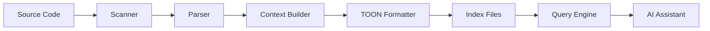

# SourceAtlas PRD v2.0

**AI-Optimized Codebase Context Engine**

- **版本**: 2.0.0
- **更新日期**: 2025-11-19
- **狀態**: Draft

---

## Executive Summary

SourceAtlas 是一個為 AI 輔助開發設計的智慧型程式碼上下文引擎。不同於傳統的程式碼索引工具，SourceAtlas 專注於提供「AI 需要知道的關鍵資訊」，採用 TOON 格式優化 token 使用，並整合 Snapshot 2.0 的開發理念。

### 核心特色

- 🎯 **目的導向索引**：不追求完整性,而是「理解專案脈絡」
- 🔄 **Token 優化**：採用 TOON 格式，節省 30-50% tokens
- 🧠 **智慧上下文**：提供範例、模式、工作流程等高階理解
- ⚡ **漸進式載入**：根據 context window 動態調整輸出
- 🛠️ **零依賴設計**：純 POSIX 工具實作，易於部署

---

## 目錄

1. [背景與目標](#1-背景與目標)
2. [核心理念](#2-核心理念)
3. [系統架構](#3-系統架構)
4. [資料模型](#4-資料模型)
5. [TOON 格式規範](#5-toon-格式規範)
6. [CLI 介面設計](#6-cli-介面設計)
7. [索引策略](#7-索引策略)
8. [智慧上下文](#8-智慧上下文)
9. [漸進式檢索](#9-漸進式檢索)
10. [實作規範](#10-實作規範)
11. [效能指標](#11-效能指標)
12. [驗收標準](#12-驗收標準)
- [附錄 A：範例輸出](#附錄-a範例輸出)
- [附錄 B：實作時程](#附錄-b實作時程)
- [附錄 C：相關資源](#附錄-c相關資源)

---

## 1. 背景與目標

### 1.1 問題陳述

現有的程式碼索引工具（如 LSIF、ctags）為 IDE 設計，產生大量細節資訊，但對 AI 助理來說：

- 資訊過多導致 token 浪費
- 缺乏專案層級的理解
- 沒有工作流程和慣例的描述
- 無法提供「怎麼做」的範例

### 1.2 目標用戶

- **主要**：使用 AI 助理（Claude、GPT-4）進行開發的工程師
- **次要**：需要快速理解陌生專案的開發者
- **延伸**：自動化文件生成、程式碼審查工具

### 1.3 成功指標

| 指標 | 目標值 | 測量方式 |
|------|--------|----------|
| Token 使用量 | 降低 40% | 相同資訊量下的 token 數 |
| 問答準確率 | > 85% | AI 能正確定位功能位置 |
| 索引時間 | < 60 秒 | 中型專案首次索引 |
| 更新時間 | < 5 秒 | 增量更新 |

---

## 2. 核心理念

### 2.1 From "What" to "Why"

#### 傳統索引
```yaml
file: user.rb
symbols:
  - User: class
  - authenticate: method
  - email: attribute
```

#### SourceAtlas 索引
```yaml
file: user.rb
purpose: Handle user authentication and profile
why_exists: Central auth logic for JWT-based API
key_responsibilities:
  - Validate credentials
  - Generate/refresh tokens
  - Manage user sessions
patterns: [ActiveRecord, JWT, BCrypt]
examples:
  login: "See authenticate method line 45"
  signup: "See create + send_welcome_email"
```

### 2.2 範例優於規範

不告訴 AI「所有 API 都繼承 BaseController」，而是：

```yaml
example_patterns:
  create_api_endpoint:
    reference: app/controllers/api/v1/posts_controller.rb
    pattern: "Inherit from Api::V1::BaseController, use serializers"
    typical_structure:
      - before_action for auth
      - strong parameters
      - render with serializer
```

### 2.3 工作流程感知

```yaml
development_workflow:
  add_feature:
    steps:
      1: "Create migration if needed"
      2: "Update model with validations"
      3: "Add service object for business logic"
      4: "Create/update controller action"
      5: "Write request specs"
    examples:
      - feature: "Add user avatar"
        files_changed:
          - db/migrate/add_avatar_to_users.rb
          - app/models/user.rb
          - app/services/avatar_service.rb
          - spec/requests/avatar_spec.rb
```

---

## 3. 系統架構

### 3.1 組件架構

```
┌─────────────────────────────────────────┐
│            SourceAtlas CLI              │
├─────────────────────────────────────────┤
│  Parser Layer                           │
│  ├─ Language Parsers (regex-based)     │
│  ├─ Pattern Detectors                  │
│  └─ Example Extractors                 │
├─────────────────────────────────────────┤
│  Index Layer                            │
│  ├─ File Scanner                       │
│  ├─ Symbol Extractor                   │
│  └─ Context Builder                    │
├─────────────────────────────────────────┤
│  Storage Layer                          │
│  ├─ TOON Formatter                     │
│  ├─ JSON Fallback                      │
│  └─ Compression (zstd/gzip)            │
├─────────────────────────────────────────┤
│  Query Layer                            │
│  ├─ Progressive Loader                 │
│  ├─ Token Calculator                   │
│  └─ Context Optimizer                  │
└─────────────────────────────────────────┘
```

### 3.2 資料流程



### 3.3 檔案結構

```
project_root/
├── .sourceatlas/
│   ├── project.toon          # 專案級理解
│   ├── index.toon            # 主索引
│   ├── symbols.toon          # 符號表
│   ├── patterns.toon         # 模式與範例
│   ├── workflows.toon        # 工作流程
│   └── shards/               # 分片目錄
│       ├── models.toon
│       ├── controllers.toon
│       └── services.toon
└── (原始程式碼)
```

---

## 4. 資料模型

### 4.1 專案理解模型

```yaml
# project.toon
project:
  name: MyApp
  type: Rails API + React SPA
  version: 1.0.0
  description: E-commerce platform with microservices

architecture:
  pattern: Microservices with Event Sourcing
  layers:
    - presentation: React + GraphQL
    - api: Rails API
    - business: Service Objects
    - data: PostgreSQL + Redis

core_concepts:
  multi_tenancy:
    how: Schema-based isolation
    gem: apartment
    key_files:
      - config/initializers/apartment.rb
      - app/models/concerns/tenantable.rb

  authentication:
    how: JWT with refresh tokens
    storage: Redis
    key_files:
      - app/services/auth_service.rb
      - app/controllers/concerns/authenticable.rb

conventions:
  naming:
    services: app/services/*_service.rb
    serializers: app/serializers/*_serializer.rb
    jobs: app/jobs/*_job.rb

  testing:
    framework: RSpec
    structure: spec/parallel/to/app
    factories: spec/factories/*.rb
```

### 4.2 檔案索引模型

```yaml
# index.toon - 標準版本
files:
  - path: app/models/user.rb
    purpose: User authentication and profile management
    layer: model
    complexity: medium  # low|medium|high

    responsibilities:
      - Authenticate users with BCrypt
      - Generate JWT tokens
      - Manage user preferences

    key_methods:
      authenticate:
        purpose: Validate credentials
        returns: JWT token or nil
        used_by: [AuthController, API::V1::SessionsController]

      generate_token:
        purpose: Create new JWT token
        ttl: 24 hours
        refresh: true

    dependencies:
      internal:
        - app/models/concerns/tokenable.rb
        - app/models/user_preference.rb
      gems:
        - bcrypt
        - jwt

    patterns:
      - ActiveRecord callbacks for token cleanup
      - Soft delete with paranoia gem

    test_coverage:
      file: spec/models/user_spec.rb
      percentage: 95
      critical_paths: [authenticate, generate_token]

    recent_changes:
      - date: 2025-01-10
        type: feature
        description: Added OAuth support
      - date: 2025-01-05
        type: bugfix
        description: Fixed token expiration
```

### 4.3 壓縮模型（Token 優化）

```yaml
# index.min.toon - 極簡版本
f:  # files
  - p: app/models/user.rb
    u: User auth  # purpose
    l: m  # layer: model
    d:  # dependencies
      - bcrypt
      - jwt
    m:  # methods
      - authenticate: validate credentials
      - generate_token: create JWT
    t: spec/models/user_spec.rb  # test
```

---

## 5. TOON 格式規範

### 5.1 為什麼選擇 TOON

| 特性 | JSON | YAML | TOON | 優勢 |
|------|------|------|------|------|
| Token 使用 | 100% | 85% | 55% | 最佳 |
| 可讀性 | 中 | 高 | 高 | ✓ |
| 註解支援 | ✗ | ✓ | ✓ | ✓ |
| 多行字串 | 複雜 | ✓ | ✓ | ✓ |
| 解析速度 | 快 | 慢 | 快 | ✓ |

### 5.2 TOON 使用規範

```yaml
# 基本規則
key: value                    # 簡單鍵值對
list:
  - item1                    # 列表項目
  - item2
nested:
  child: value              # 巢狀結構

# 多行字串
description: >
  This is a long description
  that spans multiple lines
  but will be joined.

code: |
  def example
    puts "preserves newlines"
  end

# 類型提示（可選）
count: 42 #int
ratio: 0.95 #float
enabled: true #bool
```

### 5.3 壓縮策略

```yaml
# 三層壓縮策略
compression_levels:
  full:
    when: unlimited tokens
    keys: full words
    values: complete descriptions
    includes: all metadata

  standard:
    when: normal context (32k)
    keys: abbreviated
    values: concise
    includes: essential fields

  minimal:
    when: limited context (<8k)
    keys: single letter
    values: keywords only
    includes: critical only
```

---

## 6. CLI 介面設計

### 6.1 核心命令

#### 初始化
```bash
satlas init                   # 互動式專案設定
satlas init --auto           # 自動偵測專案類型
```

#### 索引建立
```bash
satlas index                  # 完整索引
satlas index --quick         # 快速索引（僅關鍵檔案）
satlas index --layer models  # 特定層級
```

#### 更新
```bash
satlas update                # 增量更新（基於 git）
satlas update --since 1.week # 更新一週內變更
```

#### 查詢
```bash
satlas find "authentication" # 搜尋功能
satlas explain user.rb      # 解釋特定檔案
satlas flow "add feature"   # 顯示工作流程
```

#### 匯出
```bash
satlas export                # 匯出給 AI（TOON）
satlas export --json        # JSON 格式
satlas export --tokens 4000 # 限制 token 數
```

#### 分析
```bash
satlas analyze              # 專案健康度分析
satlas patterns            # 偵測設計模式
satlas suggest             # 改進建議
```

### 6.2 進階功能

```bash
# 智慧查詢
satlas ask "How do I add a new API endpoint?"
# 輸出：範例檔案、模式、步驟

# Context 產生器
satlas context "fix user login bug"
# 輸出：相關檔案、測試、最近變更

# 整合 Git
satlas blame "Why does this exist?"
satlas history app/models/user.rb

# AI 對話模式
satlas chat
> What's the authentication flow?
> Show me the user model
> How to add OAuth provider?
```

### 6.3 設定檔

```yaml
# .sourceatlas/config.toon
config:
  # 基本設定
  project_type: auto  # auto|rails|node|python
  index_mode: smart   # full|smart|minimal

  # 包含/排除
  include:
    - app/**
    - lib/**
    - config/**
  exclude:
    - vendor/**
    - node_modules/**
    - tmp/**
    - .git/**

  # 語言設定
  languages:
    ruby:
      extensions: [.rb, .rake]
      parser: regex  # regex|ast
    javascript:
      extensions: [.js, .jsx, .ts, .tsx]
      parser: regex

  # 輸出設定
  output:
    format: toon  # toon|json|yaml
    compression: auto  # none|gzip|zstd|auto
    max_file_size: 2MB

  # AI 優化
  ai:
    default_model: claude-3
    max_tokens: 8000
    include_examples: true
    include_patterns: true
```

---

## 7. 索引策略

### 7.1 智慧掃描

```yaml
scanning_strategy:
  # 優先級順序
  priority:
    1: entry_points     # main.rb, application.rb
    2: routes          # routes.rb, router.js
    3: models          # 資料模型
    4: controllers     # API/Web 控制器
    5: services        # 商業邏輯
    6: tests          # 測試檔案
    7: configs        # 設定檔
    8: others         # 其他

  # 智慧判斷
  smart_detection:
    entry_points:
      - file_names: [main, app, application, index]
      - contains: ["if __name__ == '__main__'", "Rails.application"]
    models:
      - paths: ["*/models/*", "*/entities/*"]
      - contains: ["class.*< ApplicationRecord", "@Entity"]
    services:
      - paths: ["*/services/*", "*/use_cases/*"]
      - suffix: [Service, UseCase, Handler]
```

### 7.2 符號擷取

```yaml
symbol_extraction:
  ruby:
    patterns:
      class: 'class\s+(\w+)'
      module: 'module\s+(\w+)'
      method: 'def\s+(\w+)'
      scope: 'scope\s+:(\w+)'

    importance:
      public_method: high
      private_method: low
      class_method: high
      included_module: medium

  javascript:
    patterns:
      class: 'class\s+(\w+)'
      function: 'function\s+(\w+)'
      arrow: 'const\s+(\w+)\s*=\s*\([^)]*\)\s*=>'
      react_component: '(function|const)\s+(\w+).*return.*<'
```

### 7.3 模式識別

```yaml
pattern_detection:
  design_patterns:
    singleton:
      indicators:
        - "class << self"
        - "private_class_method :new"
        - "@instance ||="

    factory:
      indicators:
        - suffix: Factory
        - methods: [create, build]

    observer:
      indicators:
        - methods: [subscribe, notify, observe]
        - gems: [wisper, activesupport]

  code_smells:
    large_class:
      threshold: 300 lines

    long_method:
      threshold: 30 lines

    too_many_parameters:
      threshold: 5 parameters
```

---

## 8. 智慧上下文

### 8.1 範例提取

```yaml
example_extraction:
  # 自動識別好範例
  criteria:
    - well_tested: coverage > 90%
    - well_documented: has comments
    - follows_patterns: matches conventions
    - frequently_referenced: imported by > 3 files

  # 範例分類
  categories:
    crud_operations:
      example: PostsController
      operations: [index, show, create, update, destroy]

    authentication:
      example: AuthService
      operations: [login, logout, refresh_token]

    background_jobs:
      example: EmailNotificationJob
      operations: [perform, retry, handle_error]
```

### 8.2 工作流程對應

```yaml
workflow_mapping:
  # 常見任務對應
  tasks:
    add_api_endpoint:
      steps:
        1: "Add route to config/routes.rb"
        2: "Create controller with action"
        3: "Add service for business logic"
        4: "Create serializer for response"
        5: "Write request specs"
      examples:
        - "See app/controllers/api/v1/posts_controller.rb"

    fix_bug:
      steps:
        1: "Write failing test to reproduce"
        2: "Find root cause in code"
        3: "Apply fix"
        4: "Verify test passes"
        5: "Check related functionality"
      tools:
        - "rspec spec/path/to/test.rb"
        - "git blame file.rb"
        - "git log -p file.rb"
```

### 8.3 關聯性分析

```yaml
relationship_analysis:
  # 檔案關聯性
  file_relationships:
    strong:
      definition: "Always change together"
      threshold: 80% co-occurrence
      example: [model, serializer, test]

    medium:
      definition: "Often change together"
      threshold: 50% co-occurrence
      example: [controller, service]

    weak:
      definition: "Sometimes related"
      threshold: 20% co-occurrence

  # 功能群組
  feature_groups:
    authentication:
      core_files:
        - app/models/user.rb
        - app/services/auth_service.rb
        - app/controllers/sessions_controller.rb
      related_files:
        - config/initializers/devise.rb
        - app/mailers/user_mailer.rb
      tests:
        - spec/models/user_spec.rb
        - spec/requests/auth_spec.rb
```

---

## 9. 漸進式檢索

### 9.1 Context Window 策略

```yaml
context_strategies:
  unlimited:  # > 100k tokens
    include:
      - full project context
      - all file indexes
      - complete examples
      - detailed patterns
    format: json

  large:  # 32k-100k tokens
    include:
      - project summary
      - relevant file indexes
      - key examples
      - important patterns
    format: toon

  medium:  # 8k-32k tokens
    include:
      - project overview
      - critical files only
      - minimal examples
    format: compressed_toon

  small:  # < 8k tokens
    include:
      - project type and stack
      - file paths only
      - entry points
    format: minimal_toon
```

### 9.2 載入優先順序

```yaml
loading_priority:
  # 根據查詢類型動態調整
  query_types:
    navigation:  # "Where is X?"
      1: file paths and purposes
      2: symbols index
      3: dependencies

    implementation:  # "How does X work?"
      1: target file full index
      2: dependencies
      3: tests
      4: examples

    modification:  # "Change X to Y"
      1: target file
      2: related files
      3: tests
      4: patterns to follow

    debugging:  # "Why is X failing?"
      1: error location
      2: recent changes
      3: dependencies
      4: tests
      5: similar issues
```

### 9.3 Token 計算

```yaml
token_calculation:
  # Token 估算規則
  rules:
    text: 4 chars = 1 token
    code: 3 chars = 1 token
    toon: 2.5 chars = 1 token
    json: 4 chars = 1 token

  # 預算分配
  budget_allocation:
    total: 8000
    distribution:
      project_context: 500
      file_indexes: 4000
      examples: 2000
      patterns: 1000
      buffer: 500
```

---

## 10. 實作規範

### 10.1 技術棧

```yaml
tech_stack:
  core:
    language: Shell (POSIX)
    reason: Zero dependencies, universal

  parsers:
    toon: Python toon-lang library
    fallback: Pure sed/awk

  storage:
    format: TOON + JSON fallback
    compression: gzip (universal)

  tools:
    scanner: find + grep
    parser: sed + awk
    hasher: sha256sum
    compressor: gzip
```

### 10.2 檔案系統

```bash
# SourceAtlas 工具結構
sourceatlas/
├── bin/
│   ├── satlas              # 主執行檔
│   └── sourceatlas         # 完整名稱連結
├── lib/
│   ├── core.sh            # 核心函數
│   ├── scanner.sh         # 檔案掃描
│   ├── parser.sh          # 內容解析
│   ├── indexer.sh         # 索引建立
│   ├── query.sh           # 查詢引擎
│   └── export.sh          # 匯出功能
├── parsers/
│   ├── ruby.sh
│   ├── javascript.sh
│   ├── python.sh
│   └── generic.sh
├── templates/
│   ├── project.toon
│   ├── config.toon
│   └── patterns.toon
└── tests/
    ├── fixtures/
    ├── e2e/
    └── helpers.bash
```

### 10.3 核心演算法

```bash
# 掃描演算法（偽代碼）
scan_project() {
  # 1. 偵測專案類型
  detect_project_type()

  # 2. 載入對應規則
  load_rules($project_type)

  # 3. 掃描檔案
  find_files() | while read file; do
    # 4. 擷取資訊
    extract_purpose($file)
    extract_symbols($file)
    extract_dependencies($file)
    detect_patterns($file)

    # 5. 建立索引
    create_index_entry($file)
  done

  # 6. 分析關聯
  analyze_relationships()

  # 7. 產生範例
  extract_examples()

  # 8. 輸出結果
  format_output($format)
}
```

---

## 11. 效能指標

### 11.1 效能目標

| 作業 | 小型專案 | 中型專案 | 大型專案 |
|------|----------|----------|----------|
| 檔案數 | < 100 | 100-1000 | > 1000 |
| 首次索引 | < 5s | < 30s | < 2min |
| 增量更新 | < 1s | < 5s | < 20s |
| 查詢回應 | < 100ms | < 200ms | < 500ms |
| 記憶體使用 | < 50MB | < 200MB | < 1GB |

### 11.2 最佳化策略

```yaml
optimizations:
  scanning:
    - parallel processing with xargs -P
    - skip binary files early
    - cache file metadata

  parsing:
    - regex over AST for speed
    - lazy evaluation
    - incremental parsing

  storage:
    - compress large indexes
    - shard by directory
    - use memory mapping

  query:
    - index symbols in TSV
    - binary search on sorted data
    - cache frequent queries
```

---

## 12. 驗收標準

### 12.1 功能驗收

```yaml
acceptance_criteria:
  functional:
    - Init: Creates config in < 5 seconds
    - Index: Covers 95% of source files
    - Update: Only processes changed files
    - Query: Returns results in < 500ms
    - Export: Fits in specified token limit

  quality:
    - Accuracy: 85% correct file locations
    - Completeness: All key symbols indexed
    - Relevance: Examples match patterns
    - Efficiency: Token usage reduced by 40%
```

### 12.2 測試案例

```yaml
test_scenarios:
  basic:
    - "Where is user authentication?"
    - "Show me the User model"
    - "How to add an API endpoint?"

  advanced:
    - "What changed in authentication recently?"
    - "Which files depend on UserService?"
    - "Find examples of background jobs"

  edge_cases:
    - Empty project
    - Single file project
    - Circular dependencies
    - Mixed languages
```

### 12.3 品質門檻

| 指標 | 門檻 | 測量方式 |
|------|------|----------|
| 程式碼覆蓋率 | > 80% | Unit tests |
| E2E 測試通過率 | 100% | Bats tests |
| 記憶體洩漏 | 0 | Valgrind |
| 效能衰退 | < 10% | Benchmark suite |

---

## 附錄 A：範例輸出

### A.1 專案理解檔案

```yaml
# .sourceatlas/project.toon
project:
  name: EcommerceAPI
  type: Rails API
  version: 2.3.1
  team_size: 5
  age_months: 18

stack:
  language: Ruby 3.1
  framework: Rails 7.0
  database: PostgreSQL 14
  cache: Redis 6
  queue: Sidekiq

architecture:
  pattern: Service-oriented
  api_style: RESTful + GraphQL
  auth: JWT

key_features:
  - Multi-tenant SaaS
  - Real-time notifications
  - Payment processing
  - Inventory management

health:
  test_coverage: 87%
  code_climate: B
  last_deploy: 2 days ago
  open_issues: 23
```

### A.2 檔案索引範例

```yaml
# .sourceatlas/index.toon (片段)
files:
  - path: app/services/payment_service.rb
    purpose: Handle payment processing with Stripe
    complexity: high

    responsibilities:
      - Process credit card payments
      - Handle refunds and disputes
      - Manage subscriptions
      - Send payment receipts

    key_methods:
      charge:
        purpose: Process one-time payment
        params: [amount, currency, source]
        returns: Payment object or error
        error_handling: Rescue Stripe errors

      refund:
        purpose: Refund a payment
        params: [payment_id, amount]
        async: true via PaymentRefundJob

    dependencies:
      gems: [stripe, money]
      internal:
        - app/models/payment.rb
        - app/models/user.rb
        - app/jobs/payment_receipt_job.rb

    patterns:
      - Result object pattern
      - Idempotency keys
      - Webhook handling

    test:
      file: spec/services/payment_service_spec.rb
      coverage: 95%
      key_scenarios:
        - successful payment
        - declined card
        - network timeout
        - webhook processing
```

### A.3 Token 優化比較

```javascript
// 原始 JSON: 156 tokens
{
  "file": "app/services/payment_service.rb",
  "purpose": "Handle payment processing",
  "methods": [
    {
      "name": "charge",
      "params": ["amount", "currency", "source"],
      "returns": "Payment object"
    }
  ]
}

// TOON 標準: 92 tokens
file: app/services/payment_service.rb
purpose: Handle payment processing
methods:
  - name: charge
    params: [amount, currency, source]
    returns: Payment object

// TOON 壓縮: 41 tokens
f: app/services/payment_service.rb
u: Payment processing
m:
  - charge: [amount,currency,source]->Payment
```

---

## 附錄 B：實作時程

### Phase 1: MVP (Week 1-2)
- 基本 CLI 架構
- 檔案掃描器
- Ruby/JS 解析器
- TOON 輸出

### Phase 2: 核心功能 (Week 3-4)
- 智慧索引
- 模式偵測
- 範例擷取
- 增量更新

### Phase 3: 進階功能 (Week 5-6)
- AI 對話介面
- Git 整合
- 多語言支援
- 效能優化

### Phase 4: 品質與部署 (Week 7-8)
- 完整測試覆蓋
- 文件撰寫
- 套件發布
- CI/CD 設置

---

## 附錄 C：相關資源

### 參考資料
- TOON Format Specification
- Snapshot 2.0 Article
- Claude Context Best Practices

### 工具連結
- TOON Python Parser
- Universal Ctags
- Bats Testing Framework

### 社群
- GitHub: sourceatlas/sourceatlas
- Discord: SourceAtlas Community
- Twitter: @sourceatlas

---

## 更新日誌

### v2.0.0 (2025-01-15)
- 整合 TOON 格式
- 加入 Snapshot 2.0 理念
- 重新設計資料模型
- 優化 token 使用

### v1.0.0 (2025-01-01)
- 初始 PRD
- 基本索引功能
- JSON 輸出

---

*本文件採用 CC-BY-SA 4.0 授權*
