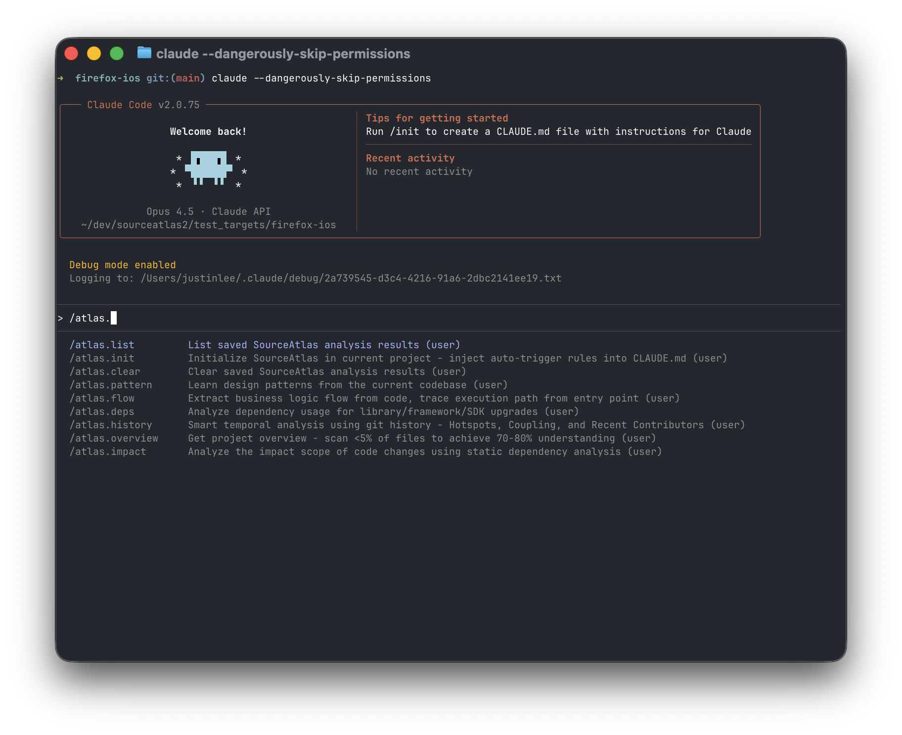
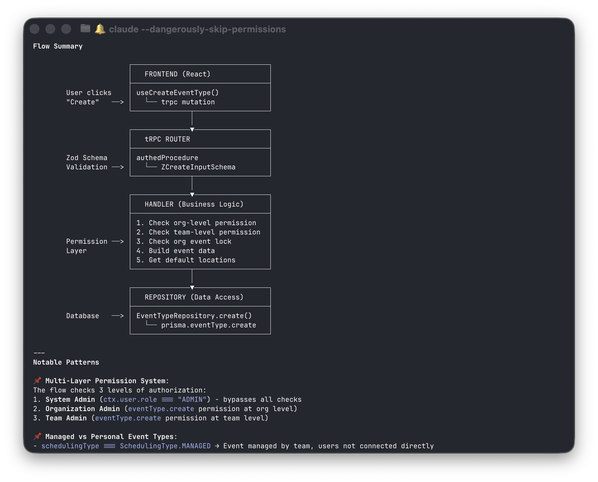

# SourceAtlas

> 🌐 **English** | [繁體中文](./README.zh-TW.md)

**Get project overview in ~3 minutes by scanning <5% of files**

A set of AI-powered slash commands for [Claude Code](https://claude.ai/code) that help you understand any codebase quickly.

[](https://github.com/lis186/SourceAtlas/releases)
[](./LICENSE)



---

## Have You Ever...

- Spent **3 days** on a new project and still don't understand the architecture?
- Wanted to change one line, but **afraid it might break everything**?
- Asked a colleague "how do I write this", and got "just look at file XXX"?
- Needed to upgrade iOS 16 → 17, but had **no idea how much work** it would take?

**SourceAtlas solves these in minutes, not days.**

---

## Before & After

| Task | Before | After |
|------|--------|-------|
| Understand project architecture | 2-3 days | **~3-15 minutes** ✓ |
| Find API implementation examples | Ask colleagues / random searching | **~seconds** |
| Analyze impact of code changes | Manual tracking, hope for the best | **~1-2 minutes** |
| Plan framework upgrade | Weeks of research | **~15-30 minutes** |
| Find code hotspots & experts | Ask around | **~5-10 minutes** |

<sub>✓ = benchmarked on 5 open-source projects. Others are estimates based on usage.</sub>

---

## How It Works

SourceAtlas uses **information theory** to prioritize high-entropy files (configs, READMEs, models) over implementation details. By scanning <5% of files, it achieves 70-80% understanding depth in minutes instead of days.



---

## 6 Commands for 6 Real Problems

### 1. "I just joined the project, where do I start?"

```bash
/atlas.overview
```

**In ~3 minutes, get**: Tech stack, architecture patterns, project scale, code quality signals

**Example output**: Detects Swift 5.10 + MVVM + Coordinator, 12K files, test coverage level

---

### 2. "I want to write an API, how does this project do it?"

```bash
/atlas.pattern "api endpoint"
/atlas.pattern "authentication"
/atlas.pattern "database query"
```

**In 0.1-30 seconds, get**: 2-3 best example files with exact line numbers + implementation guide

**Example output**: Returns `UserAPI.swift:45` with matching test file and implementation guide

**221 patterns supported**: MVVM, Networking, Core Data, React Hooks, Next.js API, Jetpack Compose, Vue Composable, FastAPI, Rails Controller...

---

### 3. "I want to change this file, what else will break?"

```bash
/atlas.impact "src/api/users.ts"
/atlas.impact api "/api/users/{id}"
```

**In 1-2 minutes, get**: All dependents, Breaking Change risks, test coverage, migration steps

**Example output**: Lists 23 dependent files, identifies 5 breaking change risks

---

### 4. "Who knows this code best? What's the danger zone?"

```bash
/atlas.history
/atlas.history src/
```

**In 5-10 minutes, get**: Hotspots (files that change constantly), Hidden Coupling, Knowledge Distribution

**Example output**: Shows `PaymentService.swift` with 47 changes, flags single-contributor bus factor risk

---

### 5. "How does the login flow actually work?"

```bash
/atlas.flow "user login"
/atlas.flow "checkout process"
```

**In 3-5 minutes, get**: Entry points, complete execution path, boundary identification (API/DB/Auth/Payment)

**Example output**: Traces `LoginViewController` → `AuthService` → `APIClient` → `TokenManager`

---

### 6. "We need to upgrade to iOS 17, how much work is that?"

```bash
/atlas.deps "iOS 16 → 17"
/atlas.deps "React 17 → 18"
/atlas.deps "Python 3.11 → 3.12"
```

**In 15-30 minutes, get**: Deprecated APIs, version checks to remove, third-party compatibility, effort estimate

**Example output**: Migration checklist with removable version checks, deprecated APIs, effort estimate

---

## Benchmark Results

**Tested on 5 open-source projects**: Firefox iOS, Discourse, Cal.com, Prefect, Thunderbird

| Command | Key Metric | Result | Report |
|---------|-----------|--------|--------|
| `/atlas.overview` | Overall Accuracy | 93% (56/60) | [✓](./dev-notes/2025-12/2025-12-21-overview-e2e-verification.md) |
| `/atlas.pattern` | Search Precision | 98.6% (7/7 cases) | [✓](./dev-notes/2025-12/2025-12-21-pattern-e2e-verification.md) |
| `/atlas.impact` | Internal Consistency | 100% (5/5 projects) | [✓](./dev-notes/2025-12/2025-12-21-impact-e2e-verification.md) |
| `/atlas.flow` | Entry Point Detection | 100% (5/5 projects) | [✓](./dev-notes/2025-12/2025-12-21-flow-e2e-verification.md) |
| `/atlas.deps` | Mode Detection | 100% (2/2 cases) | [✓](./dev-notes/2025-12/2025-12-21-deps-e2e-verification.md) |
| `/atlas.history` | Hotspots Detection | 100% (Top 10) | [✓](./dev-notes/2025-12/2025-12-21-history-e2e-verification.md) |

<sub>All E2E verified on 2025-12-21. Languages tested: Swift, Ruby, Python, TypeScript, Kotlin. Click ✓ for detailed reports.</sub>

---

## Quick Start (2 minutes)

### Requirements

- **Claude Code** 0.3+ ([Get it here](https://claude.ai/code))
- **Git** 2.0+
- **macOS 12+** or **Linux**

### Installation

```bash
# 1. Clone
git clone https://github.com/lis186/SourceAtlas.git

# 2. Install
cd SourceAtlas && ./install-global.sh
```

### First Use

```bash
cd ~/projects/any-project
/atlas.init      # One-time: inject auto-trigger rules
/atlas.overview  # Start understanding
```


**Verify installation**:
```bash
ls ~/.claude/commands/atlas.*.md
# Should see 9 files
```

---

## All 9 Commands

| Command | Problem It Solves | Time |
|---------|------------------|------|
| `/atlas.overview` | New to project, need the big picture | ~3-15 min ✓ |
| `/atlas.pattern "X"` | Need to implement X, want examples | ~seconds ✓ |
| `/atlas.impact "file"` | About to change code, worried about side effects | ~1-2 min |
| `/atlas.history` | Need to find hotspots and experts | ~5-10 min |
| `/atlas.flow "feature"` | Need to understand a feature's execution path | ~3-5 min |
| `/atlas.deps "upgrade"` | Planning framework/SDK upgrade | ~15-30 min |
| `/atlas.init` | First time using SourceAtlas | ~10 sec |
| `/atlas.list` | Check what analyses are cached | instant |
| `/atlas.clear` | Clear outdated cache | instant |

<sub>✓ = benchmarked. Times without ✓ are estimates.</sub>

---

## Supported Languages

| Language | Patterns | Example Patterns |
|----------|----------|------------------|
| **Swift/iOS** | 34 | MVVM, Coordinator, Core Data, SwiftUI, Combine |
| **TypeScript/React/Vue** | 50 | Hooks, Next.js, Zustand, Pinia, tRPC |
| **Kotlin/Android** | 31 | ViewModel, Room, Compose, Hilt, MVI |
| **Python** | 26 | Django, FastAPI, Flask, Celery, SQLAlchemy |
| **Ruby/Rails** | 26 | ActiveRecord, Controller, Service, Job |
| **Go** | 26 | Handler, Service, Middleware, Repository |
| **Rust** | 28 | Handler, Service, Middleware, Async Runtime |

**Total: 221 patterns**

---

## Limitations

| Limitation | Details |
|------------|---------|
| **Benchmark scope** | 6 commands tested (`overview`, `pattern`, `flow`, `impact`, `deps`, `history`) |
| **Tech Stack detection** | May miss secondary languages (e.g., React in a Python project) |
| **Architecture detection** | May miss secondary patterns (e.g., MVI in Clean Architecture) |
| **Best for mature projects** | Works best with README, config files; limited for undocumented legacy code |
| **Language coverage** | 7 languages supported; non-mainstream languages need manual verification |

---

## When NOT to Use

| Situation | Why | Alternative |
|-----------|-----|-------------|
| Small projects (<2K LOC) | Reading directly is faster | Just read the code |
| Need 100% precision | AI has ~93% accuracy | Use static analysis tools |
| Highly sensitive code | Code sent to Claude API | Check your compliance policy |
| Offline environment | Requires API connection | Use local tools |

---

## Privacy & Cost

| Aspect | Details |
|--------|---------|
| **Data Privacy** | Code is sent to Claude API for analysis. SourceAtlas itself stores nothing. Check your organization's AI policy. |
| **Token Usage** | ~50-100k tokens per analysis (~$0.15-0.30 USD with Sonnet) |
| **Local Processing** | Git history analysis (code-maat) runs locally. AST search (ast-grep) runs locally. |

---

## Save & Share Analyses

All commands support `--save`:

```bash
/atlas.overview --save          # → .sourceatlas/overview.yaml
/atlas.pattern "api" --save     # → .sourceatlas/patterns/api.md
/atlas.history --save           # → .sourceatlas/history.md
```

**Benefits**:
- New team members can read existing analyses
- Avoid re-running expensive analyses
- Track how the codebase evolves

**Manage cache**:
```bash
/atlas.list   # View all cached analyses
/atlas.clear  # Clear all or specific caches
```

---

## Documentation

| Document | Description |
|----------|-------------|
| [Usage Guide](./USAGE_GUIDE.md) | Complete command reference, all 221 patterns |
| [Installation Guide](./GLOBAL_INSTALLATION.md) | Detailed installation options |
| [Analysis Constitution](./ANALYSIS_CONSTITUTION.md) | Quality principles all analyses follow |
| [CLAUDE.md](./CLAUDE.md) | Developer guide, architecture |

---

## Feedback & Contributions

- **Report Issues**: [GitHub Issues](https://github.com/lis186/SourceAtlas/issues)
- **Contribute Code**: PRs welcome
- **Add Languages**: Python, Ruby, Go, Rust patterns welcome

---

## Acknowledgments

SourceAtlas is built on these excellent open-source tools:

| Tool | Purpose | Link |
|------|---------|------|
| **ast-grep** | AST-based code search for `/atlas.pattern` and `/atlas.deps` | [GitHub](https://github.com/ast-grep/ast-grep) |
| **code-maat** | Git history analysis for `/atlas.history` | [GitHub](https://github.com/adamtornhill/code-maat) |
| **Claude Code** | AI-powered code assistant | [claude.ai/code](https://claude.ai/code) |

---

**SourceAtlas** — Understand any codebase in minutes, not days.

v2.9.6 | MIT License | Made with Claude Code
