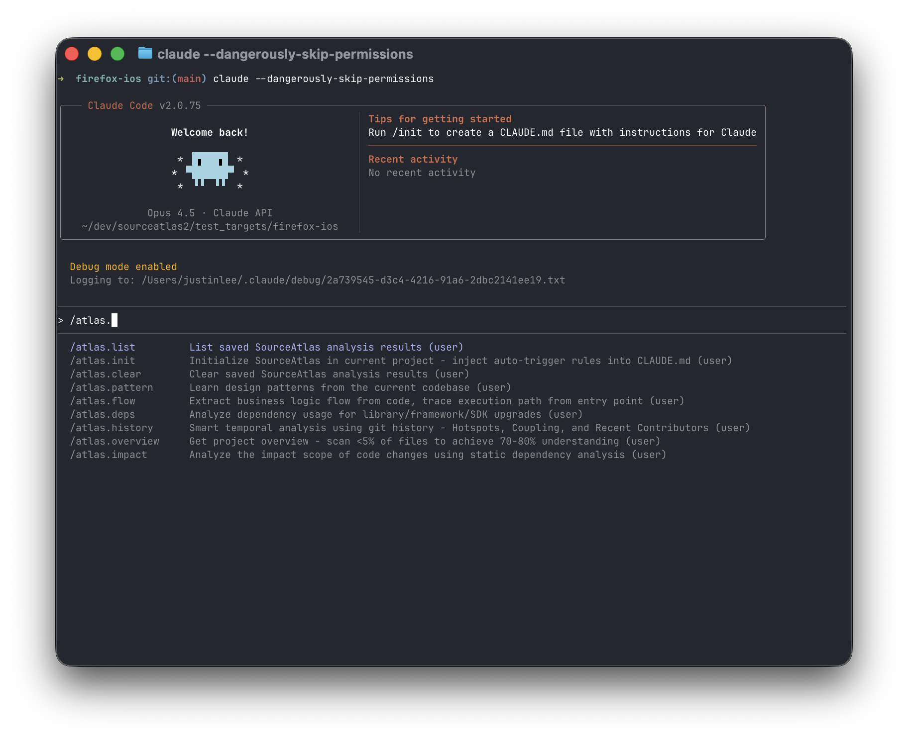
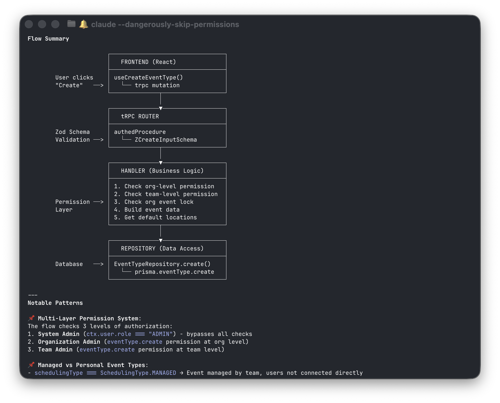
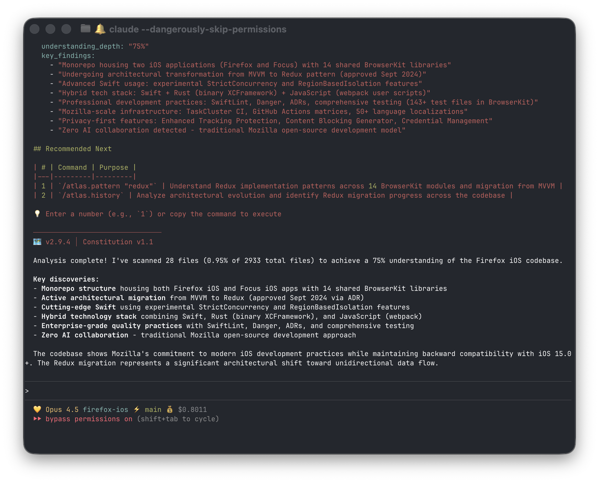

# 🗺️ SourceAtlas

> [sourceatlas.io](https://www.sourceatlas.io) | [English](./README.md) | 🌐 **繁體中文**

**掃描 <5% 的檔案，約 3 分鐘取得專案全貌**

一組 [Claude Code](https://claude.ai/code) slash commands，幫助你快速理解任何 codebase。

[](https://github.com/lis186/SourceAtlas/releases)
[](./LICENSE)



---

## 你是否遇過這些情況？

- 接手新專案 **3 天**，還是搞不清楚架構？
- 想改一行 code，但 **怕改了會爆炸**？
- 問同事「這個怎麼寫」，得到的回答是「你去看 XXX 那個 file」？
- 要升級 iOS 16 → 17，但 **完全不知道要改多少東西**？

**SourceAtlas 讓這些問題從「天」變成「分鐘」。**

---

## 使用前 vs 使用後

| 任務 | 以前 | 現在 |
|------|------|------|
| 理解專案架構 | 2-3 天 | **~3-15 分鐘** ✓ |
| 找 API 實作範例 | 問同事 / 亂翻 | **~秒級** |
| 分析程式碼修改影響 | 手動追蹤，祈禱不會爆 | **~1-2 分鐘** |
| 規劃框架升級 | 研究好幾週 | **~15-30 分鐘** |
| 找程式碼熱點和專家 | 到處問人 | **~5-10 分鐘** |

<sub>✓ = 已在 5 個開源專案上實測。其他為根據使用經驗的估計值。</sub>

---

## 運作原理

SourceAtlas 使用**資訊理論**優先掃描高熵檔案（configs、READMEs、models），而非實作細節。只需掃描 <5% 的檔案，即可在數分鐘內達到 70-80% 的理解深度。



---

## 核心命令

### 1.「我剛接手這個專案，要從哪裡開始？」

```bash
/sourceatlas:overview
```

**約 3 分鐘內得到**：Tech stack、架構模式、專案規模、程式碼品質訊號

**輸出範例**：偵測到 Swift 5.10 + MVVM + Coordinator，12K 檔案，測試覆蓋程度

---

### 2.「我想寫一個 API，這個專案的慣例是怎樣？」

```bash
/sourceatlas:pattern "api endpoint"
/sourceatlas:pattern "authentication"
/sourceatlas:pattern "database query"
```

**0.1-30 秒內得到**：2-3 個最佳範例檔案 + 精確行數 + 實作指南

**輸出範例**：回傳 `UserAPI.swift:45`，附帶對應測試檔案和實作指南

**支援 221 種模式**：MVVM、Networking、Core Data、React Hooks、Next.js API、Jetpack Compose、Vue Composable、FastAPI、Rails Controller...

---

### 3.「我想改這個檔案，會影響到什麼？」

```bash
/sourceatlas:impact "src/api/users.ts"
/sourceatlas:impact api "/api/users/{id}"
```

**1-2 分鐘內得到**：所有依賴者、Breaking Change 風險、測試覆蓋、遷移步驟

**輸出範例**：列出 23 個依賴檔案，識別 5 個 breaking change 風險

---

### 4.「這段 code 誰最熟？哪裡是地雷區？」

```bash
/sourceatlas:history
/sourceatlas:history src/
```

**5-10 分鐘內得到**：Hotspots（頻繁修改的檔案）、隱藏耦合、知識分布

**輸出範例**：顯示 `PaymentService.swift` 有 47 次修改，標記單一貢獻者 bus factor 風險

---

### 5.「登入流程到底怎麼跑的？」

```bash
/sourceatlas:flow "user login"
/sourceatlas:flow "checkout process"
```

**3-5 分鐘內得到**：入口點、完整執行路徑、邊界識別（API/DB/Auth/Payment）

**輸出範例**：追蹤 `LoginViewController` → `AuthService` → `APIClient` → `TokenManager`

---

### 6.「要升級到 iOS 17，到底要改多少？」

```bash
/sourceatlas:deps "iOS 16 → 17"
/sourceatlas:deps "React 17 → 18"
/sourceatlas:deps "Python 3.11 → 3.12"
```

**15-30 分鐘內得到**：Deprecated APIs、可移除的版本檢查、第三方相容性、工時估計

**輸出範例**：遷移清單，包含可移除的版本檢查、deprecated APIs、工時估計

---

## Benchmark 結果

**在 5 個開源專案測試**：Firefox iOS、Discourse、Cal.com、Prefect、Thunderbird

| 命令 | 關鍵指標 | 結果 | 報告 |
|------|---------|------|------|
| `overview` | 整體準確率 | 93%（56/60） | [✓](./dev-notes/2025-12/2025-12-21-overview-e2e-verification.md) |
| `pattern` | 搜尋精確率 | 98.6%（7/7 案例） | [✓](./dev-notes/2025-12/2025-12-21-pattern-e2e-verification.md) |
| `impact` | 內部一致性 | 100%（5/5 專案） | [✓](./dev-notes/2025-12/2025-12-21-impact-e2e-verification.md) |
| `flow` | 入口點偵測 | 100%（5/5 專案） | [✓](./dev-notes/2025-12/2025-12-21-flow-e2e-verification.md) |
| `deps` | 模式識別 | 100%（2/2 案例） | [✓](./dev-notes/2025-12/2025-12-21-deps-e2e-verification.md) |
| `history` | Hotspots 偵測 | 100%（Top 10） | [✓](./dev-notes/2025-12/2025-12-21-history-e2e-verification.md) |

<sub>全部於 2025-12-21 E2E 驗證通過。測試語言：Swift、Ruby、Python、TypeScript、Kotlin。點擊 ✓ 查看詳細報告。</sub>

---

## 快速開始（2 分鐘）

### 需求

- **Claude Code** 1.0.33+（[安裝連結](https://claude.ai/code)）
- **Git** 2.0+
- **macOS 12+** 或 **Linux**

### 安裝

**方法 A：Plugin Marketplace（推薦）**
```bash
# 在 Claude Code 中執行：
/plugin marketplace add lis186/SourceAtlas
/plugin install sourceatlas@lis186-SourceAtlas
```

**方法 B：本地快速測試**
```bash
git clone https://github.com/lis186/SourceAtlas.git
claude --plugin-dir ./SourceAtlas/plugin
```

> ⚠️ **已知問題**：若使用 `--scope project` 安裝後，在其他 repo 可能會遇到 "already installed" 錯誤。這是 [Claude Code 的 bug](https://github.com/anthropics/claude-code/issues/14202)。**解法**：使用預設的 user scope（不加 `--scope` 參數）。

**方法 C：透過 OpenSkills（給 Cursor、Gemini CLI、Aider 使用者）**

SourceAtlas 也支援非 Claude Code 的 AI agents，透過 [OpenSkills](https://github.com/numman-ali/openskills)。

**前置條件**：Node.js 18+

**快速安裝**：
```bash
npm i -g openskills
cd your-project
openskills install lis186/SourceAtlas
touch AGENTS.md && openskills sync -y
```

**在 Cursor 中使用**：

安裝後，在 Cursor 中開啟 AI Chat (Cmd+L)，直接用自然語言問：

| 你問 | 效果 |
|------|------|
| "幫我了解這個專案的架構" | 執行 `openskills read overview` → 專案架構分析 |
| "這個專案怎麼寫 API endpoint?" | 執行 `openskills read pattern` → 顯示現有慣例 |
| "改 UserService 會影響什麼？" | 執行 `openskills read impact` → 依賴影響分析 |
| "登入流程怎麼運作？" | 執行 `openskills read flow` → 執行路徑視覺化 |

> **提示**：如果 Cursor 沒有自動觸發，可以明確說：*「用 `openskills read overview` 分析這個專案」*

**驗證安裝**：
```bash
openskills list | grep overview
# 應該看到：overview    (project)   Get project overview...
```

**疑難排解**：

- **"SKILL.md not found"** → 使用 `openskills install lis186/SourceAtlas`（repo 根目錄路徑）
- **Skills 沒出現** → 執行 `openskills sync -y` 重新生成 AGENTS.md

詳細說明請參考 [plugin/README.md](./plugin/README.md#method-2-via-openskills-for-cursor-gemini-cli-aider-windsurf)。

### 第一次使用

```bash
cd ~/projects/any-project
/sourceatlas:overview  # 開始理解專案
```



透過 **Agent Skills**，Claude 會根據你的問題自動建議合適的分析 — 不用記指令！

---

## 全部 8 個命令

| 命令 | 解決的問題 | 時間 |
|------|-----------|------|
| `/sourceatlas:overview` | 新接手專案，需要全貌 | ~3-15 分鐘 ✓ |
| `/sourceatlas:pattern "X"` | 需要實作 X，想找範例 | ~秒級 ✓ |
| `/sourceatlas:impact "file"` | 準備改 code，擔心副作用 | ~1-2 分鐘 |
| `/sourceatlas:history` | 需要找熱點和專家 | ~5-10 分鐘 |
| `/sourceatlas:flow "feature"` | 需要理解功能的執行路徑 | ~3-5 分鐘 |
| `/sourceatlas:deps "upgrade"` | 規劃框架/SDK 升級 | ~15-30 分鐘 |
| `/sourceatlas:list` | 查看快取了哪些分析 | 即時 |
| `/sourceatlas:reset` | 清除過期快取 | 即時 |

<sub>✓ = 已 benchmark。無 ✓ 的時間為估計值。</sub>

---

## 支援語言

| 語言 | 模式數 | 範例模式 |
|------|--------|---------|
| **Swift/iOS** | 34 | MVVM、Coordinator、Core Data、SwiftUI、Combine |
| **TypeScript/React/Vue** | 50 | Hooks、Next.js、Zustand、Pinia、tRPC |
| **Kotlin/Android** | 31 | ViewModel、Room、Compose、Hilt、MVI |
| **Python** | 26 | Django、FastAPI、Flask、Celery、SQLAlchemy |
| **Ruby/Rails** | 26 | ActiveRecord、Controller、Service、Job |
| **Go** | 26 | Handler、Service、Middleware、Repository |
| **Rust** | 28 | Handler、Service、Middleware、Async Runtime |

**總計：221 種模式**

---

## 限制

| 限制 | 說明 |
|------|------|
| **Benchmark 範圍** | 6 個命令已測試（`overview`、`pattern`、`flow`、`impact`、`deps`、`history`） |
| **Tech Stack 偵測** | 可能漏掉次要語言（如 Python 專案中的 React） |
| **架構偵測** | 可能漏掉次要模式（如 Clean Architecture 中的 MVI） |
| **適合成熟專案** | 對有 README、設定檔的專案效果最好；無文件的 legacy code 效果有限 |
| **語言覆蓋** | 支援 7 種語言；非主流語言需手動驗證 |

---

## 不適用場景

| 情況 | 原因 | 替代方案 |
|------|------|---------|
| 小專案（<2K LOC） | 直接讀更快 | 直接看 code |
| 需要 100% 精確 | AI 準確率約 93% | 用靜態分析工具 |
| 高度敏感程式碼 | Code 會傳送到 Claude API | 確認合規政策 |
| 離線環境 | 需要 API 連線 | 用本地工具 |

---

## 隱私與成本

| 項目 | 說明 |
|------|------|
| **資料隱私** | 程式碼會傳送到 Claude API 進行分析。SourceAtlas 本身不儲存任何資料。請確認你的組織 AI 政策。 |
| **Token 使用量** | 每次分析約 50-100k tokens（約 $0.15-0.30 USD，使用 Sonnet） |
| **本地處理** | Git 歷史分析 (code-maat) 在本地執行。AST 搜尋 (ast-grep) 在本地執行。 |

---

## 儲存與分享分析

所有命令支援 `--save`：

```bash
/sourceatlas:overview --save          # → .sourceatlas/overview.yaml
/sourceatlas:pattern "api" --save     # → .sourceatlas/patterns/api.md
/sourceatlas:history --save           # → .sourceatlas/history.md
```

**好處**：
- 新成員可以閱讀現有分析
- 避免重複執行耗時分析
- 追蹤 codebase 的演變

**管理快取**：
```bash
/sourceatlas:list   # 查看所有快取分析
/sourceatlas:reset  # 清除全部或特定快取
```

---

## 文件

| 文件 | 說明 |
|------|------|
| [使用指南](./USAGE_GUIDE.zh-TW.md) | 完整命令參考、全部 221 種模式 |
| [實戰案例](./docs/case-studies/) | 7 個框架分析（Gin、TCA、FastAPI、tRPC 等） |
| [Plugin 指南](./plugin/README.md) | Plugin 安裝與功能 |
| [分析憲法](./ANALYSIS_CONSTITUTION.md) | 所有分析遵循的品質原則 |
| [CLAUDE.md](./CLAUDE.md) | 開發者指南、架構 |

---

## 回饋與貢獻

- **回報問題**：[GitHub Issues](https://github.com/lis186/SourceAtlas/issues)
- **貢獻程式碼**：歡迎 PR

---

## 致謝

SourceAtlas 建立在這些優秀的工具之上：

| 工具 | 用途 | 連結 |
|------|------|------|
| **ast-grep** | `pattern` 和 `deps` 命令的 AST 搜尋 | [GitHub](https://github.com/ast-grep/ast-grep) |
| **code-maat** | `history` 命令的 Git 歷史分析 | [GitHub](https://github.com/adamtornhill/code-maat) |
| **Claude Code** | AI 程式碼助手 | [claude.ai/code](https://claude.ai/code) |

---

**SourceAtlas** — 用分鐘而不是天來理解任何 codebase。

v2.13.1 | MIT License | Made with Claude Code
